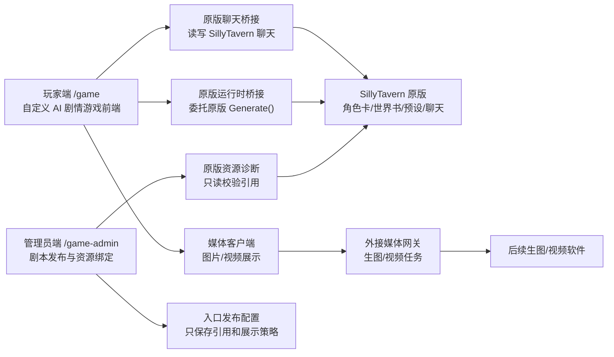

# AI Galgame 原版酒馆内核 + 自定义前端开发方案

> 文档状态：开发方案 v1.0  
> 生效日期：2026-07-25  
> 适用范围：玩家前端、管理员前端、SillyTavern 适配层、原版运行时桥接、媒体外接接口  
> 上位边界：`AGENTS.md`、`docs/GALGAME_NATIVE_FIRST_DEVELOPMENT_SPEC.md`  
> 前端落地规范：`docs/AI_GALGAME_FRONTEND_INTERACTION_AND_UI_SPEC.md`
> 落代码前材料：`docs/AI_GALGAME_PRE_IMPLEMENTATION_MATERIALS.md`  
> 代码开发清单：`docs/AI_GALGAME_IMPLEMENTATION_BACKLOG.md`

## 1. 最新产品定义

本项目不是要完整复刻传统 GalGame，也不是把 SillyTavern 简单换皮。

本项目的准确定位是：

**以 SillyTavern 原版作为后端能力、资源和运行语义内核，在其外侧建设一个完全自定义的 AI 剧情游戏前端。这个前端可以吸收 GalGame、JRPG、视觉小说的交互表达，但玩法本质仍是 AI 驱动的 SillyTavern 原生聊天与世界书系统。**

也就是说：

- 底层剧情能力来自 SillyTavern 原版。
- 玩家可见交互由我们重新设计。
- 前端可以像 GalGame，但不受传统 GalGame 固定路线、固定选项、固定结局的限制。
- 自定义层只做展示、编排、恢复、媒体和体验增强，不开发一套替代 SillyTavern 的剧情系统。

## 2. 最高原则

### 2.1 SillyTavern 是运行内核

以下能力必须以 SillyTavern 原版为权威：

- 角色卡
- 世界书、角色书、群组世界书
- 世界书激活规则、权重、位置、上下文预算
- 预设、指令预设、系统提示、上下文预设
- 模型/API 连接和生成参数
- 聊天历史、会话文件、重生成、撤回、滑动等聊天语义
- 原版 `Generate()` 负责的上下文组装、扩展事件和模型调用

自定义前端不得复制角色卡正文、世界书正文、提示词正文，也不得自己拼接上下文或直调底层模型生成接口。

### 2.2 前端是我们自己的游戏交互

玩家不进入原版 SillyTavern UI。玩家只看到我们设计的游戏界面：

- 标题画面
- 自定义剧情舞台
- 角色名和对话框
- 行动按钮
- 自由输入
- 历史、保存、读取、设置
- 图片、视频、音效等演出层

玩家端不出现模型、API、角色卡、世界书、预设、Token、提示词等酒馆术语。

### 2.3 不做平行剧情系统

禁止在前端实现：

- 固定剧情台词
- 固定分支树
- 固定结局
- 前端好感度
- 前端物品栏
- 前端世界事实
- 前端节点跳转
- `SceneResult` 或类似 AI 输出协议
- 失败时的本地 scripted fallback

如果需要剧情推进、角色记忆、世界事实、阶段目标，应写入 SillyTavern 原版角色卡、世界书、群组、聊天历史或预设中。

## 3. 总体架构

核心分工：

| 模块 | 职责 | 禁止事项 |
| --- | --- | --- |
| SillyTavern 原版 | 内容、世界观、角色、上下文、生成语义 | 不被定制层修改后端或复制逻辑 |
| 玩家前端 | 展示、输入、按钮、历史、保存、媒体、恢复 | 不拼 prompt、不造剧情、不暴露酒馆术语 |
| 管理员前端 | 发布入口、绑定资源、校验缺失、配置媒体 | 不编辑原版资源正文、不替代原版资源管理器 |
| 原版运行时桥接 | 调用原版运行时 `Generate()` 并读回目标聊天 | 不直调底层 `/generate`，不复制 `Generate()` |
| 媒体网关 | 图片/视频任务、幂等、缓存、降级 | 不参与剧情权威，不保存模型密钥到前端 |

## 4. 玩家端目标形态

玩家端不是聊天工具，也不是传统固定路线 GalGame，而是一个“AI 剧情游戏前端”。

### 4.1 基础循环

1. 玩家打开 `/game/`。
2. 前端读取管理员发布的当前入口。
3. 点击“开始游戏”后，读取绑定的原版 SillyTavern 开场聊天种子。
4. 玩家看到游戏化舞台和剧情文本。
5. 玩家可以点击行动建议，也可以自由输入。
6. 玩家输入写回原版 SillyTavern 聊天。
7. 原版运行时桥接调用 SillyTavern 原版 `Generate()`。
8. 前端读回同一个目标聊天文件里的原版回复。
9. 前端把原版回复展示成游戏文本、按钮、历史和媒体触发。

### 4.2 行动按钮的本质

行动按钮不是传统 GalGame 的固定分支。

行动按钮来自两类合法来源：

- 原版角色回复中明确写出的“可选行动”文本。
- 未来通过 SillyTavern 原版 Quick Reply 或等价扩展桥接得到的原版按钮。

按钮点击后只做一件事：

**把按钮文字作为玩家输入写回原版聊天。**

按钮不得在前端决定分支、结局、好感度或节点跳转。

### 4.3 自由输入的定位

自由输入是 AI 剧情游戏的核心优势，应保留。

推荐交互方式：

- 默认展示 2-4 个行动按钮，降低学习成本。
- 同时保留一个简洁输入框，让玩家可以说台词或做自定义行动。
- 输入框文案使用游戏语言，例如“输入你的行动或台词”。
- 不向玩家解释模型、角色卡或世界书。

### 4.4 历史、保存、读取

玩家端应提供游戏化的历史和存读档，但底层权威仍是 SillyTavern 聊天。

保存内容允许包括：

- 当前发布入口版本
- 当前原版 chatId
- 当前显示到哪条消息
- 文本分页位置
- 背景、立绘、BGM、媒体缓存
- 前端 UI 偏好

保存内容不得包括：

- 前端好感度
- 前端剧情变量
- 前端世界事实
- 前端物品
- 前端路线节点

## 5. 管理员端目标形态

管理员端的目标不是复制 SillyTavern，而是把原版资源组合成可发布的游戏入口。

### 5.1 管理员核心页面

建议保留以下页面：

- 当前发布
- 剧本入口
- 原版资源绑定
- 运行配置检查
- 分幕/章节配置
- 媒体接口
- 系统状态

### 5.2 剧本入口

一个剧本入口只保存引用和展示策略：

- 标题
- 版本
- 内容等级
- 主角色或群组引用
- 世界书引用列表
- 预设引用
- 指令预设、系统提示、上下文预设引用
- 开场聊天种子引用
- 默认背景、立绘、音乐、标题图
- 媒体策略
- 当前发布状态

不得保存角色卡正文、世界书正文、提示词正文或固定剧情文本。

### 5.3 分幕/章节配置

对于 World-Forge Lucifer 这类高级包，应采用“分幕入口”的方式：

- Lucifer Arc 1：绑定 Arc1 bundle
- Lucifer Arc 2：绑定 Arc2 bundle
- Lucifer Arc 3：绑定 Arc3 bundle
- Lucifer Arc 4：绑定 Arc4 bundle
- Lucifer Group Mode：可选绑定 Group lorebook 或群组配置

分幕切换不是前端剧情跳转，而是管理员发布不同原版资源组合。

玩家可以无感继续玩当前发布入口；如果要做章节选择，也应呈现为游戏内“章节/记录”语义，而不是世界书选择器。

## 6. SillyTavern 原版能力映射

| SillyTavern 原版能力 | 自定义前端呈现 | 实现方式 |
| --- | --- | --- |
| 角色卡 | 角色名、立绘、说话人、角色风格 | 前端只保存角色引用和视觉映射 |
| 世界书 | 剧情背景、阶段目标、事件、关系 | 管理员绑定世界书引用；原版负责激活 |
| 预设 | 当前作品运行风格 | 管理员绑定；桥接层尽量自动应用 |
| 聊天历史 | 剧情历史、继续游戏、读取 | 读取原版聊天文件 |
| Generate | 思考中、自动回应 | 原版运行时桥接调用原版 `Generate()` |
| 重试当前回复 | 再试一次 | 已部分桥接：仅限目标聊天最后一条仍是玩家输入 |
| 重生成 | 重来上一段 | `deferred/unbridged`，需先确认等价原版入口和读回验收 |
| 撤回 | 撤回上一句 | `deferred/unbridged`，需先确认原版撤回/保存语义 |
| Swipe | 切换候选回复 | `deferred/unbridged`，未来桥接原版 swipe 语义 |
| Quick Reply | 行动按钮 | `deferred/unbridged`；当前仅解析可见文本中的行动建议 |
| 群组 | 群像剧、多人对话 | `deferred/unbridged`；优先用 WorldDirector，后续桥接群组 |

## 7. 下一阶段功能设计

### 7.1 运行配置自动套用

目标：玩家开始或继续某个入口时，桥接层自动确认原版运行时处于正确配置。该目标必须拆成“引用存在”和“运行时已应用”两级，不得只因管理员 UI 显示某个引用就宣称原版运行时已经应用。

应覆盖：

- 当前角色或群组
- 当前聊天文件
- 当前世界书绑定
- 当前 generation preset
- 当前 instruct preset
- 当前 system prompt
- 当前 context preset

实现原则：

- 优先调用原版已有接口或原版前端运行时方法。
- 不复制设置正文。
- 不拼接 prompt。
- 如果某项无法等价套用，记录为未桥接能力，不假装通过。
- 如果没有可验证的原版入口，状态必须标为 `deferred/unbridged` 或 blocker。

证据要求：

| 配置 | 引用存在 | 运行时已应用 |
| --- | --- | --- |
| 角色/聊天 | 角色列表和聊天列表存在 | 桥接生成前后目标角色、目标 chatId 和最后消息稳定匹配 |
| worldbook | 世界书列表存在 | 原版运行时当前角色/聊天激活绑定可读且匹配 |
| preset | 设置列表存在 | 原版运行时当前 generation preset 可读且匹配 |
| instruct/system/context | 设置列表存在 | 原版运行时当前引用可读且匹配 |
| group | 群组引用存在 | 原版运行时进入目标群组并读回目标群组聊天 |

验收：

- 管理员诊断能显示“引用存在”和“运行时已应用”两个层级。
- 玩家生成前能确认目标聊天和目标角色一致。
- 如果 preset、世界书、group 或上下文无法应用，玩家端显示恢复状态，管理员端显示明确缺口，不能宣称完整通过。

### 7.2 多幕发布与切换

目标：完整承载 Lucifer 这类 Arc 型剧本。

Arc 是发布配置，不是前端剧情节点。Arc 切换只能来自管理员发布、玩家明确读取某个旧存档，或未来经审查通过的原版事件/管理员标记；不得由前端根据文本猜测自动跳转。

管理员端新增：

- Arc 配置列表
- 每个 Arc 的资源绑定
- 每个 Arc 的开场聊天种子
- 每个 Arc 的推荐启用世界书
- 当前发布 Arc
- 回滚到上一 Arc 发布

玩家端新增：

- 游戏化章节显示
- 继续当前 Arc
- 读取指定存档时回到对应发布版本和 chatId

注意：

- Arc 切换不是前端剧情跳转。
- Arc 阶段事实应由世界书和聊天历史承载。
- 前端只知道当前入口绑定哪个 Arc 资源组合。
- 发布必须原子化：资源引用、聊天种子、展示资源和运行配置检查全部通过后，才替换 active release。
- 旧存档继续绑定创建时的旧 release、scenarioVersion、arcId 和 chatId。
- 回滚只切 release/manifest，不改写原版聊天历史。

### 7.3 原版聊天操作补齐

目标：把 SillyTavern 原版聊天常用操作游戏化。

优先级：

1. 重试当前回复
2. 重生成上一段
3. 撤回上一条玩家输入
4. 历史回看
5. 读档恢复到某个 chatId
6. 候选回复切换，若可等价桥接原版 swipe

所有操作都必须以原版聊天文件读回为验收依据，并定义正式 bridge contract。当前只有“最后一条是玩家消息时重试当前回复”具备部分已验证路径；重生成、撤回、指定候选 swipe 和群组聊天继续都必须先标为 `deferred/unbridged`。

### 7.4 多角色展示

目标：不改变剧情语义，只优化显示体验。

做法：

- 根据原版消息的说话人识别角色名。
- 管理员配置“角色名 -> 立绘/位置/默认表情”的视觉映射。
- 前端根据说话人切换姓名栏和立绘。
- WorldDirector 叙述多 NPC 时，先保持旁白显示；后续可做更细的说话人拆分，但不能改写原文含义。

风险：

- AI 输出不稳定时，角色名识别可能失败。
- 拆分多角色对白容易误改原文。

推荐策略：

- 第一阶段只识别明确格式，例如 `—Anna`、`Anna：`、`“...”` 前缀。
- 识别失败时作为旁白显示，不阻塞剧情。

### 7.5 媒体生成接口

目标：把图片/视频作为演出增强，不作为剧情权威。

媒体触发来源：

- 管理员配置的聊天关键字或阶段标记
- 原版回复中的明确媒体提示标记
- 未来 SillyTavern 扩展事件
- 手动管理员测试触发

禁止媒体触发来源：

- 前端自建剧情状态
- 隐式 prompt 推断
- 世界书正文复制
- 未审查的结构化故事响应

媒体请求应包含：

- 当前 releaseId
- 当前 chatId
- 当前消息 id 或消息索引
- 当前场景摘要
- 出场角色引用
- 视觉风格 id
- 幂等键

媒体失败不阻断剧情。

媒体协议必须版本化、provider-neutral，并具备超时、一次自动重试、幂等、缓存和降级资源。媒体网关可以替换具体生图/视频软件，玩家前端协议不随 provider 改动。

## 8. Lucifer 完整体验方案

Lucifer 是当前测试高级剧本，建议作为完整体验样板。

### 8.1 已有资源与已验证范围

- WorldDirector 角色卡已导入。
- Anna 角色卡已导入。
- 原始世界书已导入。
- Arc1-Arc4 bundle 资源层已生成；Arc1 绑定 `galgame-imported-lucifer-seed`，Arc2-Arc4 已从用户提供的 World-Forge Lucifer draft 材料导入独立原版开场 chat seed，并绑定：
  `galgame-imported-lucifer-arc2-seed`、`galgame-imported-lucifer-arc3-seed`、`galgame-imported-lucifer-arc4-seed`。
- Lucifer preset 已导入。
- Arc1-Arc4 中文开场种子已导入。导入证据见 `.codex-longrun/evidence/lucifer-arc-seed-import.json`，seed 列表证据见 `.codex-longrun/evidence/lucifer-arc-seed-watch.json`。
- `/game/` 当前默认绑定 Arc1；管理员发布/回滚脚本已证明 Arc1-Arc4 引用均可发布、缺 seed fixture 仍被拒绝。玩家完整多幕 live Generate 仍需对应的 Arc-specific 浏览器验收逐项落盘。
- Lucifer preset、Arc1-Arc4 worldbook、context/system/instruct 的 `runtimeApplied` 仍为 `deferred/unbridged`，不能宣称运行时已应用。

### 8.2 推荐升级路径

第一步：运行配置自动套用。

- 已可做：确认 WorldDirector 角色和目标聊天稳定绑定。
- 待桥接：确认每次 Lucifer 游玩前应用 Lucifer preset。
- 待桥接：确认 Arc1 bundle 是当前原版运行时已应用世界书，而不仅是 manifest 引用存在。

第二步：Arc 管理。

- 管理员页列出 Arc1-Arc4。
- 每个 Arc 必须有独立原版开场种子和 worldbook bundle；当前 Lucifer Arc1-Arc4 已满足 seed 引用存在条件。
- 支持发布当前 Arc 的前提是 `galgame.arc-release.v1` schema、发布原子性、回滚、旧存档绑定验收脚本和 Arc-specific 原版 chat seed 读回全部通过。
- Arc seed 接入与验收清单见 `docs/AI_GALGAME_ARC_SEED_ONBOARDING_CHECKLIST.md`。

第三步：Group Mode 评估。

- 增加一个独立入口 `Lucifer Group Mode`。
- 绑定 Group lorebook 或群组配置。
- 用真实浏览器验证是否上下文过重、角色是否跑偏、回复是否变慢。

第四步：玩家操作增强。

- 重生成上一段。
- 撤回上一次行动。
- 历史回看。
- 读档到指定 chatId。

其中历史回看和读档到指定 chatId 可优先设计；重生成、撤回必须等 bridge contract 审核后再落代码。

第五步：演出层。

- Anna、Black、Bubbles、Andrei 的视觉映射。
- 顶层公寓、电梯、雨夜洛杉矶等背景。
- 关键节点生图接口。

## 9. 开发阶段规划

### 阶段 A：内核桥接完整性

目标：让自定义前端更完整地委托原版 SillyTavern。

任务：

- 运行配置自动套用
- 目标角色/聊天/世界书稳定验证
- 失败时明确恢复
- 运行前后读回目标聊天
- 并发队列、目标聊天锁、非目标聊天不变验证

完成标准：

- 不依赖原版 UI 给玩家操作。
- 不直调底层模型接口。
- 不复制 prompt。
- 真实浏览器可以稳定完成多轮对话。
- preset/worldbook/context 的“运行时已应用”有可复验材料；否则在验收中标为未桥接。

### 阶段 B：管理员资源编排

目标：让高级剧本可以完整发布和切换。

任务：

- 分幕配置
- 多世界书绑定
- Group/Director 模式选择
- 发布和回滚
- 缺失资源阻止发布

完成标准：

- 管理员发布/回滚脚本能证明 Lucifer Arc1-Arc4 完整引用可发布、缺失引用会被拒绝。
- 玩家刷新后进入当前发布 Arc。
- 已有存档继续绑定旧发布版本。

### 阶段 C：玩家操作补齐

目标：把原版聊天操作转成游戏操作。

任务：

- 历史
- 保存/读取
- 重生成，前提是 `deferred/unbridged` 转为已审查桥接能力
- 撤回，前提是 `deferred/unbridged` 转为已审查桥接能力
- 自动继续
- 输入恢复

完成标准：

- 所有操作都读写原版聊天。
- 前端不创建剧情状态。
- 失败时不播放本地剧情。
- 未桥接能力不显示为可用功能。

### 阶段 D：AI Galgame 表现层

目标：提升沉浸感。

任务：

- 多角色立绘映射
- 背景切换
- 文本分页
- BGM/音效
- 生图/视频接口
- 移动端体验优化

完成标准：

- 玩家感知为完整游戏界面。
- 底层仍是 SillyTavern。
- 媒体失败不影响主线文本推进。

## 10. 验收标准

### 10.1 必须通过

- 玩家端不显示 SillyTavern 术语。
- 玩家端不进入原版 SillyTavern UI。
- 玩家输入写入原版聊天。
- 原版运行时回复写回同一个目标聊天。
- 前端展示的是原版聊天读回结果。
- 管理员发布前校验角色、世界书、预设、聊天种子。
- 缺失资源阻止发布。
- 冻结后端和原版前端文件不被修改。

### 10.2 不算通过

- 只在前端写死一个剧情开场。
- 用本地 fallback 冒充原版回复。
- 直接调用底层模型 `/generate`。
- 把世界书内容复制到前端 manifest。
- 玩家点击后跳到原版 SillyTavern 页面。
- 测试只验证 HTTP 返回，不读回目标原版聊天。

### 10.3 分级验收

每次验收报告必须区分：

- 静态检查通过
- 只读资源诊断通过
- 真实浏览器打开通过
- 真实原版运行时生成通过
- 多轮剧情推进通过
- 管理员发布/回滚通过
- 未验证项

## 11. 当前结论

当前版本已经证明：

- 自定义前端可以作为玩家主界面。
- SillyTavern 可以继续作为底层剧情和生成内核。
- 原版 World-Forge Lucifer 第一幕可以通过自定义前端启动、输入、续写和显示行动按钮。

当前版本尚未完整覆盖：

- 待桥接：自动套用 Lucifer preset 和所有运行配置。
- 已验收：Arc1-Arc4 的管理员发布切换、缺 seed 拒绝、回滚和旧存档绑定。
- Group lorebook 或群组模式的完整体验。
- 重生成、撤回、swipe 等原版高级聊天操作。
- 多角色立绘和媒体演出。

这些项目是待桥接/待实现能力，不得在后续代码任务中作为已存在能力直接调用。每项进入代码前必须先在 `docs/AI_GALGAME_PRE_IMPLEMENTATION_MATERIALS.md` 中具备协议、状态机、安全边界和验收标准。

因此，下一阶段开发重点不是写新剧情系统，而是补齐“原版能力到自定义游戏前端”的桥接与展示。
