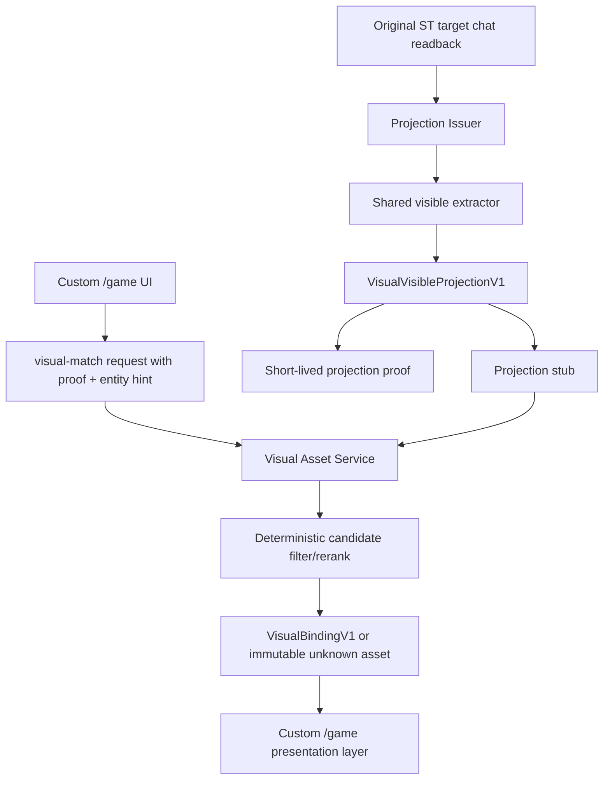

# AI Galgame 外置视觉系统开发规格

> 文档状态：visual asset docs-only review v1.5 / VS-DOCS-1..5 closure awaiting review  
> 生效日期：2026-07-30  
> 上位规则：`AGENTS.md`、`docs/GALGAME_NATIVE_FIRST_DEVELOPMENT_SPEC.md`  
> 总控文档：`docs/AI_GALGAME_VISUAL_ASSET_ENHANCEMENT_MODULE_PLAN.md`  
> 关联文档：`docs/AI_GALGAME_ADAPTIVE_PRESENTATION_SPEC.md`、`docs/AI_GALGAME_ULTIMATE_ADAPTIVE_COMPLETION_PLAN.md`、`docs/AI_GALGAME_FRONTEND_UI_IMPLEMENTATION_SPEC.md`、`docs/AI_GALGAME_IMPLEMENTATION_BACKLOG.md`

## 0. 当前用户范围纠偏

2026-07-30 用户重新确认：当前只要求“视觉资产匹配与扩展方案”的开发文档，不授权继续落视觉系统业务代码。

因此，本轮只保留和整理设计文档：

- 建立外置视觉资产库，资产类型限定为 `scene`、`character`、`equipment`、`item`、`skill`。
- 每张图由管理员预设标签、来源、授权和安全元数据，后续实现时按已发布 catalog/version/hash 精确引用。
- 匹配依据只能来自原版 SillyTavern 已读回、已经展示给玩家的可见聊天文本。
- 场景图、人物立绘、装备/道具/技能图标都只是 presentation layer，不改变原版 ST 剧情、聊天、Generate、角色卡、世界书、背包、技能或战斗权威。
- deterministic scorer 是首期基线；score `<20`、无候选、证据不足、服务不可用或安全校验失败时统一显示 type-specific immutable unknown。
- 上传、URI、图片解码、catalog 生命周期、旧存档版本绑定、异步非阻塞、CSP/XSS/隐私/日志脱敏仍作为正式开发文档必须保留的安全设计。
- Projection proof/stub、auth、hash、receipt、binding writer 等只作为未来生产实现的安全边界说明；本轮不授权实现或继续收口这些代码。
- VS-LLM 运行时视觉 LLM 匹配继续是独立后续 gate；当前文档不得宣称已实现，也不得让玩家端直接调用 provider。

已有 VS1-SG / VS1-PI / VS1-AS / VS1-M 相关代码和证据按用户要求保留，不删除、不回滚、不清理；但它们不属于本轮“只做开发文档”的交付范围，后续若要继续实现，必须由用户重新明确授权并重新走审查。

## 0.1 当前文档路由

本文件是视觉资产增强模块的详细协议附录；阶段顺序、当前范围、必需项/后置项和停机条件以 `AI_GALGAME_VISUAL_ASSET_ENHANCEMENT_MODULE_PLAN.md` 为准。VS-DOCS-1..5 的文档闭环已经在总控文档中展开，等待 reviewer。若本文件中的旧 VS1 阶段描述与总控文档冲突，以总控文档的 docs-only 范围为准。

## 1. 目标

本规格定义一个外置视觉系统，用于给自定义 `/game/` 前端增加场景图、人物立绘、装备图标、道具图标和技能图标。

核心目标：

- 原版 SillyTavern 完全不动。
- 剧情、聊天、世界书、角色卡、上下文和 Generate 仍由原版 SillyTavern 负责。
- 视觉系统只读取原版聊天已经展示给玩家的可见信息。
- 图片匹配只是展示增强，不产生剧情、背包、技能、获得、解锁、装备、关系或战斗状态。
- 第一阶段 VS1 只做 deterministic matching，不做玩家运行时 LLM。

本规格不批准代码实现。它是后续视觉系统代码准入前必须通过的正式开发材料；在用户重新授权前，所有视觉服务、匹配器、binding writer、玩家/管理员视觉 UI 都保持暂停。

## 2. 非目标

VS1 不做：

- 不修改 `src/**`、`server.js`、`plugins.js`、原版 `public/**`、`config.yaml`、root dependencies、startup scripts。
- 不创建第二套剧情、节点、分支、结局、背包、技能、战斗、好感或任务系统。
- 不让玩家运行时调用 LLM、导入助手或 provider。
- 不让视觉服务读取隐藏角色卡、世界书、prompt、context、preset、ST 内部内存或密钥。
- 不让视觉服务自行解析 SillyTavern 聊天。
- 不把图片匹配结果写回原版 ST 资源或聊天。
- 不在 manifest、save、binding 或日志中保存 provider response、完整聊天原文、上传原图正文、prompt/context/resource body。

VS-LLM 运行时 LLM 视觉匹配是后续单独 gate。VS1/VS1-SG 文档和代码不得调用、依赖或预埋 provider。

## 3. 允许架构

VS1 只允许以下可移除组件：

| 组件 | 允许位置 | 职责 |
| --- | --- | --- |
| Projection Issuer | 既有 config-service 或受控 ST adapter 边界 | 使用唯一 shared extractor 从目标 chat readback 生成可见投影与短期 proof |
| Visual Asset Service | `external-modules/visual-asset-service/**`，未来实现时需单独准入 | 管理素材库、验证上传、发布 catalog、执行 deterministic match、返回 unknown fallback |
| Visual shared contracts | `frontend/shared/**`，未来实现时需单独准入 | 严格 schema、proof/binding/profile 类型、纯展示 helper |
| Player visual layer | `frontend/player/**`，未来实现时需单独准入 | 加载已发布资产和绑定，用图片增强舞台，不改变对白/输入/Generate |
| Admin visual catalog UI | `frontend/admin/**`，未来实现时需单独准入 | 上传、验证、发布/回滚 catalog 和 profile，不复制 ST 功能 |

所有 static output under `public/game/**` 和 `public/game-admin/**` 必须由源码重建，不得手改。

## 4. 数据流



关键限制：

- visual service 不直接读 ST chat。
- `/game/` 不上传可见文本摘要作为事实。
- 服务端只信 Projection Issuer 生成的 stub + proof。
- 任意失败返回 unknown/default，不阻塞原版 Generate。

## 5. VisualVisibleProjectionV1

Projection 是视觉匹配的唯一可见事实投影。它不是剧情状态。

```ts
interface VisualVisibleProjectionV1 {
  schemaVersion: "galgame.visual-visible-projection.v1";
  projectionId: string;
  projectionHash: string;
  source: "target-chat-readback";
  releaseId: string;
  scenarioId: string;
  scenarioVersion: string;
  arcId: string;
  chatId: string;
  characterRef?: {
    mode: "single-character" | "multi-character" | "group";
    refHash: string;
  };
  sourceMessageIndex: number;
  sourceMessageHash: string;
  visibleTextDigest: string;
  locale: "zh-CN" | "en" | "mixed" | "unknown";
  entities: VisualProjectedEntityV1[];
  extractorVersion: string;
  dictionaryVersion: string;
  dictionaryHash: string;
  createdAt: string;
}

interface VisualProjectedEntityV1 {
  entityKey: string;
  entityType: "scene" | "character" | "equipment" | "item" | "skill" | "unknown";
  displayLabel: string;
  visibleAttributes: VisualVisibleAttributeV1[];
  confidenceBand: "explicit" | "probable" | "ambiguous" | "unknown";
}

interface VisualVisibleAttributeV1 {
  code:
    | "scene-location-kind"
    | "scene-atmosphere"
    | "character-explicit-name"
    | "character-explicit-appearance"
    | "character-explicit-clothing"
    | "character-explicit-species"
    | "character-explicit-gender-presentation"
    | "equipment-visible-label"
    | "equipment-visible-trait"
    | "item-visible-label"
    | "item-visible-trait"
    | "skill-visible-label"
    | "skill-visible-trait"
    | "status-visible-text-fragment";
  value: string;
  confidenceBand: "explicit" | "probable" | "ambiguous" | "unknown";
}
```

Schema rules:

- Root and nested unknown keys fail-closed.
- `projectionId` format: `vvp_[a-z0-9_-]{12,80}`.
- Hash format: `sha256:[a-f0-9]{64}`.
- `sourceMessageIndex` must be a non-negative integer.
- `entities` maximum: 32.
- `visibleAttributes` per entity maximum: 16.
- `displayLabel` maximum: 80 Unicode scalar values after normalization.
- Attribute `value` maximum: 120 Unicode scalar values.
- All strings must strip control characters and be HTML-escaped before UI display.
- `entityType: "unknown"` is allowed only inside VisualVisibleProjectionV1 to represent an unbindable visible fragment. It must not become a VisualAsset, VisualMatchResult or VisualBinding type.

Forbidden fields:

- `rawText`
- `prompt`
- `context`
- `resourceBody`
- `providerResponse`
- `regex`
- `script`
- `adminPattern`
- `dialogue`
- `choices`
- `nodes`
- `endings`
- `relationship`
- `inventoryState`
- `hpState`
- `ownership`
- `unlock`
- `effect`

## 6. Projection Issuer

Projection Issuer is the only trusted source for `VisualVisibleProjectionV1`.

Responsibilities:

1. Use the existing SillyTavern adapter to read the target chat.
2. Use the same shared pure extractor as the player display layer.
3. Generate a canonical projection.
4. Store a short-lived server-side projection stub.
5. Sign a short-lived projection proof.

It must not:

- Parse chat inside visual service.
- Read hidden original ST resources.
- Trust frontend submitted summaries.
- Store complete original messages.
- Store prompt/context/resource body.

## 7. Projection Stub And Proof

Projection stub fields:

```ts
interface VisualProjectionStubV1 {
  schemaVersion: "galgame.visual-projection-stub.v1";
  projectionId: string;
  projectionHash: string;
  sourceMessageHash: string;
  releaseId: string;
  scenarioId: string;
  scenarioVersion: string;
  arcId: string;
  chatId: string;
  profileId: string;
  profileHash: string;
  catalogId: string;
  catalogRevision: number;
  catalogHash: string;
  sourceMessageIndex: number;
  entities: VisualProjectedEntityV1[];
  extractorVersion: string;
  dictionaryVersion: string;
  dictionaryHash: string;
  expiresAt: string;
}
```

Projection proof fields:

```ts
interface VisualProjectionProofV1 {
  schemaVersion: "galgame.visual-projection-proof.v1";
  audience: "visual-asset-service";
  purpose: "visual-match";
  projectionId: string;
  projectionHash: string;
  sourceMessageHash: string;
  releaseId: string;
  scenarioId: string;
  scenarioVersion: string;
  arcId: string;
  chatId: string;
  profileId: string;
  profileHash: string;
  catalogId: string;
  catalogRevision: number;
  catalogHash: string;
  sourceMessageIndex: number;
  extractorVersion: string;
  dictionaryVersion: string;
  dictionaryHash: string;
  nonce: string;
  issuedAt: string;
  expiresAt: string;
  signature: string;
}
```

Validation:

- Proof must be HMAC or equivalent server-side signature.
- Frontend cannot sign proof.
- Replay cache is mandatory.
- Expired, mismatched, stale, cross-release, cross-chat, cross-profile, cross-catalog or wrong-audience proof fails.
- A missing stub fails.
- Stub hash mismatch fails.
- Failure returns unknown; it does not load active/default assets by guessing.

Shared schema guard note:

- A shared/browser-visible validator may validate proof shape, required fields, string lengths, timestamp format and forbidden keys only.
- It must not treat a structurally valid proof as authorized.
- HMAC verification, signer trust, replay cache, service-to-service stub readback and release/profile/catalog authorization belong only to the future Projection Issuer or visual service server boundary.
- If proof-related schema is rebuilt into `public/game/shared/**`, that output is build consistency only; the active player app must not call proof issuance, stub storage, binding writer, provider, recommendation or visual service administration APIs.

## 8. VisualAssetCatalogV1

```ts
interface VisualAssetCatalogV1 {
  schemaVersion: "galgame.visual-asset-catalog.v1";
  catalogId: string;
  catalogRevision: number;
  catalogHash: string;
  dictionaryVersion: string;
  dictionaryHash: string;
  status: "draft" | "validated" | "published" | "archived";
  assets: VisualAssetRefV1[];
  createdAt: string;
  publishedAt?: string;
  archivedAt?: string;
}

interface VisualAssetRefV1 {
  assetId: string;
  assetVersion: number;
  assetContentSha256: string;
  type: "scene" | "character" | "equipment" | "item" | "skill";
}
```

Rules:

- Published catalog revisions are immutable.
- New images require new `assetVersion` or new `catalogRevision`.
- Rollback restores exact previous revision.
- Unknown keys fail.
- Missing unknown assets fail catalog validation.

## 9. VisualAssetV1

```ts
interface VisualAssetV1 {
  schemaVersion: "galgame.visual-asset.v1";
  catalogId: string;
  catalogRevision: number;
  assetId: string;
  assetVersion: number;
  assetContentSha256: string;
  type: "scene" | "character" | "equipment" | "item" | "skill";
  title: string;
  caption?: string;
  tags: string[];
  localeTags?: string[];
  styleTags?: string[];
  negativeTags?: string[];
  assetUri: string;
  thumbnailUri: string;
  mime: "image/webp" | "image/png" | "image/jpeg";
  width: number;
  height: number;
  transparentBackground: boolean;
  safeCrop?: {
    mode: "cover-safe" | "contain" | "focus-anchor";
    anchorX?: number;
    anchorY?: number;
  };
  layerHint?: "background" | "sprite" | "icon" | "decorative";
  licenseCode?: string;
  sourceLabel?: string;
  status: "draft" | "validated" | "published" | "archived";
  createdAt: string;
  updatedAt: string;
}
```

Rules:

- `assetUri` and `thumbnailUri` must be service-generated content-addressed relative paths.
- Forbidden URI schemes: `http:`, `https:`, `data:`, `blob:`, `javascript:`, `file:`, UNC path, absolute filesystem path.
- `title`, `caption`, `sourceLabel` are untrusted display metadata; escape in UI and never execute as HTML/Markdown.
- Tags must be bounded strings or fixed codes; tag dictionary version/hash determines scorer behavior.
- `licenseCode` and `sourceLabel` are admin metadata only; they are not runtime fetch URLs.
- `type: "unknown"` is not a valid asset type in VS1-SG. Unknown display is represented by one immutable type-specific fallback asset for each bindable type, such as `unknown_equipment` with `type: "equipment"`.

## 10. Immutable Unknown Assets

VS1 requires one immutable unknown asset per type:

| Type | Asset id |
| --- | --- |
| scene | `unknown_scene` |
| character | `unknown_character` |
| equipment | `unknown_equipment` |
| item | `unknown_item` |
| skill | `unknown_skill` |

Rules:

- Unknown assets are service-owned.
- They are part of every published catalog revision.
- They have exact version/hash.
- Score below 20 always resolves to the corresponding unknown asset.
- Candidate empty, proof invalid, projection stale, asset missing, hash mismatch, service timeout, dictionary unavailable and provider failure all resolve to unknown.
- UI displays friendly fallback, not technical errors.

## 11. AdminVisualProfileV1

```ts
interface AdminVisualProfileV1 {
  schemaVersion: "galgame.admin-visual-profile.v1";
  profileId: string;
  profileRevision: number;
  profileHash: string;
  catalogId: string;
  catalogRevision: number;
  catalogHash: string;
  templateCode: "visual-novel" | "rpg-adventure" | "romance-social" | "mystery-investigation" | "management-sim" | "sandbox-roleplay";
  enabledTypes: ("scene" | "character" | "equipment" | "item" | "skill")[];
  priorityRules: VisualPriorityRuleV1[];
  scenePolicy: "ttl-message-count" | "ttl-time" | "manual-disabled";
  characterPolicy: "session-fixed-on-first-explicit-appearance" | "silhouette-only-until-explicit";
  equipmentPolicy: "display-binding-on-first-visible-label";
  itemPolicy: "display-binding-on-first-visible-label";
  skillPolicy: "display-binding-on-first-visible-label";
  threshold: number;
  allowProviderMatcher: false;
  allowAdminPatterns: false;
}

interface VisualPriorityRuleV1 {
  type: "scene" | "character" | "equipment" | "item" | "skill";
  weight: number;
}
```

Rules:

- `allowProviderMatcher` must be false in VS1.
- `allowAdminPatterns` must be false in VS1.
- Profile cannot contain regex, free prompt, provider config, asset URLs, ST resource body, fact values, HP/inventory/skill truth, or secrets.
- Profile is versioned and published with exact hash.
- Old save uses the profile it was created with.

## 12. Entity Key

`entityKey` is a presentation cache key only.

Rules:

- Format: `entity_<type>_<digest>`.
- Character set: `[a-z0-9._:-]`.
- Maximum length: 96.
- Derived from normalized visible label/type/source scope.
- Matching result cannot change entityKey.
- Asset id cannot become entity identity.
- It must not represent ownership, unlock, equipped state, learned skill, relationship or plot condition.

Collision behavior:

- Same visible label/type/scope should reuse entityKey.
- Clearly different visible entities with same label get short digest suffix.
- Ambiguous collision returns unknown instead of assigning the wrong image.

## 13. Confidence And No-Guess Rules

### 13.1 Character

Concrete character sprite binding requires:

- explicit visible name/speaker identity; and
- explicit visible appearance evidence, such as clothing, species, gender presentation, body, age band or other concrete description; or
- an admin-published non-factual silhouette/template policy.

If only probable or ambiguous identity/appearance exists:

- score cap is 19;
- service returns `unknown_character` or neutral silhouette;
- no fixed portrait is created.

Forbidden inference:

- Do not infer race/gender/age/body from name, job, weapon, faction, mood or dialogue style.
- Do not let probable/ambiguous evidence reach normal/high confidence.
- Do not change a fixed portrait without a new explicit source message/evidence digest.

### 13.2 Scene

Scene may use explicit environment wording:

- "废旧木屋"
- "雨夜街道"
- "地下墓室"
- "贵族宴会厅"

Ambiguous mood may create only low-confidence display and must remain short-lived. It is not story state.

### 13.3 Equipment, Item, Skill

Binding requires explicit visible label:

- Equipment: "生锈短刀", "长弓", "Scale mail"
- Item: "铜制乌鸦徽记", "黑羽毛"
- Skill: "火球术", "潜行", "Medicine"

Forbidden inference:

- Do not create item from a natural-language mention alone.
- Do not infer obtained/owned/equipped/learned.
- Do not infer item effects or RPG rules.
- Do not compute AC/damage/charges/cooldown.

Missing label returns hidden/unknown. Missing traits may still show low-confidence label-only icon if score reaches threshold; otherwise unknown.

## 14. Deterministic Scorer

VS1 scorer input:

- trusted projection stub entity;
- published catalog revision;
- published admin visual profile;
- versioned dictionary.

VS1 scorer output:

```ts
interface VisualMatchResultV1 {
  schemaVersion: "galgame.visual-match-result.v1";
  matchId: string;
  bindingId: string;
  entityKey: string;
  type: "scene" | "character" | "equipment" | "item" | "skill";
  catalogId: string;
  catalogRevision: number;
  catalogHash: string;
  visualProfileId: string;
  profileHash: string;
  evidenceDigest: string;
  projectionId: string;
  sourceMessageIndex: number;
  sourceMessageHash: string;
  assetId: string;
  assetVersion: number;
  assetContentSha256: string;
  matcherVersion: string;
  scorerVersion: string;
  dictionaryVersion: string;
  dictionaryHash: string;
  score: number;
  scoreBand: "unknown" | "low" | "medium" | "high";
  reasonCodes: VisualMatchReasonCodeV1[];
  usesLlm: false;
  createdAt: string;
  expiresAt?: string;
}
```

Allowed reason codes:

- `explicit-visible-label`
- `explicit-appearance`
- `type-match`
- `tag-overlap`
- `locale-match`
- `style-match`
- `negative-tag-conflict`
- `ambiguous-appearance-capped`
- `missing-visible-label`
- `scene-ambiguous-low-confidence`
- `candidate-empty`
- `asset-missing`
- `hash-mismatch`
- `proof-invalid`
- `projection-stale`
- `dictionary-unavailable`
- `unknown-fallback`

Unknown reason codes fail.

Score rules:

- Score is 0..100 integer.
- Score < 20 becomes unknown.
- Candidate empty becomes unknown.
- Character probable/ambiguous appearance cap is 19.
- Equipment/item/skill without explicit label cap is 0.
- Service finalizes score; frontend cannot override.
- VisualMatchResult never uses `type: "unknown"` in VS1-SG. It keeps the bindable entity type and points to that type's immutable unknown asset when a fallback is required.

Provenance rules:

- `catalogId/catalogRevision/catalogHash`, `visualProfileId/profileHash`, `evidenceDigest`, `projectionId`, `sourceMessageIndex/sourceMessageHash`, `matcherVersion/scorerVersion/dictionaryVersion/dictionaryHash`, `createdAt` and `expiresAt` are service-derived.
- The player browser cannot provide or override these fields.
- `VisualMatchResultV1` must be immediately checkable against the current projection stub/proof, active or old-save release scope, published visual profile and catalog revision.
- The player layer and service cache must reject stale or cross-version match results before display.
- Hash, scope, profile, catalog, dictionary or projection mismatch resolves to immutable unknown and must not fall back to active/latest assets.
- A later `GET /v1/bindings/:bindingId` may return the same provenance again, but it cannot be the only source of provenance needed to validate a fresh visual-match response.

## 15. Dictionary Versioning

Dictionary package:

```ts
interface VisualDictionaryV1 {
  schemaVersion: "galgame.visual-dictionary.v1";
  dictionaryVersion: string;
  dictionaryHash: string;
  tagCodes: string[];
  synonyms: Record<string, string[]>;
  negativeTags: Record<string, string[]>;
  weights: Record<string, number>;
}
```

Rules:

- Dictionary hash covers tags, synonyms, negative tags and weights.
- Binding records dictionaryVersion/hash.
- Old bindings are not recomputed under a new dictionary.
- If old dictionary is unavailable, restore exact old asset or unknown; never rebind to active catalog by default.

## 16. VisualBindingV1

```ts
interface VisualBindingV1 {
  schemaVersion: "galgame.visual-binding.v1";
  bindingId: string;
  bindingType: "scene" | "character" | "equipment" | "item" | "skill";
  entityKey: string;
  releaseId: string;
  scenarioId: string;
  scenarioVersion: string;
  arcId: string;
  chatId: string;
  sourceMessageIndex: number;
  sourceMessageHash: string;
  evidenceDigest: string;
  projectionId: string;
  visualProfileId: string;
  profileHash: string;
  catalogId: string;
  catalogRevision: number;
  catalogHash: string;
  assetId: string;
  assetVersion: number;
  assetContentSha256: string;
  matcherVersion: string;
  scorerVersion: string;
  dictionaryVersion: string;
  dictionaryHash: string;
  score: number;
  scoreBand: "unknown" | "low" | "medium" | "high";
  reasonCodes: VisualMatchReasonCodeV1[];
  bindingPolicy: "scene-ttl" | "session-fixed" | "entity-first-seen-fixed" | "unknown";
  idempotencyKey: string;
  createdAt: string;
  updatedAt: string;
  expiresAt?: string;
}
```

Lifecycle:

- Scene binding may refresh only by TTL or monotonic message sequence.
- Character binding is session/save fixed after explicit evidence.
- Equipment/item/skill binding is fixed for first visible label.
- Old save restores exact release/profile/catalog/asset hash.
- Asset missing/hash mismatch/archived returns unknown.
- Binding write is idempotent.
- Conflicting binding write is rejected, not overwritten.
- VisualBinding never uses `bindingType: "unknown"` in VS1-SG. Unknown fallback bindings retain the bindable type and exact immutable unknown asset id/version/hash.

## 17. Save Compatibility

Player save may reference visual binding ids and exact visual profile/catalog hashes only as UI display state.

Allowed save additions in a future code phase:

```ts
interface VisualSaveStateV1 {
  visualProfileId: string;
  visualProfileHash: string;
  catalogId: string;
  catalogRevision: number;
  catalogHash: string;
  bindingIds: string[];
}
```

Forbidden save additions:

- obtained items
- inventory state
- equipped state
- skill learned
- scene truth
- NPC identity facts
- relationship state
- HP/AC/gold/XP truth

Old save behavior:

- Exact old visual assets if available.
- Unknown fallback if exact asset/catalog/profile missing.
- No rebind to active catalog.
- No silent migration without a reviewed migration rule.

## 18. Upload Security

Admin upload requirements:

- Real admin auth/proxy; hidden route is not authentication.
- MIME sniff.
- Decode and re-encode image.
- Reject SVG.
- Reject polyglot files.
- Reject damaged images.
- Reject zip bombs and extreme compression ratio.
- Pixel count limit.
- File size limit.
- Batch size limit.
- Strip EXIF and unsafe metadata.
- Quarantine temp files.
- Atomic content-addressed write.
- Hash-identical upload is idempotent.
- Same asset id with different hash requires new version or conflict review; no overwrite.

Image storage:

- Relative content-addressed paths only.
- No arbitrary external URL runtime loading.
- No SSRF path.
- No path traversal.
- No absolute filesystem path in public contract.

## 19. API Matrix

| API | Caller | Auth | Purpose | Forbidden |
| --- | --- | --- | --- | --- |
| `POST /v1/admin/assets/upload` | admin | external auth/proxy | Upload draft image | Player access, no-auth access, arbitrary URL |
| `POST /v1/admin/catalogs/validate` | admin | external auth/proxy | Validate draft catalog | Publish invalid assets |
| `POST /v1/admin/catalogs/publish` | admin | external auth/proxy | Publish immutable catalog revision | Silent replacement |
| `POST /v1/admin/catalogs/rollback` | admin | external auth/proxy | Restore previous catalog revision | Delete user assets |
| `GET /v1/assets/:assetId/:version` | player/admin | proof scoped read | Read exact published asset | Draft search, arbitrary path |
| `POST /v1/visual-match` | player | visual projection proof | Deterministic match for current projection entity | Client facts, runtime LLM, ST Generate |
| `GET /v1/bindings/:bindingId` | player/admin | proof scoped read | Read exact binding | Cross-chat search |
| `POST /v1/bindings` | service-internal binding writer only | visual proof + idempotency | Create deterministic display binding after `visual-match` validation | Browser-direct writes, shared/player exported client, gameplay ownership state |

All player APIs require short-lived proof. CORS is not authorization.

Binding writer rules:

- The player browser cannot directly call `POST /v1/bindings`.
- Shared/player code must not export a browser binding-writer client or convenience wrapper.
- `/game/` calls `POST /v1/visual-match`; the visual service validates proof, projection stub, scope, catalog/profile hashes, dictionary hash, idempotency and conflict state.
- Only after validation may the service-internal binding writer create or reuse a binding.
- Binding writer conflicts fail closed; they do not overwrite existing binding or create gameplay state.

## 20. Frontend Rendering Requirements

Scene:

- Background layer uses safe crop.
- Text remains readable on desktop/mobile.
- Reduced motion disables animated transition.
- Failure shows neutral background/unknown scene.

Character:

- Transparent PNG appears beside dialogue or stage layer.
- Unknown/silhouette if explicit appearance missing.
- It never covers input, actions or status panels.

Equipment/item/skill:

- Icons appear in status/detail UI only for visible labels.
- Details still show original visible text.
- No "unlocked", "owned", "equipped", "learned", "effect" claim unless visible ST text itself says it, and even then it is displayed as text, not computed state.

Accessibility:

- Decorative background `aria-hidden=true`.
- Meaningful icon has short alt generated from asset title/type, not raw provider text.
- Focus order unchanged.
- Dialog/drawer keyboard behavior remains from existing UI spec.
- Image load failure does not trap focus or block input.

## 21. VS-LLM Strict Provider Gate

VS-LLM is not part of VS1 deterministic implementation and is not part of VS1-SG schema/proof guard implementation.

If later proposed, VS-LLM must meet at least UAP1/UAP2 strictness:

- Provider called only by service.
- Player never holds provider key.
- Provider receives only minimal feature bag and server-filtered candidates.
- Provider may return only candidate `assetId`, bounded score and fixed reason codes.
- Provider cannot return URL, metadata, caption, prompt, resource body, regex, script, free reason text, entity facts, ownership or gameplay state.
- `matchId`, `evidenceDigest`, `catalogRevision`, `matcherVersion`, `usesLlm` are service-derived.
- Unknown key, wrong type, out-of-range score, replay, stale scope, oversized JSON, prompt-injection-shaped output all fail-closed to deterministic/unknown.
- Provider failure never blocks ST Generate.

## 22. Test And Evidence Matrix

VS1 formal code admission must define and later implement these tests before any code PASS:

| Gate | Required evidence |
| --- | --- |
| Schema closed tests | Unknown root/nested key, forbidden fields, type/range/size/duplicate/prototype pollution rejected for Projection/Asset/Profile/Binding |
| Projection proof tests | Valid proof accepted; expired/replayed/cross-chat/cross-release/hash mismatch/stub missing rejected |
| No visual-service chat parsing audit | Static audit proves visual service does not call ST chat APIs or duplicate extractor |
| Deterministic scorer tests | Explicit label selects candidate; score <20 unknown; character ambiguous cap; equipment without label cap 0 |
| Unknown assets tests | Missing/invalid asset resolves immutable unknown exact id/version/hash |
| Upload security tests | MIME sniff/re-encode/SVG/polyglot/zip bomb/path traversal/over-size rejected |
| URI security tests | http/data/blob/javascript/file/absolute path rejected |
| Catalog lifecycle tests | draft->validated->published->archived/rollback, immutable published asset versions |
| Old save tests | Old catalog/profile exact restore; missing/hash mismatch unknown; no active fallback |
| Player leak tests | No prompt/context/resource body/raw chat/provider response/localStorage leak |
| Native-first architecture | No ST backend/original public/root/startup diff; no direct bottom generate; no local scripted fallback |
| UI rendering | Desktop/mobile scene, sprite, icon, unknown fallback, reduced motion, focus, alt/aria |
| Failure semantics | visual service down/proof invalid/provider unavailable never blocks ST Generate/input/save |

## 23. VS1 Development Phases

VS1 code work is not approved by this document alone. Under the current user scope correction, even previously prepared or partially implemented VS code paths are paused and preserved as historical work. Future work should be split only after explicit user reauthorization:

| Phase | Scope | Notes |
| --- | --- | --- |
| VS1-SG | Shared schemas and pure contract guards | Future optional implementation gate; currently paused unless user reauthorizes code |
| VS1-PI | Projection Issuer design and proof tests | Future optional implementation gate; proof/stub remains a safety boundary in docs only |
| VS1-AS | Asset security/catalog implementation | Future optional implementation gate; visual-asset-service code is not current deliverable |
| VS1-M | Deterministic scorer and binding lifecycle | Future optional implementation gate; current matcher/binding work is paused and must not be marked done |
| VS1-P | Player visual rendering layer | Future optional implementation gate; presentation-only, no gameplay state |
| VS1-A | Admin catalog/profile UI | Future optional implementation gate; beginner-safe, auth boundary explicit |
| VS1-R | Full regression and reviewer gate | Future optional implementation gate; static, browser, save/old catalog, failure semantics |

Each future phase must update `.codex-longrun` state, receive explicit user authorization, and pass reviewer gates before implementation. Until then, this document is the current deliverable.

## 24. Current Deferred / No-Claim

Still deferred:

- VS-LLM runtime LLM visual matcher.
- Real provider visual scoring.
- Generated images/video.
- Preset/instruct/system/context runtime switching.
- Regenerate/undo/swipe/group/Quick Reply.
- Frontend gameplay calculations.
- Chapter/ending judgment.
- Player runtime LLM assistant.

No UI may claim these are available until separate contracts, tests and reviewer PASS exist.
