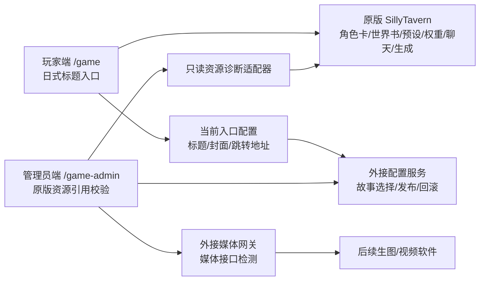
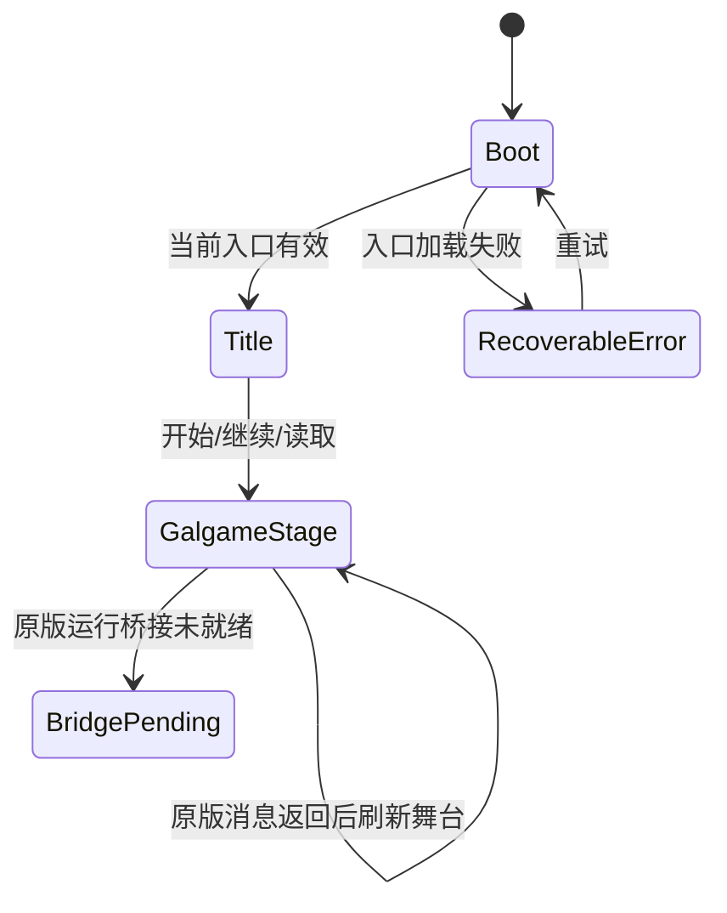

# AI Galgame 前端开发与外接接口规范

## 当前：2026-10-10 旁白页标题的结构证据覆盖

长消息中的混合叙述/对白可能仍按原分页器显示为旁白页。标题层会在页面含引语时调用既有完整消息结构解析器；parser 的 rank 0–2 唯一说话人/群体证据经同一规则契约校验，rank 3/default 证据不覆盖旁白标题。只有精确验证到当前页的 `speaker`/`group` 证据时，才投影标题。旁路不更改 semantic type、身份/视觉角色、正文、分页或 sourceSpan；无明确说话人时继续原有兜底。规格与验收边界见 `GALGAME_NARRATION_SPEAKER_TITLE_PROJECTION_FIX_TASKSPEC_2026-10-10.md`。

## 当前：2026-10-10 LLM 感知复位恢复

现有复位控件委托本机 supervisor 执行有界进程恢复，随后刷新服务/LLM 状态，并只重新投影当前绑定聊天。运行桥仅在 LLM 传输失败且取得关闭闸门后可被替换；闸门阻止新生成并证明没有生成正在运行。详见 `GALGAME_RESET_LLM_AWARE_RECOVERY_TASKSPEC_2026-10-10.md`。

## 当前：2026-10-09 V87 本地强证据标题快路径（parser v86）

当语义投影为未归属对白，而当前生产页面已经有 runtime-text 人物候选时，先跑既有完整结构解析器；rank 0 明确发言 cue 可立即修正显示标题，不等待可选世界书候选请求。其它情况保留旧流程。不会更改正文分页、sourceSpan、语义类别、身份或头像绑定。详见 `GALGAME_SPEAKER_ATTRIBUTION_V87_LOCAL_EVIDENCE_FAST_PATH_TASKSPEC_2026-10-09.md`。

## 历史：2026-10-09 V86 复合职务称谓引语归属（parser v86）

所有剧本共用 V86 shared parser，闭合冒号引语可使用有证据支持的复合职务称谓；无证据任意名词、书面载体/心理活动/并列主体继续拒绝。只影响 display-title evidence，不改 production segmenter、正文分页、source spans 或身份投影。详见 `GALGAME_SPEAKER_ATTRIBUTION_V86_COMPOUND_ROLE_QUOTE_TASKSPEC_2026-10-09.md`。

## 历史：2026-10-09 V85 局部人物主体引语归属（parser v84）

所有剧本共用 V84 shared parser，闭合冒号引语可使用唯一人物主体归属；书面载体/心理活动/并列主体仍保持拒绝。只影响 display-title evidence，不改 production segmenter、正文分页、source spans 或身份投影。详见 `GALGAME_SPEAKER_ATTRIBUTION_V85_LOCAL_ACTOR_QUOTE_RECOVERY_TASKSPEC_2026-10-09.md`。

## 历史：2026-10-09 V84 跨剧本结构规则（当时 parser v83；已由顶部 V86/parser v86 继承）

Player memo/cache 为 `full-message-speaker-index.v83`。所有剧本共用同一套结构规则，动态姓名按当前剧本/聊天隔离；生产端与 replay 同版本。v78+ 累积规则均通过数字版本门槛继承。只投影既有页面标题，production segmenter、正文 formatter、页数组与 source spans 保持原样。历史覆盖不等于准确率，缺少完整 gold 时仍为 `INSUFFICIENT_EVIDENCE`。详见 `GALGAME_SPEAKER_ATTRIBUTION_V84_CROSS_SCENARIO_RULE_ACTIVATION_TASKSPEC_2026-10-09.md`。

## Historical record: 2026-10-09 v77 speaker title projection

历史 parser/cache 版本为 `full-message-speaker-index.v77`，包括引语后的声音/语气报告、句首动作主体冒号引语和最近明确动作主体规则。当前行为以页面顶部 V86 条目为准。只投影现有页标题，不改正文 formatter、segmenter、页数组与 source spans。详见 `GALGAME_SPEAKER_ATTRIBUTION_V77_TASKSPEC_2026-10-09.md`。

## 2026-10-09 v76 historical speaker title projection

v76 为历史 cache namespace；当前行为和版本以文档顶部 V86 契约及 parser v86 实现为准。详情见 `GALGAME_SPEAKER_ATTRIBUTION_V76_TASKSPEC_2026-10-09.md`。

## 2026-10-09 v75 speaker title projection

v75 为历史版本；当前行为与证据以文档顶部 V86 契约及 parser v86 实现为准。

播放器的结构说话人 memo/cache 版本为 `full-message-speaker-index.v75`。它继承 v74 的局部名册主体规则，并在句首连接词后按精确名册边界识别同一子句内的说话 cue；候选保护和证据 rank 不变，等强冲突继续不猜。竞争主体、报告/铭文/其他信息来源、普通邻句提名和 roster 外姓名继续拒绝归属。旁白 fallback replay 单独汇总 `noUniqueNarratorFallbackNatureCounts`，保留原互斥结果类别，不表示其语义类型已改成旁白。此优化只投影标题，production page 生成与 source spans 保持冻结。具体边界和用例见 `GALGAME_SPEAKER_ATTRIBUTION_V75_TASKSPEC_2026-10-09.md`。

## 2026-10-09 v73 历史版本：代词发声回指；v72 邻句姓名猜测停用

v73 是 v74 的前一版本；其代词回指边界和历史结果见 `GALGAME_SPEAKER_ATTRIBUTION_V73_TASKSPEC_2026-10-09.md`。运行时/cache 当前版本与准确率声明以本文件顶部 V86 段为准。

## 2026-10-09 v72 局部姓名兜底与 scope 防污染

历史版本说明；v72 的宽松邻句人名猜测已由 v73 退役。

在既有归属候选全部为空时，闭合引语可从同句及紧邻前后句中选引号外的已知姓名；同优先级多个候选取源文本最先出现的一个。代词/泛称主体接管、并列动作、思考/书面载体和场景边界会阻断候选。聊天内观察到的姓名继续要求两条不同消息中的高置信显式署名，并只保留最近 8 条消息；单锚点试验会传播错误姓名，未进入运行配置。parser/cache namespace 为 v72。只改变 display-title evidence。TaskSpec：`GALGAME_SPEAKER_ATTRIBUTION_V72_TASKSPEC_2026-10-09.md`。

## 2026-10-09 v70 邻句已知姓名+发声线索末级兜底

`full-message-speaker-index.v70` 在现有归属规则全部无候选后、旁白显示兜底前，有限检查目标句及前/后紧邻句；必须同时命中已知姓名与发声 cue，且唯一、无其他人物主体或边界冲突。仅生成可重算的展示标题 evidence；正文、分页、source span、聊天、身份和头像都保持不变。实现与历史回放见 `GALGAME_SPEAKER_ATTRIBUTION_V70_TASKSPEC_2026-10-09.md`。

## 2026-10-09 v69 标题署名扩展

说话人标题证据可在目标引语前后各两句的有界窗口中查找明确署名。候选按是否直接绑定目标 quote、是否跨越其他引语/场景/文书边界及句距排序；同级异人不做猜测。不得改变 SillyTavern 原版分页、正文、source span 或聊天数据。详细实现与验收见 `GALGAME_SPEAKER_ATTRIBUTION_V69_TASKSPEC_2026-10-09.md`。

## 2026-10-09 v68 同句主体动作与引语闭合

`full-message-speaker-index.v68` 在同一消息、直接引出冒号引语的局部结构中综合唯一主体与动作/状态关系；不把前页独立描述扩展成 speaker anchor。书面载体、共同动作、多主体冲突和静态外貌/状态仍 abstain。只投影标题 evidence，不修改正文段、production page spans、分页、页序或数量。细节与验收记录见 v68 TaskSpec。

## 2026-10-09 v67 结构标题的代词续接

`full-message-speaker-index.v67` 为完整独立引语增加有界的跨页代词承接：前页显式 speaker anchor 与紧邻 pronoun-action narrative frame 一致时，将下一句标题归回该 speaker；匹配失败、载体文本、场景边界和竞争证据继续 fallback。sourceSpan、正文页分割、页序及数量均不改；规则只产生标题 evidence。完整协议与回放结果见 `GALGAME_SPEAKER_ATTRIBUTION_V67_TASKSPEC_2026-10-09.md`。

## 2026-10-09 v65 同源 cue 边界和跨页 evidence 投影（实现回放完成，独立 A1 待审）

历史剩余样例的 quote resolver 已将“瑞恩小声说”归属瑞恩，page-local 姓名正则却贪婪地把“小声”并入姓名，造成假同级冲突。相同 quote、相同完整 cue evidence span、相同姓名起点的前缀分段差异，使用 message-level quote winner；真正不同 cue/起点仍 abstain。冲突/旁白 evidence 只映射至当前已有 page core，replay 检查相交 quote ledger 并隐藏无效 projection text。全历史只读 replay 的 unresolved 候选由 2 降为 0；这只是 coverage 分类变化，不是准确率证明。只更新展示标题 sidecar/replay report，不改正文、segmenter、page builder、identity、roster、avatar 或原版代码。独立 A1 待审。详见 v65 TaskSpec。

## 2026-10-09 v64 当前 quote resolver 与 probable-title 安全门（实现回放完成，整体独立 A1 证据不足）

page-local `姓名 + speech cue + quote` 作为精确 source-span 候选进入同一 resolver；与已有 top decision 同 rank 的异人导致 abstain。已有四字段 probable hint 仅能产生 `姓名（推测）` 展示标题；如果同一 quote 已归属其他人或有冲突则不显示，且不触碰 identity/roster/avatar。全历史只读 replay：158 chats、950 assistant messages、18,562 pages、6,094 candidates（3,937 attributed、223 anonymous、1,932 narrator fallback、2 unresolved）；digest `sha256:5b77a344284bcdccfa8c3df54e2fbfb0bf9fb289e5fc915b3031915022626a20`，158 chats / 18,562 pages 的 roster scope unavailable。748 probable hints 的 source span 均有效；539 被同 quote 决议门阻断、209 未被此门阻断，这些不是准确率，也不等于 replay 中实际展示数；accuracy `INSUFFICIENT_EVIDENCE`。source unchanged、无聊天写回、无 provider 调用。adapter 1/1、speaker replay 60/60、runtime regressions 58/58、player/admin build、DOM smoke、diff-check 通过。静态架构审计按任务限制未执行；独立 A1 未发现 resolver 明确缺陷，但无法核实 v64 分页起点快照，整体为 `INSUFFICIENT_EVIDENCE`。冻结 segmenter slice 3,453 bytes / SHA-256 `a88752786dd13250fa269d75b9489b374931429c90164de6c18f41b41a1eae3d`；真实 browser/mobile 未验收。产物 hash 和测试复现命令见 `GALGAME_SPEAKER_ATTRIBUTION_V64_TASKSPEC_2026-10-09.md`。

## 2026-10-09 v63 当前 quote 决议优先于历史标题桥接（回放完成，独立 A1 待复审）

v63 Player 标题侧车先检查当前页 core 相交 quote decision，再考虑 historical heading/pronoun bridge。唯一 source attribution 与当前冲突阻止旧桥覆盖/填补；普通未归属 quote 仍可使用原有的唯一、有界连续关系。协议只消费现有 production page spans，不改 segment/page 字段、正文、body formatter、identity、roster、头像或游戏状态。全历史只读回放命令 `node frontend/player/tools/speaker-structure-replay.mjs`：158 chats、950 assistant messages、18,562 pages、6,094 candidates（3,998 attributed、213 anonymous、1,883 fallback、0 unresolved）；digest `sha256:5b77a344284bcdccfa8c3df54e2fbfb0bf9fb289e5fc915b3031915022626a20`；158 chats / 18,562 pages 的 roster scope unavailable；`sourceUnchanged=true`、`chatWriteback=false`、`externalProviderCalls=0`。分桶保持 coverage-only，不代表 accuracy（`INSUFFICIENT_EVIDENCE`）。adapter 1/1、speaker replay 60/60、runtime 57/57、player/admin static build、DOM smoke、static architecture audit、`git diff --check` 均通过。冻结 segmenter source slice 3,453 bytes / SHA-256 `a88752786dd13250fa269d75b9489b374931429c90164de6c18f41b41a1eae3d` 前后相同；原版 SillyTavern source 没改。真实 browser/mobile UI 未验收；独立 A1 复审待执行。实现范围见 v63 TaskSpec。

`node frontend/build-static.mjs` v63 产物 SHA-256：player app `public/game/app.js` `A7AEF9E1F2C23D2D3FF8A8BB9578CC11098512F930C463B38D85F321D69EBD69`，player index `8216F83DABFF9EB30B313B00515ADDCD0E3A29DAE4F7F22BBF8A00E4E436FD25`，共享 adapter `3C4EA09E05CF4BF35A0490F3ABEC059B55B7AAC54BCA026D3AB28031213AC63E`；admin app `1045A549033948C22B889B488997B64398D01F5004B33FFCD515F8121857CD81`，admin index `35F12C72AB18231363EA6A43075EA83CA1FE3CB033B48C298BDE55D718A2CB91`。

## 2026-10-08 v60 逐引语 evidence projection

Player title adapter 对原消息中的每段 quote 独立建立 source span，并合并引语前句、引语后句及前两张既有 production page 的 source evidence；多候选先按明确署名、唯一动作主体、相邻原文主体、前页显式发言 anchor/唯一动作主体排序，句法角色优先于词面距离。静态姓名介绍不单独证明 speaker。嵌套 quote 与开放 quote 保留边界；开放 quote 可继续分析但不可吞并其后独立引语。书面载体、拟声、场景边界及同级冲突阻止猜测。投影仅更新 display title metadata；不得改变现有分页/段落、正文、annotation、角色数据或 SillyTavern source。验收标准见 v60 TaskSpec。

## 2026-10-08 v59 两页内代词说话人续接

标题只可在同一条原版 assistant 消息的前两张既有显示页中存在唯一、最近的显式 speaker source anchor，且当前页是“代词主体 + 动作/状态框架 + 冒号 + 配对引语”时沿用该角色。依据 source span，不使用已渲染标题文字。标题、记录、场景切换、竞争说话人、新具名主体、音效、书面载体和非对白页都会阻断续接。该能力只写入标题元数据，不改分页、正文、annotation、identity、roster 或视觉数据。测试和回放边界见 v59 TaskSpec。

## 2026-10-08 v57 标题证据局部归属

标题侧车可从同一消息中紧邻闭合引语的唯一具名动作主体取得说话人证据；跨现有显示页的连续引语仅沿同一原始 quote span 保留归属。正文页数组、原文和 source spans 仍完全由 SillyTavern 原有分页结果决定。文书/公告 carrier、单纯物件交接、无唯一代词锚、场景边界、新说话人或音效后新分句会阻断人物归属；声音词本身不生成 speaker。该规则只影响 display title，不创建 identity/roster/avatar，也不修改 semantic annotation、renderer、页构造或原版代码。

v57 exact history gold 4/4、边界 negatives 7/7，另有直接动作续接正例；全历史 158 chats / 950 messages / 18,562 unchanged pages 中有 6,112 dialogue candidates：4,046 attributed、148 anonymous、1,918 narrator fallback、0 unresolved。SFX 只通过紧邻动作谓词或窄声音框架续接唯一局部主体，新名词事件切断关联。来源 digest unchanged，无聊天写回、无 provider 调用。覆盖数字不是准确率；v56/v57 缺少可直接比较的逐页金标，`speakerAccuracy=INSUFFICIENT_EVIDENCE`。构建、分页冻结和审计证据见 v57 TaskSpec 与历史回放计划。

## 2026-10-08 v56 匿名说话标题投影边界

对已有生产页的 display-title evidence 增加一条窄规则：只有同一消息的匿名实体引入、先前语言对白、紧邻的匿名代词发声谓词和当前闭合语言引语连成局部证据链时，当前页可显示“？？？”。不从引语里的自称提取姓名，结果必须保持 `speakers=[]`；不得创建 speaker identity、roster、人物头像或视觉资源绑定。书面通知/公告等 carrier quote 仍显示“旁白”，没有语言引语的音效/描述也不会变为匿名角色。它不改语义 annotation、正文、source span、页面数量/顺序/分页或 renderer/asset resolver。其它闭合对白继续沿用 narrator display fallback。

精确生产页、负例、全历史只读回放及静态构建证据见 `docs/archive/speaker-attribution/GALGAME_SPEAKER_ATTRIBUTION_V56_TASKSPEC_2026-10-08.md` 与历史回放计划。

v56 全历史只读 replay：158 chats、950 messages、18,562 existing pages、6,240 dialogue candidates；4,524 attributed、140 anonymous、1,576 narrator fallback、0 unresolved。新增 22 页全部是同一 Gribble 源页的重复归档（归一化内容指纹一致），因此只是覆盖迁移；不代表 22 个独立 gold 或准确率改善。测试、静态构建和 source freeze 证据见 v56 TaskSpec 与历史回放计划。

## 2026-10-08 v54 标题证据实现边界

玩家端继续使用原版生产分页作为唯一页数组/顺序/source span 来源。结构化标题解析只消费已有正文 span：对同消息中的具名发声/动作关系、真正仍未闭合的同一对白和最近唯一同场景代词锚生成标题证据；粒子“也/则/把”不属于人物名。报告/账本书写、单独递交物件和匿名声线描述不推断人物；匿名或冲突证据不借角色身份。`role=narrator` 仍仅表示 display-only 旁白 fallback，并使用中性 narrator channel，不创建 speaker identity 或头像绑定。

v54 六条真实历史标题 gold 6/6；聚焦 suite：runtime 57/57、renderer 1/1、shared 1/1、speaker replay 47/47。全历史 replay：6,242 候选、4,519 attributed、118 anonymous、1,605 narrator fallback、0 unresolved；指标是分类覆盖，不能解释为准确率。player/admin staging build、完整 architecture audit、DOM smoke、cache coherence、frozen segmenter hash 和 diff-check 均通过，精确摘要与输出 hash 见 v54 TaskSpec/历史回放计划；独立 A3 audit 仍待执行。源文/分页和原版 SillyTavern 源码未改。

> 最新冲突标记：自 2026-07-24 起，凡本文提到由定制层重做 SillyTavern 的角色卡、世界书、预设、上下文构造、聊天历史、生成语义、固定剧情、前端分支/结局或平行剧情状态的内容，均以 `docs/GALGAME_NATIVE_FIRST_DEVELOPMENT_SPEC.md` 为准并视为作废。最新原则是：原版 SillyTavern 提供后端能力和运行语义，玩家端必须是我们自定义的 Galgame UI。

> 文档状态：最终方向工程基线 v1.1
> 生效日期：2026-07-24
> 适用范围：玩家端、管理员端、SillyTavern 前端适配、剧本配置服务、媒体接口
> 产品依据：`docs/GALGAME_DESIGN_SPEC.md`

## 2026-10-08 v53 A2 最新标题范围与全历史结果

同聊天 observed-name 词表现在只覆盖调用方最近八个消息位置，并在识别到的开场标题/场景边界清空。它仅给当前消息自己的完整局部 cue 提供候选姓名，不跨场景携带 speaker owner/pronoun。报告或物件传递后的直接说话 cue 必须截取完整主语，`马库斯把`不可作为人物标题；文书载体及无直接说话 cue 的交接保持旁白显示 fallback。

全历史只读 replay：158 chats、950 assistant messages、18,562 pages、6,242 dialogue candidates；4,500 attributed、118 anonymous、1,624 narrator fallback、0 unresolved display rows。候选 fallback reasons 合计 1,624（no-unique 1,610、narrative quote 2、ambiguous local 2、dialogue-shape 10）。和冻结 v52 相比 candidate −160 / attributed −471 / anonymous +15 / fallback +296，这是姓名词表收窄后的保守分类迁移，不能当作准确率提升，也不能认定所有 fallback 都是叙述。六条真实历史 gold 6/6；runtime 57/57、renderer 1/1、shared adapter 1/1、speaker replay 46/46；`sourceUnchanged=true`、无聊天写回/外部 provider，完整证据见 TaskSpec 和历史 replay 计划。

## 2026-10-08 v52 同消息结构归属与 fallback 诊断（由 v53 A2 更新）

玩家标题侧车在既有 production page 上消费同一原版 assistant 消息的显式来源证据：前置或后置的直接说话 cue、具名动作锚、同场景最近唯一角色和可信群体锚。页面分割器仍是唯一决定页数、顺序与 source span 的组件。闭合引语按自身说话 cue 判断；只有相同、仍未闭合的引语可跨现有页延续。唯一代词锚不得越过场景边界、竞争角色或更强后续说话 cue。引号外明确玩家发话 cue 才能投影“你”，角色引号内第一人称永不解释为玩家发言。消息/聊天之间不共享锚或建立持久身份。文书引用按旁白；“人群”只在同消息有明确集体来源和连续匿名引语时使用，quote plurality 本身不够。

显示兜底与语义分类分离：已闭合但无法唯一归属的对白显示“旁白”并只走中性 narrator channel；semantic segment/type 不改写，speaker identity 仍 unresolved，不创建 roster/角色身份/avatar binding。匿名首次出现仍“？？？”，真正未闭合引语仍“未识别”。历史 replay 中 candidate narrator fallback 必须有固定 reason schema、含零值，并且总和精确等于 `dialogueCandidateBuckets.narratorFallback`；所有页面的 narrator 诊断单独汇总，不混作候选分母。

2026-10-08 v52 只读全历史回放：158 chats、950 assistant messages、18,562 pages、6,402 dialogue candidates；4,971 attributed、103 anonymous、1,328 narrator fallback、0 probable、0 unresolved display rows。相对记录的 v51 桶，candidate +23、attributed +63、anonymous −2、fallback −38；这些是类别覆盖差异，不是准确率。v52 candidate fallback reasons 为 no-unique 1,317、narrative quote 2、ambiguous local reference 4、dialogue shape without speaker 5（合计 1,328）；全页旁白原因分母另含 119 个非候选叙述页。source digest 保持 `sha256:5b77a344284bcdccfa8c3df54e2fbfb0bf9fb289e5fc915b3031915022626a20`，17,818/17,818 evidence spans 有效，`sourceUnchanged=true`、`chatWriteback=false`、`externalProviderCalls=0`。角色范围不完整且无全量人工 holdout，accuracy 仍 `INSUFFICIENT_EVIDENCE`。具体验收见 `docs/archive/speaker-attribution/GALGAME_SPEAKER_ATTRIBUTION_STATEFUL_OPTIMIZATION_TASKSPEC_2026-10-08.md` 与 full-message report。

## 2026-10-07 结构化标题人工校准（parser v16）

玩家明确发言显示“你”；明确群体引语显示具体群体称谓，如“守卫（群体）”；铭文/书信等非角色引文显示“旁白”；检定、数值和状态记录标题统一显示“旁白”，编号选项保留“选项”。这些规则只生成分页后的展示标题，不改 SillyTavern 原文、正文分页、状态语义、roster 或角色身份；“你”使用 player channel，无法安全归属的对白仍显示“未识别”。详细规则以 Native-first 文档为准。

角色名或称谓在冒号前承担动作并引出引语时，标题归该动作主体，且必须绑定同一消息的精确原文 spans。

parser v17 将“补充道/提醒道/回应道/插话道/解释道/嘀咕道/嘟囔道”等复合说话谓语作为整体匹配，避免截断角色名；代词和泛指主语仍保持未识别。此规则只产生标题，不改变正文分页或身份。

2026-10-07 parser v18：标题仅限剧情推进开头，非开头标题样式按旁白投影；独立短拟声词引语与经验/数值汇总归旁白；角色名称加动作/反应后接冒号引语归该角色，并选择完整姓名。普通短对白不会被误作拟声词。正文分页仍完全独立。

2026-10-07 parser v20 明确边界：每条剧情回复的首个可见页才可使用“标题”；其他页面出现任何标题外观，包括 Markdown 标题，也显示“旁白”。该规则只影响标题投影，不改原文或分页。

parser v21 将 `（…）`、`《…》` 也纳入标题样式识别，适配对白候选页：开头仍显示“标题”，后续页显示“旁白”；直接署名对白优先。

parser v22 增补常见角色动作/反应引语（欢呼、低吼、走近、取放/撕开道具等），并让短拟声词在较长消息中保持旁白性质；若拟声词夹在动作主体和该主体后续引语之间，可以越过拟声词继续定位主体。短自然语言回应仍不会仅凭字数强行判为旁白。

2026-10-07 parser v24 收紧上述规则：名字后的连接词不计入姓名；跨拟声词沿用角色必须证明仍是同一动作从句，出现新代词主体即停止继承；明确署名拟声对白保留角色归属。原文空行、段落边界和 source span 均需保留，不能为识别便利合并原文段落。最近历史片段的人工校准遵循“地图/记录和环境音归旁白、同一未闭合引语可跨页沿用唯一说话者、玩家行动对白标为你、标题只在推进开头”的判断顺序；人工判断数与自动解析数必须分别报告，不能将人工推断计入 parser accuracy。

## 2026-10-06 说话人标题 Demo 窄范围补充（早期版本，已由 v7 取代）

> 本节保留早期 Demo 规则作为历史记录，不再限定当前实现。最终结构规则以文末“2026-10-06 正文分页恢复补充”中的 v7 约定及 `GALGAME_STRUCTURAL_SPEAKER_TITLE_BACKTEST_DEVELOPMENT_SPEC_2026-10-06.md` 为准；后续扩展仍只影响 display-only 标题 evidence。

说话人标题 Demo 以 `docs/archive/speaker-attribution/GALGAME_SPEAKER_LABEL_HYBRID_DEMO_DEVELOPMENT_SPEC_2026-10-06.md` 为实施清单。只允许明确署名、明确引语归属及同消息已确认说话人的跨页引语续接作为 speaker 快路；不得把它扩展为通用题材词典或关键词分类器。无引号、非行首对白格式且无疑似姓名冒号前缀的普通正文可暂时显示“旁白”，但只是粗略标题，不改 segment 类型或身份；语义标成 dialogue/unattributed-dialogue 后该 fallback 失效。跨页续接只使用前一相邻页来源/hash/span 均有效的单一标题证据。完整有效投影为当前页提供的标题优先；若只有 projected segment 数组但该页标题缺失/unknown，仍可由快路或现有 page-window Annotation 补充。此标题补充窄例外也覆盖旧文“page-window 只补 source-only unknown base page”的限制，但页窗口的 core span 必须与唯一一个实际显示页的 sourceSpan 精确相等才可应用；否则保留原标题/unknown，不改页码。此规则不改变 segment 内容与身份；正文、稳定页范围、source spans、identity、头像和 roster 均不由快路改变。

2026-10-06 修正：无模型结果时，未标记、无引号的普通 character 正文可以使用“旁白”作为粗略 display-only fallback；保留引号、行首对白格式和疑似姓名冒号格式为“未识别”。一旦当前投影已标为 dialogue 或 unattributed-dialogue，粗旁白 fallback 不适用。此逻辑只设置标题，不变更 segment 类型、身份或视觉绑定；未加引号的台词可能临时显示为“旁白”，属于 Demo 已知取舍，须由语义结果纠正。

> 历史视觉条款（2026-09-05，已被取代）：旧 `VISUAL-RUNTIME-1` 允许服务端 LLM 从对白提取标签。当前 annotation 必须按 shadow/gate 运行；只有带可校验原文证据的版本化 projection 和通过验收的 matcher 才能驱动图片呈现。旧 `docs/AI_GALGAME_VISUAL_RUNTIME_INTELLIGENCE_DEVELOPMENT_SPEC.md` 中与最新 `GALGAME_NATIVE_FIRST_DEVELOPMENT_SPEC.md`、`GALGAME_VISUAL_MATCHING_RECOVERY_DEVELOPMENT_SPEC.md` 冲突的行为均不生效。

## 1. 目标与硬性边界

本项目在不修改 SillyTavern 后端源代码、不改变 SillyTavern 原版功能语义的前提下，建设两个独立前端：

- 玩家端：面向普通玩家的极简 Galgame
- 管理员端：面向运营人员的故事入口、原版资源绑定、检查、发布和回滚工具

允许通过独立外接模块提供共享配置、存档或媒体生成能力，但外接模块必须与 SillyTavern 后端解耦，不能通过补丁、中间件注入或覆写路由改变 SillyTavern 行为。

最终版本的基本定位是“日式 JRPG/Galgame 前端皮肤 + SillyTavern 原版能力适配 + 极薄外接模块”。角色卡、世界书、预设、权重、上下文注入和生成能力必须以 SillyTavern 原版为准；定制层只改变展示和编排方式，不重写原版功能。

### 1.1 禁止修改

以下原版范围绝对只读；本项目不修改任何 SillyTavern 原版代码，只做上层开发：

- `src/**`
- `server.js`
- `plugins.js`
- SillyTavern 原版前端的所有页面、脚本、样式、模板以及已有 extension/plugin 代码
- SillyTavern 现有后端路由、鉴权、CSRF、存储和启动逻辑
- `config.yaml` 中与后端行为相关的配置
- 根目录 `package.json`、`package-lock.json` 中会影响 SillyTavern 运行的依赖和脚本

如果需求看起来必须改动上述原版代码，停止该实现路径并报告；允许新增的 `frontend/**`、`public/game/**`、`public/game-admin/**`、`external-modules/**` 代码只能通过既有接口/运行时合同委托 SillyTavern。原版运行桥调用 `Generate()` 不构成修改原版代码的授权。

### 1.2 允许范围

- 新增隔离的玩家端和管理员端源码
- 新增独立前端构建配置
- 使用 SillyTavern 已存在的 HTTP 接口
- 使用 SillyTavern 已存在的角色、世界设定、预设、聊天和生成能力
- 使用管理员适配层只读校验 SillyTavern 原版角色卡、世界书、预设和上下文配置引用
- 新增独立运行的配置服务或媒体网关
- 新增文档、测试和静态资源

### 1.3 兼容性原则

所有 SillyTavern 调用集中在适配层。页面组件不得直接散落调用 SillyTavern 接口，以便上游版本变化时只修改一个位置。

定制后台展示 SillyTavern 设置时必须保持原版功能等价。也就是说，后台可以换布局、换术语分组、提供发布校验和默认组合，但不能改变设置含义、权重含义、世界书激活逻辑或角色卡结构。无法做到等价封装的功能，应保留原版维护入口作为权威操作面。

玩家端“开始游戏”继续读取当前 Arc 的 chat seed；“继续游戏”把自动槽视为可恢复指针：先通过既有绑定聊天读取能力查找当前 Arc 的最新非 seed 聊天，并在它比自动槽指向的短分支更完整时展示并更新自动槽；未命中更完整聊天时才精确读取自动槽。手动存档始终按其保存的 chatId 精确读取，不得被最新聊天匹配替换。玩家视觉通道允许使用独立 `asset_curated_player-*` 资源作为 `playerAssetId`，该资源必须仍属于字符目录的受校验素材，不得混入角色池。

## 2. 总体架构



架构原则：

- SillyTavern 是内容与生成能力的权威源。
- 故事入口配置只保存原版资源绑定关系、舞台锚点、媒体策略和发布状态。
- 玩家端不直接接触角色卡、世界书、预设、权重和模型参数。
- 管理员端可以操作这些原版能力，但必须通过原版接口、原版数据结构或等价适配层完成。
- 外接模块只处理游戏进度、媒体生成、发布索引和安全隔离，不承载 SillyTavern 原版业务逻辑。

### 2.1 部署方式

推荐同源部署：

- 玩家端：`/game/`
- 管理员端：`/game-admin/`
- SillyTavern 原版页面：仅内部维护人员可访问

玩家端和管理员端可以构建为静态文件，由现有静态托管或独立静态站点提供。不得为了挂载页面而修改 SillyTavern 服务端路由。

### 2.2 发布与配置模式

**本地发布缓存**

- 默认故事入口、发布信息和存档状态存储在浏览器 IndexedDB
- 适合同一台设备上的设计、演示和调试
- 管理员发布只对当前浏览器生效
- 不提供本地剧情引擎；故事文本和走向仍必须来自 SillyTavern

**共享部署模式**

- 使用独立配置服务保存故事入口、默认推荐版本和可游玩作品清单
- 玩家端只读取已上架作品摘要和对应入口内容
- 管理员端经过独立鉴权后进行发布
- 配置服务是外接模块，不进入 SillyTavern 后端
- 故事入口引用 SillyTavern 原版资源；配置服务保存的是发布索引和绑定关系，不保存密钥或复制版世界书

共享部署必须使用配置服务；纯静态前端无法安全、可靠地让管理员向其他设备发布剧本。

前端通过 `frontend/shared/src/config-service.js` 接入配置服务。部署时可在玩家端和管理端 HTML 中设置 `meta[name="galgame-config-service"]`，或由静态托管层注入 `window.GALGAME_CONFIG_SERVICE_URL`。未配置时使用本地发布缓存。

玩家端从配置服务读取当前发布版本和剧本清单后，会把最近一次成功的 release 与 manifest 成对缓存到 IndexedDB。配置服务短暂不可用时，玩家端使用最近成功版本降级恢复，不进入管理端，也不暴露技术错误。

本地开发部署应使用统一启动脚本启动配置服务和原版运行桥，使两者共享同一份本地 proof secret，并统一指向当前 SillyTavern 地址。玩家端可通过共享适配层自动发现同机 loopback 运行桥，但续写授权仍以配置服务签发的短期 proof 为准；自动发现不得扩展为任意远程服务扫描，也不得绕过 proof 校验。

## 3. 建议目录

后续实现建议使用隔离目录，避免与上游页面形成耦合：

```text
frontend/
  player/
    src/
    tests/
    package.json
  admin/
    src/
    tests/
    package.json
  shared/
    domain/
    adapters/
    protocol/
    ui/
    tests/
public/
  game/                 # 玩家端构建产物
  game-admin/           # 管理员端构建产物
external-modules/
  game-config-service/  # 共享部署时可选，只保存入口发布索引
  media-gateway/        # 需要保护媒体服务密钥时使用，不参与剧情生成
docs/
```

要求：

- 前端使用自己的依赖清单，不修改根目录依赖。
- 构建产物与源码分离。
- 不直接修改 `public/index.html`、`public/script.js`、`public/style.css`。
- 不复制 SillyTavern 大段内部代码；通过适配器调用稳定能力。

### 3.1 物理隔离要求

本项目的定制代码必须形成清晰分层：

- `frontend/**` 是定制前端源码区。
- `public/game/**` 与 `public/game-admin/**` 是定制前端静态输出区。
- `external-modules/**` 是可独立运行、可替换、可删除的外接服务区。
- SillyTavern 原版源码、后端和原版前端保持独立，不承载定制业务逻辑。

玩家端、管理端和共享协议可以互相引用，但不得引用 `src/**` 后端源码，不得依赖原版 `public/index.html`、`public/script.js` 或 `public/style.css` 中的全局状态。

如果未来为了接入需要“开接口”，优先使用独立外接模块或反向代理。只有在用户明确批准某一个具体后端变更后，才允许触碰 SillyTavern 后端。

## 4. 前端应用划分

### 4.1 玩家端

主要模块：

- `Bootstrap`：读取默认推荐入口、可游玩作品清单和最小展示资源
- `TitleScreen`：作品选择、标题、封面、角色视觉锚点、开始、继续、读取
- `GameStage`：Galgame 舞台、背景、角色层、对话框和输入区
- `StageMessagePresenter`：从原版聊天可见 `displayText/text` 呈现原文、分页和交互；不得改写剧情事实、补造对白，或把展示注释写回 prompt、世界书、Arc、分支或结局。说话人、正文片段、人物实体、属性和场景必须采用独立、版本化且带原文证据的展示注释；消息级 `speaker/name` 仅表示原版消息作者，不等同于内嵌对白的实际说话人。未归属对白与旁白是不同类型，不能以固定角色表、语言词表或句式/动作词正则作为通用分类方案；不确定时保留 unknown speaker identity；已闭合/完整且无唯一 speaker 的对白只在 display title/context 使用 v51 中性“旁白”fallback，未闭合引语仍为“未识别”，匿名首次登场为“？？？”。注释只消费已展示文本及有限的已展示历史，按原文偏移和哈希校验，不得读取隐藏思考、prompt、角色卡正文或世界书正文。原文是唯一剧情内容，身份、头像和状态均为可重算的只读投影；详细架构、缓存失效、身份连续性、头像唯一绑定、状态回放和跨剧本验收见 `docs/GALGAME_PRESENTATION_IDENTITY_AND_STATE_PROJECTION_DEVELOPMENT_SPEC.md`。

#### v51 闭合对白旁白显示兜底

对已闭合/完整、但无唯一 speaker 的对白，display-title projection 显示标题“旁白”，并可给 renderer 传入 role=narrator。它仍保留原 semantic segment/type（如 unattributed-dialogue）和 unresolved speaker identity；此路径是 display classification/fallback，不是 narration annotation。该 renderer role 只使用既有中性 CORE_NARRATOR_PLACEHOLDER_URL/narrator channel，不能读取 character catalog 头像，也不能创建人物身份、roster、speaker identity 或人物头像绑定。明确 speaker/group evidence 优先；匿名首次登场仍显示“？？？”；真正未闭合的引语仍显示“未识别”，不走 fallback。本规则 supersedes 旧版要求所有缺少唯一 speaker 的 display title 一律 unknown/“未识别”的例外范围；不改变 semantic annotation、原始 source body、production segment/page、分页、顺序、source span 或 SillyTavern 原版路径。
展示语义通过对应语言 gate 前（包括 `shadow`/`off`、缺失、超时、无效或过期注释），assistant/character 可见正文必须无损保留；语义 classification/identity 无法确认时保持 unknown。不得将不确定内容语义分类为 narration 或猜测角色；但 v51 允许已闭合/完整且无唯一 speaker 的对白只在 display title/context 使用中性“旁白”fallback。仅 2026-10-06 Demo 规定的普通无标记正文可以临时显示“旁白”标题字样；这是 display-only 的粗标题，不等于 `narration` 分类，也不创建旁白身份或视觉 channel。长消息即使已有该粗标题，也必须继续执行当前页 Annotation v1；有效页级 annotation 提供 semantic type/speaker evidence；v51 display fallback 仍可用于已闭合且无唯一 speaker 的对白标题，但不覆盖明确 speaker/group 证据。unknown/unattributed 的 semantic type 与 identity 保持原样；v51 closed-speech fallback 可将 renderer context 标为 role=narrator，但只走 CORE_NARRATOR_PLACEHOLDER_URL/既有中性 narrator channel，不读取角色 catalog 头像、不创建 identity/roster/avatar binding，也不请求人物匹配。只有完整通过 Annotation v1 校验的 `narration` 注释可以将正文分类为旁白；服务端按原文生成 request-local source-unit/evidence-cell ID，再将其严格映射回 code-point spans，不接受模型输出的 offsets、anchors 或逐字符 markers。每个最终段必须带段内 `classification` evidence；tile core 裁切与最终响应边界都会重验覆盖、证据、span/hash 和完整 Annotation v1。混合 unit 只允许有限的字素安全细分，仍不明确则整条回到“未识别”。局部恢复只允许在 ID/span/hash/coverage 结构完整时删除 allowlist 中无效的可选属性、身份或状态声明；内部候选若把无说话人引用且无 speaker evidence 的 `dialogue` 标为有归属对白，服务会保留分类证据并规范化为 `unattributed-dialogue`；具名归属的 speaker 错误可以删除 `speaker` evidence 并将对白降为 `unattributed-dialogue`。说话人引用缺失但仍带 speaker evidence 属于矛盾输出，拒绝整条分析；其他非 speaker segment evidence 错误仍整条失败关闭。恢复结果重新通过完整 Annotation v1 校验后才算有效；未知校验错误或恢复后仍无效时整条回到“未识别”。明确受信的旁白发布绑定仅在正文已被分类为 narration 后选择其素材，不能作为旁白分类证据。

2026-10-05 用户指定当前 `zh-CN` 发布版本进入语义 annotation v1 的 `assisted` 试运行，因此当前语言的有效注释可驱动画面；`PRESENTATION_GATE_REPORTS` 保持为空，其他语言仍需通过各自 gate。此设置未达到金标准门槛，不得宣称分类准确率或跨剧本 production 验收通过。没有有效完整注释时仍按上一段 fail closed：保留正文并显示“未识别”，不生成猜测头像或状态。

切片分析器的局部恢复不改变以上语义合同：只有恢复后完整通过 Annotation v1 校验的注释才能作为语义 annotation 进入 renderer；无效归属的对白语义仍为“未归属对白”并使用 unresolved identity。若原文是已闭合/完整且无唯一 speaker 的对白，其 display title/context 仍可按 v51 使用中性旁白 fallback，但不得显示人物头像或创建身份/头像绑定。

语义试运行每个活动 cursor 只对当前非空 assistant 消息发起 singleton 分析，不做历史多目标批量回填，并排除 cursor 之后的未来消息；未访问的旧行保留原文并显示“未识别”，玩家回看使旧行成为当前 target 后才单独分析。当前消息 Annotation v1 完整通过校验后，可以按 `speakerMentionRef` 指向 entity 的 exact `surfaceSpan` 显示原文 speaker 标签，即使 identity projection 因未访问的旧行而 incomplete。此时该 segment 的 identity 必须为 unknown，不请求人物 catalog，也不占用头像唯一绑定；只有所有相关时间线行都有当前 singleton provenance 的有效注释时，projection 才可产生角色头像和 chat-local identity。roster 在时间线未完整时必须保持 incomplete。多目标 batch 注释不能完成 projection、改变 roster 或覆盖 singleton memo。当前聊天文本/索引/cursor 前缀、scenarioId/version、release/arc、完整已见历史前缀、contextDigest、analyzerScope 或发布 known-entities fingerprint 任一不一致即废弃 memo；缓存命中必须针对当前单条原文和 known entities 重新通过 Annotation v1 validator，验证失败时删除并按 cache miss 处理。旧 IndexedDB batch cache 保留在旧 namespace，不能作为 singleton 命中。标签仅从该段经验证注释的原文提及产生，不加正则兜底。

长消息切页分析是独立的 label-only 路径：必须使用 `createPresentationPagesForMessage()` 在无完整注释时的 source-only base page ranges，不能因页面分析改变 page count、body、顺序或 `sourceSpan`。消息超过 6000 Unicode code points 或 base pages 超过 8 页时，只有当前显示页可发 Annotation v1 请求，viewText 为该页 core 加同一消息紧邻的前一 base page lookbehind；不附加其他聊天正文，不预取其他页。窗口超出单条请求上限、source/hash/cursor 不匹配或验证失败时 semantic identity 保持 unknown；闭合/完整且无唯一 speaker 的对白标题仍按 v51 fallback，未闭合引语保持“未识别”。Annotation v1 必须针对准确 viewText 完整通过验证。页标题归纳覆盖所有与 core 相交的分类段，每段都必须有完全落在 core 内的 classification evidence；唯一明确人物 speaker 显示其原文名，多人物显示“多人对话”，纯旁白/动作/状态/选项/正文只在分类一致且证据完整时使用已有标签。有效 speaker ref 可引用 core 或唯一 lookbehind 的同消息人物 mention，但 speaker evidence 必须通过 validator 并映射到同一消息；不得根据前页标题或引号推断。此路径可补 source-only unknown base page，或补 sourceSpan 完全匹配且 identityRef=unknown 的当前投影页标题；完整段数组存在本身不构成阻止条件。当前页显式结构 speaker 标题和有效语义标题仍优先，plain-prose-narration 粗标题允许被有效页级语义标题覆盖。该路径只改标题，不改 type/text/span/identityRef，不占头像、不更新身份或 roster projection。page-window cache 使用独立版本键并绑定完整消息、core/view spans 与 hashes、cursor prefix、scenario/release/arc、context digest、known-entities fingerprint 和 analyzer scope；缓存命中按当前准确 request 重新验证。换页、编辑、swipe、换聊天时取消旧请求或拒绝迟到回写；未访问页保留 unknown。 页窗口分析与完整 singleton projection 共用当前消息分析 run 和页光标，不由 render/翻页启动并行 page-only controller；短消息仍保留最多四条前序 character context。

已验证 annotation 的 renderer 映射固定为：有身份的 `dialogue` 使用对应人物名/头像；当前消息具有有效 speaker evidence、但完整 identity projection 尚未确认时，可用同消息 entity 的精确 surface span 显示标题，同时 identity 保持 unknown 且不匹配头像；`unattributed-dialogue` 或 `unknown` 保持 semantic type 与 unknown identity；闭合/完整且无唯一 speaker 的对白按 v51 仅显示“旁白”标题并使用中性 role=narrator context (CORE_NARRATOR_PLACEHOLDER_URL/narrator channel)，未闭合引语仍显示“未识别”和 unknown 占位，不读取角色 catalog、不创建头像绑定；`narration` 使用“旁白”和 narrator 符号；`player` 使用“你”和 player channel；`stage-direction`、`status`、`choice`、`other-visible` 分别显示“动作”“状态”“选项”“正文”，均不显示消息作者/人物头像。SillyTavern 隐藏 system 消息由 adapter 排除，不进入玩家 renderer；本应用不能把 system catalog 用途当作未知说话人。

StageMessagePresenter 的分页必须携带经证据确认的说话人状态。已归属对白的引号在页面分割点仍未闭合时，下一页可以继承同一身份，直至配对闭合符号；该规则仅作低优先级兜底，当前段内更强的明确归属及有效注释优先，闭合引号本身不能创建角色身份。播放器可将同一原版消息中连续、有完整来源跨度且每段都有有效 identityRef 的对白段聚合为一个只读“多人对话页”；中间出现旁白、未归属对白、未知、玩家、系统、动作段或来源缺口即结束聚合，且不得跨消息/分页会话边界。页面正文按原顺序无损显示全部片段；标题为“多人对话”，避免随头像轮换造成错误的单人归属。聚合页仅在至少两位角色均有已验证头像时，舞台角色层每 3 秒轮播该页内按 identityRef 去重的头像；少于两张已验证头像时，整个多人页显示中性群像占位，不显示唯一成功绑定的单人头像；缺图身份不借用他人图；引语延续页独立显示并固定其说话人，不轮播。轮播头像必须来自当前发布版本的精确角色绑定或通过现有视觉服务、hash/context/channel/唯一账本校验的决定；失败候选使用未知占位且不影响正文、输入、继续或原版聊天。换页/切聊天/舞台重置须取消旧定时器和迟到结果，确保新页不继承旧头像。
- `StageMessagePresenter` 对长回复还要做保守的完整性检查：没有足够可见正文、没有三选一、尾部停在未闭合句且没有终局标记时，只显示“可能未生成完”的恢复提示，保留原文并允许玩家显式输入“继续”走原版聊天追加流程；不得删除或覆盖原版截断消息，也不能把短的合法续写误判为失败。`行动顺序`、`先攻顺序`、`轮到 X 行动`只作为展示信息提取，无法解析时显示空状态，不创建剧情状态。

视觉绑定必须保持保守：角色名及其 `的回合`、`回合`、`的行动` 等展示后缀先归一到基础名，再执行精确角色/别名匹配。`性别`、`种族/物种`、`外观/特征`、`服装` 等可见属性会进入同一份 visual projection，不能从隐藏思考或角色卡正文补造。RUNTIME-3 闭集标签由服务端维护，角色性别最多匹配一个 masculine/feminine/androgynous 代码，无法确认时省略。未知角色不借用已绑定角色的 `characterPool` 资产；播放器会在池耗尽、跨角色冲突或服务失败时显示未知占位。已识别的敌方单位会从发布 catalog 中按哥布林/兽族、亡灵、强盗和敌方守卫等闭集标签选择独立透明立绘；同一局内按实体键保留绑定，池耗尽才回退未知占位。旁白优先使用 manifest 中 `channel: narrator` 的中性符号素材；未配置时才使用内置中性 SVG。玩家使用独立占位，切换消息前先清理上一角色的立绘。装备、道具和技能侧栏素材可以从同一发布 catalog 中按可见标签确定性匹配，匹配失败仍保持未知占位。视觉理解服务失败时，带显式可见标签的装备/道具/技能实体可以按闭集标签走确定性图标匹配；背景唯一允许进入生产匹配的输入是经当前页原文哈希、跨度与 chat/release/arc/catalog scope 验证，并由 `scene-continuity.v1` 判定为 `changed` 的场景投影。可见地点标签、清单标签或可信角色绑定都不能直接绕过该 gate 命中背景；它们最多作为独立 scene-continuity producer 的受限证据。没有有效 `changed` 投影时，不构造场景候选，也不得把默认背景标成命中。只有精确匹配成功时才允许锁定角色视觉资源。

播放器运行时应先排除不适合舞台层的缩略图和占位像素：动态场景素材至少为 640×360 且宽高比不低于 1.2，动态人物素材至少为 320×320。视觉服务 catalog v2 在 `catalogHash` 覆盖的 `characterChannels` 中为每个人物图声明 `character|player|narrator|system` 用途；视觉上下文 v2 返回这份已验证映射，玩家端在应用任何本地精确头像绑定前，必须验证 asset ID/version 与当前 speaker role 对应的 channel 完全一致。普通人物候选和精确绑定只能使用 `character`；player/narrator/system 只使用各自 channel。本次 `system` channel 保持零引用，system 角色仍显示中性内置占位，不读取 catalog system 资源。旧 catalog v1 仍可读取背景/图标和资源元数据，但没有可验证的人物用途映射，其角色头像精确绑定与动态候选一律 fail closed。新增人物资源不得被简易发布隐式归入 `character`，需通过带明确 channel 的 catalog 流程。人物闭集语义标签只有在可见当前页证据通过身份/来源校验时才可进入匹配；分析器失败或分数相近时使用未知占位。场景标签不属于此回退：地点 mention/显式标签本身不可触发背景匹配，只有当前页通过 `scene-continuity.v1` gate 的 `changed` 才能创建背景候选。

同一局内必须保持角色与素材的一对一关系。校验器允许显式角色和池中的同角色别名镜像，但拒绝不同角色共享 `assetId`；运行时池分配会排除显式绑定资源并按 `manifest + Arc + chat/session` 记录已分配资源，已分配资源不会再分给另一个名字。玩家端以隔离的派生账本记住 chat/release 下的 entityKey→asset 绑定；Arc 只是分析缓存失效因子，不得重置头像占用范围。该账本不存剧情事实、不写回原版聊天，绑定冲突时失败关闭为未知占位；账本不得因人物数量而裁剪旧绑定。默认角色图不能作为未知角色的隐式回退；原版聊天和存档仍是剧情权威。

历史 manifest 中的 `defaults.narratorAssetId`、`defaults.playerAssetId` 可能仍指向旧角色 PNG；玩家端不会把这些 legacy default 渲染为旁白或玩家头像。新 catalog 应为旁白和玩家保留独立、中性且内容哈希不复用的资源，并分别使用 `channel: narrator` 与 `channel: player`；玩家只有在发布了独立 player 资源时才显示该资源，否则继续使用中性占位。迁移旧 catalog 时必须保留原版本回滚。

视觉运行时不可用或返回未知匹配时，背景行为取决于经原文哈希、来源跨度及 chat/release/arc/catalog scope 校验的 `galgame.scene-continuity.v1` 投影：`continued`（无当前场景实体，或仅提及仍为当前地点的实体）保留当前已验证背景；只有可信 `changed` 才表示当前地点变化，此时若匹配未知/冲突/不唯一或资源加载失败，必须清除旧 scene identity 并恢复当前发布版本的默认背景，不能让旧地点图冒充新地点；`unknown` 或 evidence 校验失败时不得猜测切场，应保留最后验证背景并记录非敏感诊断。地点提及不等于切场，连续分页保持上一场景；聊天、release、arc 或 catalog scope 改变时清除旧场景身份并恢复新 scope 的默认背景。背景分析器未配置、不可用或未通过当前页 evidence gate 时，不执行 location-tag 确定性回退；只有本阶段独立 scene-continuity producer 通过当前页 evidence gate 并产生 `changed` 后才能创建背景候选，不承诺覆盖任意地点表达。角色层仍使用当前说话人已验证绑定头像或对应的中性占位，旁白和玩家使用各自符号占位。已发布且通过 manifest 校验的显式角色绑定可在运行时理解器不可用时直接作为可信头像映射；动态场景和未绑定角色仍须经过匹配。非法资源 URL 不得沿用旧图。为避免长原版回复让视觉请求整包失败，发送给 visual-asset-service 的可见消息 DTO 可保留头尾并限制在 4000 个 Unicode 字符以内；这只限制视觉理解输入，不截断聊天正文、存档或原版生成上下文。
- `SillyTavernOriginalChatBridge`：读取绑定角色的原版聊天、把玩家输入写回原版聊天，并把原版消息转换成 Galgame 可显示消息
- `PlayerErrorBoundary`：将入口加载错误转换为简短恢复提示

### 4.2 管理员端

主要模块：

- `ReleaseDashboard`：当前发布和回滚
- `StoryEntryLibrary`：导入、复制、归档和删除故事入口
- `SillyTavernResourceBinder`：绑定原版角色卡、群组、世界书、预设、权重和运行配置
- `SillyTavernParityPanel`：以后台方式展示原版功能，并保持与原版语义一致
- `SillyTavernResourceAvailabilityDiagnostic`：通过原版已有接口只读核对角色卡、世界书和预设引用是否存在，只提取名单字段，不展示、保存或复制资源正文
- `ScenarioValidator`：结构、资源、能力和兼容性校验
- `MediaHealthView`：接口检测和测试任务
- `SystemHealthView`：SillyTavern、配置服务和资源可用性

管理员端不得与玩家端共享路由入口。共享代码仅限领域模型、协议、适配器和基础 UI。

管理员端不是另一个独立剧情编辑器。它的职责是把 SillyTavern 原版能力组合成“故事入口”，并为玩家端提供发布后的只读游戏化入口。若某个原版功能尚未完成等价封装，管理员端应提示使用原版页面维护该项功能。

管理员端的“校验”和“发布”路径必须执行原版资源存在性诊断。当前实现通过适配层只读调用 `/api/characters/all`、`/api/worldinfo/list`、`/api/settings/get` 和 `/api/characters/chats`，核对角色卡、世界书、生成预设、指令预设、系统提示、上下文预设和聊天种子引用。适配层只提取名称字段用于比对，任何缺失项都必须阻止发布。

## 5. 核心领域模型

### 5.1 当前发布

```ts
interface ActiveRelease {
  releaseId: string;
  scenarioId: string;
  scenarioVersion: string;
  manifestId?: string;
  manifestVersion?: string;
  activeArcId?: string;
  publishedAt: string;
  manifestUrl: string;
  contentHash: string;
  minimumPlayerVersion: string;
}
```

玩家端每次启动时读取默认推荐 `ActiveRelease` 和可游玩作品清单。玩家可在标题页选择清单中的已上架作品；一局已开始的游戏继续绑定创建时的 release、manifest 和 Arc。管理员发布新版本不能悄悄改变进行中的存档。

继续或读取存档时，玩家端必须优先按存档中的 `scenarioId + scenarioVersion + arcId` 从配置服务或本地缓存取回对应 manifest，而不是只使用当前默认发布入口。若原版聊天已经在存档保存点之后新增角色回复，自动存档恢复时应同步到最新原版回复；若最新消息仍是玩家输入，则自动请求正式原版运行桥接续写，失败时只显示可恢复状态。

标题画面必须常驻提供“一键复位”，与连接状态栏的异常复位调用同一流程：探测服务、按监督器白名单恢复符合条件的进程，并重新读取当前发布内容和绑定原版聊天；不删除聊天、不清空浏览器存档、不自动发起生成。标题画面还在复位旁提供“一键关闭”：收到本机 process-supervisor 的成功受理后，只调用当前标签的 `window.close()`；若浏览器拒绝，则替换当前页面为简洁“已关闭”画面，绝不尝试关闭其他标签或浏览器。当前生成中、运行桥状态不明确或监督器拒绝时，留在页面并提示安全原因。关闭游戏服务后保留 8790 恢复控制器供下次复位使用。继续按钮不能只依赖 IndexedDB 自动槽；当槽缺失或版本不匹配时，应只读检查当前发布版本绑定角色的聊天列表，存在符合 Arc/seed 选择规则的聊天即允许继续，并由既有原版聊天加载路径恢复内容。该可用性探测只读聊天元数据，不读取/复制聊天正文，也不改变 SillyTavern 数据。

存档中的 `releaseId` 可能来自旧本地版本或后来被替换的发布记录，不能直接作为新的运行桥授权身份。读档时必须在保持 `scenarioId + scenarioVersion + arcId + chatId` 不变的前提下，从该版本 manifest 换算为配置服务认可的稳定可游玩 release，并在 proof 请求与运行桥请求中使用同一个换算结果。该换算只修复授权索引，不得把旧存档迁移到当前默认剧本或新版本。

玩家提交自由输入或点击原版回复中提取出的行动按钮后，前端必须先把玩家消息保存到同一原版聊天，再请求配置服务签发运行桥 proof。配置服务、运行桥和浏览器 CORS 必须让该 proof 请求从玩家路由一次性通过；请求进入运行桥后玩家端显示“思考中”直到成功或明确失败。失败时不得循环刷新状态，只能稳定保留当前玩家输入并提供手动“再试一次”。

“再试一次”和正式请求运行桥前都必须先重新读取当前绑定的原版聊天文件。若该文件已经包含角色新回复，前端应直接同步舞台和自动进度，不再重复请求运行桥；只有最新消息仍是玩家输入时，才允许继续请求原版运行桥。

配置服务为当前聊天签发运行桥证明时，可能遇到刚保存后的原版聊天读回短暂不同步或临时网络失败。玩家端可以在同一次玩家操作内做少量短间隔重试，并把失败原因记录到非玩家日志；不得进入持续自动重连循环，也不得向玩家暴露 proof、接口或配置服务等技术词。

### 5.2 故事入口清单

```ts
interface StoryEntryManifest {
  schemaVersion: "1.0";
  id: string;
  version: string;
  title: string;
  author?: string;
  locale: string;
  contentRating: string;
  saveCompatibility: string;
  resourceBindings: ResourceBindings;
  sillyTavernBindings: SillyTavernBindings;
  arcs?: ArcBindingV1[];
  defaultArcId?: string;
  presentation: PresentationConfig;
  story: NativeLauncherStory;
  media?: MediaPolicy;
}
```

`resourceBindings` 只保存游戏演出资源标识或别名，不保存凭据。`sillyTavernBindings` 只保存对原版资源的引用和绑定策略，不复制密钥，不复制一份与原版脱节的角色卡或世界书。

`arcs` 使用 `docs/AI_GALGAME_PRE_IMPLEMENTATION_MATERIALS.md` 定义的 `galgame.arc-release.v1` / `ArcBindingV1` 正式 schema。旧的单入口 `sillyTavernBindings` 只能兼容迁移为一个 `defaultArcId`，不能继续扩展成平行剧情节点。`ActiveRelease.activeArcId` 指向当前新局入口；进行中存档继续绑定创建时的 release 和 Arc。

`interaction` 与 `runtimeRequirements` 是旧方案字段，当前入口不得用它们重建一套前端玩法或运行配置。玩家实际输入、重生成、上下文与模型运行配置必须委托 SillyTavern 原版机制；展示层由自定义 Galgame 前端负责。

```ts
interface SillyTavernBindings {
  characters: Array<{
    id: string;
    avatar?: string;
    role: "main" | "supporting" | "narrator";
  }>;
  groupId?: string;
  worldBooks: Array<{
    name: string;
    mode: "global" | "character" | "scene" | "manual";
    weight?: number;
  }>;
  presetId?: string;
  instructPresetId?: string;
  systemPromptId?: string;
  contextPresetId?: string;
  chatSeedId?: string;
}
```

后续 Arc schema 中的 `SillyTavernBindingsV1.target` 是单角色、多角色和 group 的统一表达。旧 `characters[] + groupId` 结构只作为兼容输入；如果无法无歧义迁移，管理员发布必须失败并提示修正，不能由前端猜测。

字段名可以随原版接口适配调整，但语义必须与 SillyTavern 原版资源保持一致。

```ts
interface NativeLauncherStory {
  mode: "sillytavern-live";
  startChapterId?: string;
  startNodeId?: string;
  nodes?: {
    [anchorId: string]: {
      chapterId?: string;
      sceneId?: string;
      backgroundId?: string;
      characters?: StageCharacterAnchor[];
      lines?: [];
      choices?: [];
      allowFreeInput?: never;
      freeInputPrompt?: never;
      choicePrompt?: never;
      fallbackChoices?: never;
      nextNodeId?: never;
      freeInputNextNodeId?: never;
      proposedStateChanges?: never;
    }
  };
}
```

`story` 在当前版本只是入口锚点，不能承载前端剧情。`lines` 与 `choices` 必须为空；`allowFreeInput`、`freeInputPrompt`、`choicePrompt`、`fallbackChoices`、`nextNodeId`、`freeInputNextNodeId`、`proposedStateChanges` 都属于旧自建剧情循环残留，发布校验应拒绝。

`StoryDefinition` 只提供运行锚点和默认舞台。校验器必须拒绝任何前端固定台词、固定选项、固定跳转、固定结局或前端状态变更清单。玩家看到的文本、可选分支和剧情推进必须来自 SillyTavern 的生成结果、聊天历史和原版资源语义。

`sillytavern-live` 故事入口不得包含 `initialVariables`、`initialRelationships` 或 `initialInventory`。这些字段会让前端状态成为平行剧情权威，必须在导入、校验、发布和运行时被拒绝或清空。

### 5.3 运行要求

```ts
interface RuntimeRequirements {
  minimumContextTokens: number;
  structuredOutput: "required" | "preferred";
  multiCharacter: boolean;
  latencyPreference: "fast" | "balanced" | "quality";
  contentTags: string[];
  preferredProfileId?: string;
  fallbackProfileId?: string;
}
```

### 5.4 入口状态

当前定制层不维护 `GameState`。浏览器本地只允许缓存：

- 当前发布入口 `ActiveRelease`
- 当前入口 manifest
- 发布历史索引
- 媒体接口配置

聊天历史、重生成、滑动、上下文和实际剧情进度的权威归 SillyTavern 原版负责。自定义前端可以保存必要的显示状态和 UI 偏好，但不得保存节点、变量、关系、物品或 AI 场景结果来形成平行剧情系统。

### 5.5 已废弃的 AI 场景结果

旧方案中的 `SceneResult`、自建输出结构、结构化解析、可读文本降级、前端选择和前端剧情状态均已废弃。当前定制层不得绕开 SillyTavern 原版机制去请求、解析、规范化或推进剧情文本。

实际对白、选择、聊天历史、重生成、滑动、上下文和失败恢复必须来自 SillyTavern 原版运行机制。自定义前端负责把这些内容以 Galgame UI 展示给玩家。

## 6. 玩家入口状态



玩家端负责加载当前管理员发布的入口元数据，并在自定义 Galgame UI 内启动或恢复游玩。开始、继续、读取不得默认把玩家送回原版 SillyTavern UI；如果运行桥接尚未完成，应展示明确的游戏内未就绪/恢复状态，而不是伪装成已完成。

## 7. SillyTavern 适配层

### 7.1 适配层职责

`SillyTavernAdapter` 只允许用于管理员存在性诊断：

- 检查原版服务是否可用。
- 读取原版角色列表。
- 读取原版世界书列表。
- 读取原版设置列表，用于确认预设、指令预设、系统提示和上下文预设引用是否存在。
- 将缺失引用转换为管理员可理解的校验结果。

`SillyTavernAdapter` 不得创建或恢复聊天会话，不得调用生成接口，不得读取角色卡正文、世界书正文、提示词正文或密钥，不得拼接模型消息，不得返回剧情结果。

### 7.2 管理员只读调用规则

- 只调用当前 SillyTavern 已存在的只读或诊断接口。
- 保留现有会话、鉴权和 CSRF 机制。
- 不绕过安全检查，不在前端伪造内部权限。
- 接口路径、请求体和响应转换只能出现在适配层。
- 上游升级后先运行适配器契约测试，再允许发布管理员端。
- 原版支持的角色卡、世界书、预设、权重和上下文设置不得被定制层转换成不兼容语义。
- 管理员资源诊断只能读取列表类接口并做引用存在性核对。
- 故事入口可以绑定当前本地 SillyTavern 中真实存在的原版资源以便验证，但这只是引用绑定，不代表复制或创建同名资源正文。

### 7.3 玩家端原版聊天桥接层

`SillyTavernOriginalChatBridge` 是玩家端的独立薄桥接器。当前可算已验证的范围仅限原版聊天读写、目标角色/目标聊天绑定和目标聊天读回；其余能力必须按本文分级标注。它与管理员只读适配器位于同一共享适配层，但职责不同：

- 通过 `/api/characters/chats` 读取绑定角色的原版聊天列表。
- 通过 `/api/chats/get` 读取某个原版聊天文件。
- 通过 `/api/chats/save` 把玩家输入追加保存到原版聊天文件。
- 只把原版聊天消息转换成说话人、角色类型、文本和时间，供 Galgame 舞台展示。
- 可以从原版角色回复的可见文本中识别清晰标记的可选行动，并作为 `suggestedActions` 返回给玩家 UI；该字段只能用于按钮化快捷输入，不得决定分支、节点、结局或前端剧情状态。
- “开始游戏”优先读取故事入口绑定的 `chatSeedId` 作为原版开场聊天种子。
- 玩家首次从聊天种子提交输入时，应保存到新的原版聊天会话文件，避免改写种子本体。
- “继续”和“读取”读取绑定角色的最新原版聊天历史。
- 玩家提交输入后，若最新原版聊天仍以玩家消息结尾，玩家端必须显示“行动已记录、下一段暂时未接上”的恢复状态，暂停继续输入，并提供重新读取原版聊天的轻量操作。

它不得：

- 调用 `/api/backends/*/generate`、`/api/novelai/generate` 或任何底层模型生成接口。
- 读取 `/api/characters/get` 或其他角色卡正文接口；`SillyTavernOriginalChatBridge` 也不得读取 `/api/worldinfo/get` 或其他世界书正文接口。
- 拼接角色卡、世界书、预设、系统提示或模型消息。
- 调用、复制或模拟原版前端 `Generate()`。
- 生成本地 AI 台词、固定剧情、固定选项、分支或结局。
- 把 `suggestedActions` 保存为前端剧情权威，或在没有原版文本依据时补造选项。

标题候选读取的窄例外（`galgame.speaker-candidate-worldbook.v2`）：所有已发布剧本默认尝试由独立只读 `SillyTavernSpeakerCandidateAdapter` 调用 SillyTavern 既有 `POST /api/worldinfo/get`。世界书来源只取玩家聊天桥当前加载快照的 `chat_metadata.world_info` 精确值；不要求每个剧本再把该世界书重复配置到 manifest Arc。它仅覆盖“聊天绑定世界书”，不是角色卡、全局或 persona 等原版运行时全部世界书来源的清单。读取仍要求 release、manifest 的 scenario ID/version 精确相符及当前目标聊天有效。聊天头未提供唯一世界书名、scope 不符、资源过大、API 失败或解析失败时，返回空候选并继续游戏；不得枚举资源、查全局默认、使用相似名或复用其他聊天结果。adapter 仅提取 `worldbook.explicit-headings.v1` 显式角色标题，并只返回候选名和内容指纹；原始世界书 JSON 留在 adapter 方法内，不进入聊天桥、UI、日志、持久化缓存、存档、manifest、提示词或分析服务。未知/自由文本 schema 不猜姓名。候选只用于结构标题解析，不能确立角色身份、头像、队伍成员或剧情事实；聊天、release/scenario/version/arc 或聊天头 worldbook 切换后，旧异步响应不得写入新标题 memo。此例外不得扩展为世界书正文复制、通用玩家端资源读取或任何 SillyTavern 原版源代码改动；详细验收见 `GALGAME_SPEAKER_ATTRIBUTION_V83_AUTO_ACTIVE_WORLD_BOOK_TASKSPEC_2026-10-09.md`。

当前跨剧本结构规则契约（`galgame.structural-speaker-rules.v84`）：所有已发布剧本默认走同一 shared parser，不按 scenario ID 或剧本名称启停规则；场景标识只隔离当前资源候选和缓存。角色名必须由当前发布剧本/聊天候选动态提供，禁止把某部剧情的人名加入全局规则表。规则版本使用累积阈值，production parser 和 historical replay 必须保持同版本；当前生产版本为 `full-message-speaker-index.v85`，继承 v78 及之前的累积规则。人物、群体、代词、引号、发声线索、相邻句/页承接和叙述/游戏信息形状等通用结构规则对每个剧本都可用。个别题材词汇辅助分支只在相应原文线索出现时参与判定；这不是剧本级开关，也不构成对任意语言、题材或作者格式的准确率承诺。启用既有累积规则不能降低唯一证据要求；不确定仍按既有 abstain/fallback。只影响标题投影和 parser cache namespace，不改正文切分、分页、source spans、聊天数据、identity 或原版运行时。详见 `GALGAME_SPEAKER_ATTRIBUTION_V84_CROSS_SCENARIO_RULE_ACTIVATION_TASKSPEC_2026-10-09.md`。

可见文本展示提取必须遵循 `docs/AI_GALGAME_FRONTEND_INTERACTION_AND_UI_SPEC.md` 中的 `galgame.presentation-extraction.v1`。该既有契约只提取 `displayText`、`suggestedActions` 和粗粒度 `speakerHints`，不是多角色语义分段、角色身份解析或状态回放的充分契约。后续通用语义注释如另行实现，必须使用独立版本化的只读 presentation contract；它不是 AI 故事响应协议，不得参与 prompt、世界书、Arc、结局或任何剧情状态决策。识别失败时保留原文和自由输入。详细目标见 `docs/GALGAME_PRESENTATION_IDENTITY_AND_STATE_PROJECTION_DEVELOPMENT_SPEC.md`。

当前聊天桥接层证明“原版聊天读写与自定义舞台展示”可用。2026-07-24 用户已明确批准一个等价的正式原版运行时桥接面：`external-modules/original-runtime-bridge/**`。

该外接桥接服务：

- 独立于 SillyTavern 后端运行，不挂载或修改原版后端路由。
- 在隔离浏览器进程中进入原版 SillyTavern 前端运行时。
- 选择故事入口绑定的原版角色和原版聊天。
- 调用原版运行时自己的生成函数继续当前聊天。
- 返回更新后的原版聊天快照给玩家端展示。
- 生成前后都以原版目标聊天文件读回为准：生成前确认目标聊天最后一条是玩家输入，并确认隐藏的原版运行时内存已经重新加载到同一条最后消息；生成后确认同一目标聊天新增角色回复。如果原版运行时跳到其他聊天、仍停在旧内存、目标文件未更新或只返回了文本字段，桥接必须返回失败。

玩家端只允许调用该桥的 HTTP 契约，不得 iframe 原版 UI，不得 import 原版 `public/script.js`，不得复制 `Generate()`，不得直接调用 `/api/backends/*/generate` 或 `/api/novelai/generate`。桥接失败时只能保留当前舞台、玩家输入和聊天上下文，显示重试/恢复状态，不播放本地固定剧情。

该桥默认只能监听 loopback 或本机等价通道；如需非本机访问，必须先有明确认证。CORS 只用于限制浏览器来源，不是认证。桥接请求必须绑定当前已发布入口或进行中旧存档 release 中允许的角色、group 和 chat；收到任意 `avatar + chatId` 不得直接触发生成。授权失败、release 不匹配、chat 不属于该 release 或角色/group 与 Arc 绑定不一致时，必须拒绝并返回可恢复错误。

桥接服务可以对原版模型上游的瞬时失败做有限次数内部重试，例如 429、500、502、503、504 或网络抖动。该重试不得复用到授权失败、目标聊天绑定失败、世界书不匹配或串聊天风险上；重试后仍必须按目标原版聊天文件读回验收。

聊天种子缺失或为空时，玩家端必须显示可恢复未就绪状态，不能显示“故事已经准备好”一类假成功文案，也不能播放前端固定开场。

玩家输入保存成功后，若配置了正式原版运行桥接服务，前端应显示“思考中”并请求桥接服务触发原版运行时续写；原版回复写回后自动刷新舞台。若桥接服务不可用或超时，前端应保留玩家刚提交的文本，显示可恢复状态，并允许稍后重试；它不得在此时补写本地 AI 回复。

连接状态异常、LLM 探测失败或生成失败标记持续存在时，玩家端显示“复位”按钮。复位中止过期的浏览器探测、使过期视觉请求失效、清理客户端瞬时健康状态并重新探测四项服务；随后由原生运行桥读取当前 SillyTavern Claude 配置，执行一次低 token 的 `/v1/messages` 请求验证实际推理链路。该探测不得携带聊天、角色卡或剧情上下文，不得写入目标聊天；结果单独记录 provider/model、耗时和非敏感错误码，不能记录凭据或上游正文。若酒馆与配置服务已恢复，只能重新读取并展示当前内存中已绑定的原版聊天；当前绑定缺失或读回不匹配时必须保留舞台和存档，不得改读自动存档或最新聊天。复位不能刷新页面、删除原版聊天、覆盖玩家存档、切换正在游玩的故事或把失败请求标记为成功。复位完成后仍以真实探测结果显示正常、部分异常或中断；因避免后台付费探测而过期的 LLM 结果只显示“待复测”并保留手动复位入口，不把其误判为整体连接故障。LLM 检测仅在用户主动复位时进行，避免定时轮询触发付费请求。未进行用户触发的 LLM 探测时显示“待按需检测”，未知状态不构成异常且不降低整体连接状态。视觉健康的本机只读 GET 遇到网络 TypeError 或 502/503/504 时最多做一次短重试，并有界超时；已确认视觉服务由断开恢复后，播放器应重新投影当前可见页的图像，不要求用户再推进剧情或触发模型生成。

原版 `Generate()` 成功写回非空角色回复时，玩家端以桥接诊断返回的实际 provider/model 更新 LLM 最近成功状态；该更新只记录标识与耗时，不保存提示词、回复正文或凭据。

Windows 本机模式下，复位先向独立进程管理器发送固定版本协议，请它检测 SillyTavern（当前端口 8001）、配置服务、原生运行桥和视觉服务的端口/健康状态。仅在端口未监听时启动对应的固定服务入口，随后限时重探；运行桥明确报告 `pending + stale` 且未处于停止过程时按既有策略重启，普通生成中不得重启。监听端口仍存在但健康失败时应保留现场并显示未恢复。管理器不可达时，复位仍执行上述健康探测和只读聊天恢复，不得阻断玩家恢复路径。

进程管理器并发探测固定核心端口，启动入口派发后立即返回 `starting` 状态；不可让多个逐项启动健康等待超过浏览器请求期限。玩家端在收到 `starting` 后继续限时重探最多 30 秒，只有对应健康探测变为正常才算恢复；`presentationAnalysis` 仍在启动时以视觉聚合健康探测确认，不得因其未列入四项核心状态而提前结束等待。复位中 monitor 暂时清为 `unknown` 时保留最后已确认的视觉连接状态，确保后续 `down -> up` 能触发当前可见页的只读视觉重投影。到期或探测失败仍显示部分异常，保留舞台/进度和再次复位入口；不得把启动派发当成服务恢复。

一键关闭请求只包含固定 `galgame.process-supervisor-shutdown.v1` 协议，不包含任何进程标识或执行内容。监督器只有在运行桥可达且明确空闲时才接受；先取得 shutdown lease 禁止新生成和竞争性 stop，再在 HTTP 受理响应送达后回收固定清单中的服务。执行期间监督器每 15 秒使用相同 owner `gateId` 续租 60 秒 lease；只有当前未过期 owner 可续租。续租失败必须中止并等待关闭执行器退出，保留 fail-closed 状态，不能继续未受 gate 协调的关闭，也不能释放无法确认所有权的 lease。客户端轮询最终 receipt，必须校验全部七个服务键与已知状态/错误码；只有确认各服务停止或已停止才关闭当前标签。监督器保留进行中的操作，并将已完成的最近 32 条 receipt 保留 5 分钟；运行桥 lease 60 秒后惰性释放，防止监督器崩溃留下永久 gate。状态不可读、未知、超时或部分失败时保留页面并报告失败。回收结果逐服务返回状态；8790 恢复控制器不得终止。Node 进程只允许按完整仓库绝对 entry 参数匹配。SillyTavern 相对 `server.js` 形式要求参数严格限定为该入口、直接父进程已退出，并通过只读 Windows 进程查询确认真实 CurrentDirectory 规范化后与仓库根目录完全相等；父进程仍存活但不是精确项目 launcher，或 CWD 查询、权限、架构及规范化任一失败，均返回 `failed/ambiguous`，不得视为已停止或终止该进程；Chrome 只允许精确匹配运行桥的专用 profile。通过强制结束实现关闭，所以必须先取得运行桥 gate 并再次验证 pending/stale/stopping；无法确认状态时 fail closed。所有游戏启动器（含根 `Start.bat`）应隐藏启动窗口并保留原参数与日志。

桥接验收不得只检查 HTTP 返回文本。测试必须读回目标原版聊天文件并确认最新消息为角色回复，同时确认非目标聊天没有被误写、误推进或被返回字段伪装为目标聊天。

### 7.4 运行配置

模型、API、预设、上下文、权重和生成参数全部通过 SillyTavern 原版能力维护。管理员入口只保存引用名称或标识，并检查这些引用是否存在；玩家端不展示 `profileId`、运行配置或模型参数。

运行配置校验必须区分两个层级：

- **引用存在**：通过原版列表/设置接口证明角色、世界书、preset、instruct、system、context、chat seed 的名称或标识存在。
- **运行时已应用**：通过已批准的原版运行时桥接或原版正式接口，在生成前证明当前原版运行时实际使用了目标角色、目标聊天、目标世界书和目标预设。

当前已经验证的是角色/聊天的目标绑定和资源引用存在性。preset、instruct、system、context、worldbook、group 的“运行时已应用”若缺少正式等价入口，必须标为 `deferred/unbridged` 或 blocker，不得只靠管理员 UI 状态宣称通过。

## 8. AI 输出与剧情约束

定制层可以展示 AI 输出，但不得成为 AI 输出的语义权威。所有 AI 文本、选择、失败恢复和聊天状态必须来自 SillyTavern 原版运行机制。

玩家端允许把原版角色回复中已经写出的行动候选显示成按钮。按钮点击必须等价于玩家在自由输入框中输入同一行动文字，并走现有原版聊天保存与原版运行桥接流程。该展示适配不得读取角色卡或世界书正文，不得补写隐藏提示词，不得把按钮点击解释成前端分支。

当前版本的约束是：

- 玩家端不得绕过 SillyTavern 直接调用底层模型生成接口。
- 玩家端不得把模型输出解析成自建分支、结局、节点跳转或平行状态。
- 玩家端不得保存剧情状态、变量、关系、物品、节点或 `SceneResult`。
- 运行失败时不得播放本地固定剧情或固定选择。
- 媒体接口只能根据未来明确的原版聊天、插件或人工标记事件接入，不得从自建剧情结果中派生剧情权威。

## 9. 故事入口配置与发布接口

配置服务为独立外接模块。建议最低接口如下：

前端适配层只依赖本节接口，不直接改写 SillyTavern 后端，也不把发布索引写入原版 SillyTavern 配置。共享部署下，`ConfigReleaseStore` 负责在外接服务和本地缓存之间切换；玩家页面只读取“默认推荐作品”和“可游玩作品清单”。

故事入口配置保存的是“哪个游戏入口使用哪些原版资源，以及怎样以游戏方式呈现”。它不得成为角色卡、世界书、预设或权重的替代存储。

### 9.1 玩家只读接口

```http
GET /v1/releases/active
GET /v1/scenarios
GET /v1/story-entries/{entryId}/versions/{version}/manifest
GET /v1/story-entries/{entryId}/versions/{version}/assets/{assetPath}
```

`GET /v1/releases/active` 返回：

```json
{
  "releaseId": "rel_20260723_001",
  "scenarioId": "summer-memory",
  "scenarioVersion": "1.2.0",
  "publishedAt": "2026-07-23T12:00:00Z",
  "manifestUrl": "/v1/scenarios/summer-memory/versions/1.2.0/manifest",
  "contentHash": "sha256:...",
  "minimumPlayerVersion": "1.0.0"
}
```

`GET /v1/scenarios` 返回玩家可选择的已上架作品摘要。摘要只包含标题、版本、入口、封面、角色显示名和对应 release 引用；不得返回角色卡正文、世界书正文、提示词、密钥、模型设置或原始资源内容。

### 9.2 管理员接口

```http
POST /v1/admin/story-entries/import
POST /v1/admin/story-entries/{entryId}/versions/{version}/validate
GET  /v1/admin/scenarios
GET  /v1/admin/releases
POST /v1/admin/releases
POST /v1/admin/releases/{releaseId}/rollback
GET  /v1/admin/health
```

发布必须是原子操作：新版本完成校验后才替换当前发布。服务端保留最近成功版本以支持回滚。

管理员鉴权由配置服务或反向代理负责。静态前端不能承担真正的权限保护。

配置服务掉线时，玩家端可使用本地最近成功缓存；管理员端不得在外接服务已配置但发布失败时悄悄改用本地发布，以免产生“管理员以为已经上线，玩家实际不可见”的误判。

管理员视觉上传入口必须把安全 PNG 合同说清楚：仅接受 8 位、非隔行 RGB/RGBA PNG；palette/indexed PNG 被服务拒绝时只显示可理解的转换提示，不显示内部错误码、路径、hash 或凭据。

本机视觉素材维护只能在 `127.0.0.1`/`localhost` 管理页会话中进行。写请求必须带匹配会话的 CSRF 令牌并通过 loopback 与同源校验；本机路由不接受 bearer/proof header，不可经 LAN 或反向代理暴露。素材上传得到的 draft 必须进入独立暂存 catalog 并完成 validate/publish；服务端拒绝与当前 `visual-control` 或已有活动 catalog 索引冲突的暂存 catalog ID。玩家 catalog 更新使用实时 source pointer 的完整 v2 manifest，按 `preview → journaled copy-on-write activate` 执行，回滚必须提交精确的当前/目标指针。暂存目录不得使用玩家源目录或迁移目标目录 ID，也不得切换玩家 `visual-control` 指针。简单发布遇到 draft 继续 fail closed。详细恢复记录见 `docs/GALGAME_VISUAL_MATCHING_RECOVERY_DEVELOPMENT_SPEC.md`。

最小 `game-config-service` 外接模块支持通过 `GALGAME_ADMIN_TOKEN` 保护 `/v1/admin/**`。该 Token 只能存在于外接服务环境、反向代理或受控运维工具中，不能写入玩家端、管理端静态文件、localStorage、故事入口配置或提交文件。

### 9.3 AI 剧本整理助手

`external-modules/script-import-assistant/**` 是允许的外接导入服务。它只用于管理员上架前整理剧本包，不参与玩家游玩时的剧情生成。

管理员端默认可调用：

```http
GET  /v1/health
POST /v1/admin/script-import/drafts
POST /v1/admin/script-import/drafts/{draftId}/redeploy
POST /v1/admin/script-import/drafts/{draftId}/confirm
```

整理助手输出 `galgame.script-import-draft.v1` 草稿。确认后，它可以通过 SillyTavern 已有 API 创建或核对明确命名的原版角色、世界书和开场 chat seed，然后返回只含引用的 manifest。该 manifest 继续走现有配置服务或本地发布流程。

`/v1/admin/**` 必须默认拒绝未认证请求。整理服务只能在配置了有效 `GALGAME_SCRIPT_ASSISTANT_ADMIN_TOKEN`，或位于受信外部反向代理、独立 admin service、mTLS、受控本地会话等真实认证边界之后时，开放上传、草稿、重新整理、确认导入和原版资源写入能力。未配置有效 token 或外部认证边界时，服务必须拒绝管理员请求或拒绝启动管理员接口。CORS、隐藏 `/game-admin/`、隐藏按钮和前端路由守卫都不是认证。

安全细节必须 fail-closed：非法 `GALGAME_SCRIPT_ASSISTANT_ADMIN_TOKEN_EXPIRES_AT` 不得被当作无过期继续放行；`TRUST_EXTERNAL_AUTH` 布尔开关不是认证本身，非 loopback 暴露必须有代理/mTLS/身份证明；带 `Origin` 的管理员请求必须命中明确白名单，未配置白名单时拒绝跨来源管理员请求。

整理助手不得：

- 把 LLM 作为玩家剧情运行时。
- 定义 `SceneResult`、剧情节点、固定分支、固定结局或玩家运行时本地 scripted fallback。
- 在前端、manifest、localStorage、IndexedDB 或日志中写入 LLM key、ST key、角色卡正文、世界书正文或提示词正文。
- 静默覆盖已有原版资源；同名资源内容不一致必须失败。

若需要沿用 SillyTavern 使用的 LLM key，只能由外接服务端读取同一服务端密钥来源。前端只知道整理服务地址，不知道 key。

AA1 只允许实现服务端 LLM 配置状态与密钥边界，不代表真实 LLM 整理已经实现。真实 LLM 调用必须另行增加服务端 prompt、超时、脱敏日志、错误恢复和不泄密测试；在此之前草稿应保持 `usesLlm=false`。

未配置 LLM 时，整理服务可以提供“导入期确定性摘要/导入计划生成器”用于形成管理员草稿。该路径只能输出普通摘要、资源引用计划、风险提示和是否可确认；不得输出玩家对白、行动选项、剧情节点、结局、`SceneResult` 或 runtime story，不得写入玩家 manifest 正文或本地剧情状态，玩家 `/game/` 也不得调用它。静态架构审计必须把这种 import-only 路径与禁止的玩家本地 scripted fallback 分开分类。

## 10. 外部媒体接口

### 10.1 设计目标

游戏只依赖统一任务协议，不依赖具体生图软件、模型或工作流。后续更换实现时只新增或替换 `MediaProvider`。

后续最小 `media-gateway` 外接模块应实现同一协议的 mock provider，用于前端联调、幂等验证和失败降级测试。它不得被视为真实生图实现；接入用户后续生图软件时，只替换网关内部 provider，不改变玩家端协议。

媒体请求需要角色外观、世界书和当前剧情语境时，应从原版 SillyTavern 聊天、插件事件、导出摘要或人工标记中取得授权后的媒体提示摘要。玩家前端不从自建剧情状态派生媒体语义，不携带密钥，也不直接暴露完整世界书或提示词。

```ts
interface MediaProvider {
  healthCheck(signal?: AbortSignal): Promise<MediaHealth>;
  createJob(
    request: CreateMediaJobRequest,
    signal?: AbortSignal,
  ): Promise<MediaJob>;
  getJob(jobId: string, signal?: AbortSignal): Promise<MediaJob>;
  cancelJob?(jobId: string, signal?: AbortSignal): Promise<void>;
}
```

### 10.2 创建任务

```http
POST /v1/media/jobs
Content-Type: application/json
Idempotency-Key: <releaseId>:<chatId>:<messageIndex>:<mediaKind>:<sourceProofHash>:<styleId>
```

```json
{
  "protocolVersion": "galgame.media-job.v1",
  "idempotencyKey": "rel_20260723_001:chat_01:12:image:hash_01:scenario_default",
  "releaseId": "rel_20260723_001",
  "scenarioId": "sillytavern-live-entry",
  "scenarioVersion": "2026.07.25",
  "arcId": "lucifer-arc1",
  "chatId": "galgame-imported-lucifer-seed",
  "messageIndex": 12,
  "mediaKind": "image",
  "triggerSource": "visible-chat-text",
  "sourceProof": {
    "sourceType": "visible-chat-text",
    "releaseId": "rel_20260723_001",
    "scenarioId": "sillytavern-live-entry",
    "scenarioVersion": "2026.07.25",
    "arcId": "lucifer-arc1",
    "chatId": "galgame-imported-lucifer-seed",
    "messageIndex": 12,
    "messageHash": "sha256:...",
    "createdAt": "2026-07-25T12:01:00Z"
  },
  "sceneSummary": "来自原版可见聊天文本的短场景摘要，最长 600 字符",
  "characterVisualRefs": ["visual:lucifer:anna", "visual:lucifer:black"],
  "styleId": "scenario_default",
  "timeoutMs": 120000
}
```

成功受理返回：

```json
{
  "protocolVersion": "galgame.media-job.v1",
  "requestId": "req_01",
  "job": {
    "protocolVersion": "galgame.media-job.v1",
    "jobId": "job_01",
    "idempotencyKey": "rel_20260723_001:chat_01:12:image:hash_01:scenario_default",
    "status": "queued",
    "createdAt": "2026-07-25T12:01:00Z",
    "updatedAt": "2026-07-25T12:01:00Z",
    "retryCount": 0
  },
  "statusUrl": "/v1/media/jobs/job_01",
  "cancelUrl": "/v1/media/jobs/job_01/cancel",
  "retryAfterMs": 2000
}
```

### 10.3 查询任务

```http
GET /v1/media/jobs/{jobId}
```

处理中：

```json
{
  "protocolVersion": "galgame.media-job.v1",
  "jobId": "job_01",
  "idempotencyKey": "rel_20260723_001:chat_01:12:image:hash_01:scenario_default",
  "status": "running",
  "createdAt": "2026-07-25T12:01:00Z",
  "updatedAt": "2026-07-25T12:01:05Z",
  "retryCount": 0
}
```

完成：

```json
{
  "protocolVersion": "galgame.media-job.v1",
  "jobId": "job_01",
  "idempotencyKey": "rel_20260723_001:chat_01:12:image:hash_01:scenario_default",
  "status": "succeeded",
  "createdAt": "2026-07-25T12:01:00Z",
  "updatedAt": "2026-07-25T12:01:20Z",
  "retryCount": 0,
  "result": {
    "assets": [
      {
        "mediaId": "media_01",
        "mediaKind": "image",
        "url": "https://media.example/game/job_01.webp",
        "mimeType": "image/webp",
        "width": 1536,
        "height": 864,
        "sha256": "...",
        "cacheKey": "rel_20260723_001:chat_01:12:image:hash_01:scenario_default"
      }
    ],
    "cache": []
  }
}
```

失败：

```json
{
  "protocolVersion": "galgame.media-job.v1",
  "jobId": "job_01",
  "idempotencyKey": "rel_20260723_001:chat_01:12:image:hash_01:scenario_default",
  "status": "failed",
  "createdAt": "2026-07-25T12:01:00Z",
  "updatedAt": "2026-07-25T12:01:30Z",
  "retryCount": 1,
  "error": {
    "code": "PROVIDER_FAILED",
    "safeMessage": "媒体暂时没有完成",
    "retryable": true,
    "providerTraceId": "trace_01"
  }
}
```

### 10.4 状态与重试

允许状态：

- `queued`
- `running`
- `succeeded`
- `failed`
- `cancelled`
- `expired`

规则：

- 同一幂等键必须返回同一任务或同一结果。
- 可重试错误最多自动重试一次。
- 前端使用逐步延长的轮询间隔，页面隐藏时降低频率。
- 非阻塞任务超时后停止前台轮询，保留任务标识供下次恢复。
- `sceneSummary` 和 `characterVisualRefs` 都是不可信输入，网关必须防 HTML、URL、路径和命令注入。
- 输出 URL 只允许同源相对路径、受控媒体网关 URL 或短期签名 `https` URL；禁止 `file:`、`data:`、`javascript:`。
- 缓存键必须绑定 release/chat/message/mediaKind/sourceProof/styleId，且读取时校验 MIME、文件大小、路径归属和可选 `sha256`。

### 10.5 视频兼容

视频使用同一接口：

- `mediaKind` 改为 `video`
- 输出资产增加时长、帧率、编码等字段
- `result` 返回视频 URL、封面和时长

图片版客户端遇到不支持的媒体类型时使用事件中的降级资源。

## 11. 进度边界

### 11.1 首期策略

- 定制层不保存玩家剧情进度。
- 定制层不保存 SillyTavern 会话句柄、聊天片段、最近 AI 场景结果、节点、变量、关系或物品。
- “开始游戏”“继续游戏”“读取”都进入自定义 Galgame 舞台；继续与读取语义最终必须由 SillyTavern 原版聊天历史承担，定制层只保存必要显示状态。
- IndexedDB 只保存当前入口发布索引、入口 manifest、发布历史和媒体接口配置。

### 11.2 版本兼容

入口发布记录绑定 `releaseId`、`scenarioVersion` 和 `saveCompatibility`，仅用于管理员发布与回滚说明。玩家实际进行中的聊天版本和历史仍以 SillyTavern 原版数据为准。

## 12. 玩家端错误模型

统一错误类型：

| 错误码 | 玩家提示 | 默认处理 |
| --- | --- | --- |
| `RELEASE_UNAVAILABLE` | 当前游戏暂时无法开始 | 重试并使用最近成功发布 |
| `RUNTIME_OFFLINE` | 这一段暂时没接上 | 保留画面并允许重试或返回标题 |
| `ORIGINAL_RUNTIME_TIMEOUT` | 这一段暂时没接上 | 保留本次输入和画面上下文并后台记录 |
| `ORIGINAL_EMPTY_REPLY` | 这一段暂时没接上 | 移除原版目标聊天中的空白回复，保留玩家输入并允许重试 |
| `ORIGINAL_MESSAGE_UNAVAILABLE` | 这一段暂时没接上 | 不播放本地剧情，提示稍后重试 |
| `MEDIA_FAILED` | 不弹窗打断 | 使用降级资源 |
| `SAVE_FAILED` | 暂时无法保存 | 保留内存状态并再次尝试 |

管理员端可以查看更具体的错误码、发生时间、关联版本和请求标识，但不得记录完整提示词、密钥或不必要的玩家输入。

## 13. 安全与隐私

- 玩家端和管理员端不包含 AI 或媒体服务密钥。
- 管理员页面必须由反向代理或独立服务鉴权保护，仅隐藏 URL 不构成安全措施。
- 所有外部接口使用 HTTPS。
- 跨域访问采用明确来源白名单。
- 剧本资源路径必须防止目录穿越。
- 所有用户输入或外部返回文本在展示前进行安全转义。
- AI 输出按不可信数据处理，禁止直接注入 HTML。
- 媒体 URL 必须限制允许协议和来源。
- 日志默认不保存完整对话；需要诊断时采用可关闭、可脱敏的方式。
- 商业发布前应单独评估 SillyTavern AGPL-3.0 许可义务和所使用模型、素材的授权。

## 14. 性能与体验指标

- 标题画面可交互时间：本地资源场景目标不超过 2 秒。
- 对话推进响应：点击后 100 毫秒内出现视觉反馈。
- 场景切换：不因未完成生图永久阻塞。
- 首屏资源按需加载，下一场景背景和立绘提前预取。
- 大图使用适合显示尺寸的 WebP/AVIF，并保留降级格式。
- 移动端与桌面端都不出现文本遮挡、按钮溢出或横向滚动。
- 页面恢复前后台后，不能重复提交玩家行动。

## 15. 测试策略

### 15.1 单元测试

- 故事入口清单校验
- 固定台词、固定选项、固定跳转和固定结局拒绝校验
- `sillytavern-live` 拒绝 `initialVariables`、`initialRelationships` 和 `initialInventory`
- `interaction`、`runtimeRequirements`、`allowFreeInput` 和 `freeInputPrompt` 等旧运行时字段拒绝校验
- 入口发布缓存和回滚索引
- SillyTavern 只读适配器不得暴露生成、会话或资源正文读取能力
- 媒体任务状态转换与幂等键

### 15.2 契约测试

- SillyTavern 管理员只读适配器对当前版本列表/设置接口的请求与响应
- SillyTavern 玩家聊天桥接器对原版聊天列表、读取和保存接口的请求与响应
- 原版角色卡、世界书、预设和上下文配置引用的存在性校验
- 缺失原版资源引用阻止管理员发布
- 配置服务发布和回滚
- 媒体任务创建、轮询、失败和超时
- 资源 URL 与内容哈希

### 15.3 端到端测试

至少覆盖：

1. 管理员导入并发布一个有效故事入口。
2. 缺失原版资源引用时管理员发布被阻止，并展示缺失项。
3. 缺失或为空的 `chatSeedId` 被管理员资源诊断拒绝。
4. 玩家首次打开 `/game/` 只看到标题入口，不看到模型、API、提示词、角色卡、世界书、预设等术语。
5. 玩家端没有故事/场景管理入口，也没有管理员入口。
6. 点击开始、继续或读取后进入自定义 Galgame 舞台，不离开玩家路由。
7. 点击开始后读取绑定的原版聊天种子并显示其文本；若读取失败，只显示恢复状态，不显示本地固定剧情。
8. 配置正式原版运行桥接后，玩家提交输入会显示“思考中”，随后自动显示由同一目标原版聊天文件读回的角色回复；若原版运行时串到其他聊天，玩家端显示重试状态而不是接受结果。
9. 媒体服务离线时不影响入口加载和自定义舞台进入。
10. 管理员回滚只影响后续入口元数据，不改写原版聊天历史。
11. SillyTavern 连接异常时玩家只看到入口级恢复提示，不暴露技术细节。
12. 冻结边界检查确认未修改 `src/**`、`server.js`、`plugins.js`、原版 `public/index.html`、`public/script.js` 和 `public/style.css`。

### 15.4 视觉验收

在桌面、平板和常见手机尺寸检查：

- 标题、封面、角色视觉锚点和版本提示不互相遮挡
- 开始、继续、读取按钮在移动端不溢出
- 玩家端没有管理员入口、故事管理入口或原版技术术语
- 点击开始、继续、读取后进入自定义 Galgame 舞台，不默认跳转原版 UI
- 背景和角色展示资源比例正确，不发生意外裁切

## 16. 实施阶段

### 阶段 1：静态体验壳

- 玩家端标题、封面、角色视觉锚点和开始/继续/读取入口
- 建设最小舞台、对话框和输入区外观，但不接管剧情语义
- 验证零学习成本、自定义舞台进入和不跳转原版 UI

### 阶段 2：管理员只读资源校验

- 完成只读适配器和契约测试
- 校验角色卡、世界书、预设、系统提示和上下文配置引用是否存在
- 缺失引用时阻止发布

### 阶段 3：配置索引与媒体接口

- 入口发布、回滚和本地/共享配置索引
- 媒体接口幂等、超时、失败和回调协议
- 媒体语义只从原版聊天、插件事件或人工标记接入

### 阶段 4：视觉打磨与边界验收

- 日式标题页视觉、美术资产和移动端适配
- 玩家术语隔离、路由隔离和管理员入口隔离
- 冻结 SillyTavern 后端和原版前端边界验证

### 阶段 5：媒体接口

- `MediaProvider`、任务协议、轮询、缓存和降级
- 使用模拟服务完成契约测试，等待后续生图软件接入

### 阶段 6：打磨与交付

- 响应式适配、性能、可访问性和端到端测试
- 固化一个标准故事入口样板
- 形成部署与运营检查清单

## 17. 完成定义

一个功能只有同时满足以下条件才算完成：

- 玩家体验符合产品文档，不暴露底层概念。
- 管理员功能不进入玩家路由和菜单。
- SillyTavern 调用只存在于适配层。
- 原版角色卡、世界书、预设、权重和上下文功能没有被定制层改写或降级。
- 没有修改 SillyTavern 后端文件。
- 对应单元或契约测试通过。
- 网络失败、解析失败和媒体失败有明确降级。
- 桌面与移动端完成视觉检查。
- 新增协议或产品行为已同步更新两份基线文档。

## 18. 开发变更流程

开发任务开始前：

1. 判断需求属于玩家端、管理员端、适配层还是外接模块。
2. 检查是否触碰后端禁区。
3. 确认是否改变玩家零学习成本原则。
4. 确认是否需要更新剧本或媒体协议版本。

若任务要求修改 SillyTavern 后端，必须停止实施并向用户说明原因，获得明确书面授权后才能继续。不得以“实现更方便”为理由自行修改。


## 2026-10-03 稳定性与 HUD 明细补充
按 `GALGAME_STABILITY_AND_HUD_DEVELOPMENT_2026-10-03.md` 执行，仍遵守 native-first。
装备、道具、技能展示复用现有明确字段解析器；装备与背包字段分别解析，不把盔甲重复列为消耗品。
普通对白没有新字段时，可显示当前可见聊天分支中最近一条明确记录，必须标为“最近记录”并在详情注明来源消息与“非实时状态”。
这不是库存快照合并、消耗计算或持续状态引擎；每次从当前快照重算，不读取未来消息，不跨聊天继承，不持久化物品权威。
已识别字段值精确为“无”“空”“none”“empty”或“[]”时，显示明确空记录并替换旧记录；未完成的字段标题不等于清空。自然叙述不由新增规则推断库存变化。
图片只增强显示：无图仍显示原文物品明细，明确空记录不能被图片匹配重新填充。非法 URL 决策仍须拒绝，独立有效的显式人物绑定按现有规则保留。
编辑、swipe、删除、分支和读档后重新计算派生记录；所有原版文本、存档、模型与 catalog 配置保持不变。
测试必须等待本次视觉渲染 Promise 完成，不能以历史请求存在或固定 sleep 认定成功。独立审计与真实端到端验收单独记载。


### 携带武器的保真补充
装备字段与背包字段已分开提取，因此不再隐藏背包记录中的 weapons 分组。背包明确列出的剑、弓等仍按原分组展示，不能当作消耗品，也不能据此推断已经装备。历史来源和明确空状态规则不变。

## 2026-10-04 可见页场景连续性生产接线

背景生产流程默认只消费当前显示的原版可见页。刷新恢复例外只在连续性账本缺失时，后台只读回看同一 scope 的旧角色可见页以找已发生的转场；历史回放不阻塞当前页面。页面标注经 8801 版本化只读 endpoint 生成，shared 层复核 scope/hash/Unicode spans 并创建既有 `scene-continuity.v1`；`changed` 才把带闭集语义标签的当前页 scene entity 提交给 8798，`continued`/`unknown` 不请求切图。该特定展示投影按用户要求限域启用，不能复用为 dialogue speaker/identity/roster 自动启用依据；其余一般注释仍按本文件 §4 gate。分析失败不得阻塞对话或清空同 scope 已验证背景；所有 UI 显示只呈现原版内容。
Scene analysis is latest-visible-page first. A page change supersedes any non-identical in-flight cursor, aborts its browser request, and begins analysis for the page now on screen. The analysis service forwards client cancellation to the provider request. Only a response that still matches the current request token, scope, and timeline may update the stage; exact duplicate requests for one cursor may share the in-flight result.
该 producer 仅消费原版角色消息；按原版 `is_system===true`→system、否则 `is_user===true`→player、原版 assistant/character→character 归一，来源不明时不创建请求。player/system 消息由播放器跳过，8801 对非 character 来源也须 fail closed，固定回 low-confidence 空场景响应并回填当前 requestId/hash，不调用 provider。对外响应中的 `visualTags` 证据跨度必须完全位于 `currentLocation` 内；无 current location 时标签列表为空。8801 会先按原始数组校验 `visualTags` 的 `maxItems`，超限仍须 fail closed；未超限时才丢弃结构完整但跨度不属于 `currentLocation` 的可选标签，不伪造或扩写 evidence。位置、转场和响应其余字段仍按原 schema 严格校验，畸形/未知标签继续失败关闭。这样保住有效地点/转场，同时不让旁提环境词成为背景证据。玩家输入的行动意图本身不证明转场。
刷新或连接复位若落在 player/system 页，不分析该页；播放器先按当前 chat/release/arc/catalog scope 校验场景连续性账本。账本缺失时，可在后台从当前页之前最多 128 个原版角色可见历史候选进行同合同的只读冷启动分析；不超过 4000 code point 的早期完整消息按一个候选处理，超限时按原版显示页扫描。每批最多 12 个候选，provider 请求至少间隔 2.1 秒，不使用会早于候选窗口所需时长的整轮硬超时。每条完成后可以写只含摘要哈希和调度偏移的可丢弃检查点；刷新恢复必须重新验证同一 scope、当前 cursor、候选集合和 analyzer scope。切换 chat/page 取消运行；失败候选记录偏移并在下一次恢复时重试，不阻塞当前页面。找到最近一个 high-confidence 且带当前地点/转场 exact spans 的有效 `changed` 锚点后，只有可见 cursor 仍匹配时才重新投影，再由 8798 重新解析资源。历史消息/页正文会发送到已配置的Claude 文本分析 provider（凭据来自独立的本地语义分析配置，且与剧情生成密钥和视觉密钥分离），不发送凭据或 chat id。player/system 和之后的消息不进入候选。该流程不调用剧情生成，不修改原版聊天或存档，只重建带消息/页面/前缀 hash 的可丢弃缓存。不得从 player/system 文本生成场景实体；无有效锚点时显示发布版本默认背景。

## 2026-10-04 浏览器视觉分析访问修复

玩家端分析 adapter 必须请求 8798 的固定 `/v1/presentation/health`、`/v1/presentation/annotations` 与 `/v1/presentation/scene-continuity` 路由；8798 通过 exact Origin allowlist、固定方法/版本头、请求体上限、超时和客户端取消检查后代理到 loopback 8801。浏览器不得直接连接 8801；代理不转发 Cookie、任意头、客户端指定 URL 或密钥。分析器健康检查与 `/v1/core/visual-context` catalog 检查合并成当前单一“视觉”连接状态；catalog 必须启用、活动 catalog/profile 信息完整一致，且 presentation 与 scene-continuity 两个分析范围均已就绪，避免将 HTTP 200、空 catalog 或只启用部分分析能力误报为视觉链路正常。SillyTavern 原版文件、聊天、存档、catalog 指针与视觉资源均不因代理接线而变化。

## 2026-10-06 结构化标题解析

规则边界补充：当前显示页中，唯一开放至页尾的引语可由同页直接署名标出当前页标题；这只初始化该页的说话人。后续页必须通过同消息的相邻 source span、完整原文 hash 和引号状态检查，不能只继承标题。

当前页角色标题使用 `docs/archive/speaker-attribution/GALGAME_STRUCTURAL_SPEAKER_TITLE_BACKTEST_DEVELOPMENT_SPEC_2026-10-06.md` 定义的确定性结构解析。标题依据当前消息内的直接署名/对白边界；多说话人页显示“多人对话”，闭合/完整但无法唯一归属的对白按 v51 使用旁白 display fallback；未闭合引语仍保持“未识别”，semantic identity 保持 unresolved。结构 title evidence 为 display-only：不更改来源文本、页数、消息/段类型、identity、头像、队伍或状态。LLM 语义标题只按既有严格证据合同补充 semantic unknown；不得把 v51 display fallback 写回 semantic annotation 或自动分类为 narration。全历史规则回放不发 provider 请求、只读聊天；规则命中率与人工 gold 准确率分开呈现。本节取代旧 Demo 对标题结构语法数量的限制；总体 source-freeze 和 unknown-safe 规则不变。

## 2026-10-06 正文分页恢复补充（覆盖此前不准确的 paginator 表述）

玩家实际播放页必须直接使用 GitHub 语义接入前的 `createVisualNovelDisplaySegments()` 返回值，沿用“一条可见 segment 对应一屏”的旧路径（基线提交 `34277b809506a9b4dc24901f5a40b56bb4405dc1`）。正文播放不得调用身份分组合页的 `createPresentationPages()`；不得让 projected/semantic segments 作为分页器输入。语义分析仅能在这些页形成后，按精确 source span 与原文匹配提供独立的 speaker/title/visual 展示元数据；不得覆盖页的 `text`、`type`、`speaker`、`identityRef`、`sourceSpan`、顺序或数量。长消息窗口分析读取现有直接显示页的边界，窗口只用于分析，不参与正文排版。此前“source-only base pages”若被解释为调用 `createPresentationPagesForMessage()`/`createPresentationPages()` 重新生成正文页，以本补充为准。

结构标题 v7 只在以上正文页已形成后附加。直接归属引语要求当前局部证据可唯一落到已发布人物；不唯一则 unknown。普通旁白标题不得吞掉引号对白、独立标题或多行键值状态块；英文所有格撇号不单独阻断普通叙述标题。语义与结构模块都不能创建、移除、合并、拆分或改写正文页。测试与当前覆盖数据见 `docs/archive/speaker-attribution/GALGAME_STRUCTURAL_SPEAKER_TITLE_BACKTEST_DEVELOPMENT_SPEC_2026-10-06.md`；14 页单簇 pilot 不构成整体准确率认证。

## 2026-10-07 完整消息证据索引补充

标题层可在一条原版 assistant/character 可见消息内扫描完整规范化正文，建立直接署名到对白范围的只读索引，再把每条证据精确投影到现有生产 segmenter 返回的 page `sourceSpan`。这只消除“署名在前页、同一明确对白延续到后页”造成的证据盲区；页面相邻本身仍不能继承说话人。projection 继续是分页后单独附加的 `pageTitleEvidence`，绑定 message index/hash/core span，正文与 identity/roster/visual 投影保持不变。结构证据包络可跨越当前页以覆盖同消息中的姓名锚点，但它不能扩大语义 analyzer 的请求 view window；语义仍只接收现有当前页 core 加一页 lookbehind。出现未归属对白、冲突或不可寻址范围时，semantic identity 保持 unresolved；闭合对白的显示标题按 v51 使用中性旁白 fallback，未闭合引语保持“未识别”。具体实现、缓存键、回放 sidecar、负例及验收以 Native-first §2026-10-07 和配套开发规范为准；若旧章节仅允许当前页扫描或相邻页续接，均以两份更新后的规范为准。

归属只接受姓名与直接说话 cue 的结构组合；消息中唯一出现的角色名、姓名后的动作/地点/关系子句，以及彼此冲突的前后署名都不能产生人物标题。语义 `unattributed-dialogue` 保持 semantic type 与 unknown identity/visual，但不阻止同消息完整扫描产生的、覆盖所有可检测对白且无未归属跨度/冲突的结构 speaker/group 标题；该结构补充只能改变标题文案。行内普通叙述里的引用词组不单独视作对白；姓名与 cue 之间仅接受有界语法修饰（短“地/着”、英语 `-ly` 或单层括号），不使用固定修饰词表。任何真实未归属对白、冲突或证据校验失败时，semantic identity 保持 unresolved；闭合对白的显示标题按 v51 使用中性旁白 fallback，未闭合引语保持“未识别”。本段也明确覆盖本文 2026-10-06 标题补充中的当前页/相邻页限制；旧条款只保留为历史记录。

### 标题结构识别边界补充

按 Native-first §2026-10-07，未发布的短汉字候选名不能只靠单字通用说话 cue 取得标题；Latin 词内 U+2019 撇号与成对 `‘…’` 引号必须区分，引号闭合后紧接中文叙述仍算已闭合。所有这些调整仅影响 display-only 标题 evidence，不改正文与分页。

## 2026-10-07 页面形态与说话人标题分离

玩家端结构标题按 `docs/archive/speaker-attribution/GALGAME_SPEAKER_CANDIDATE_SHAPE_AND_REPLAY_DEVELOPMENT_SPEC_2026-10-07.md` 先判断当前页是对白候选、结构记录、标题、叙述还是歧义，再使用同一原版消息中的直接证据归属说话人。状态表格/骰点统计/列表等文本不能仅因冒号左边匹配已发布人物，或旧 segmenter 给出 `dialogue` type，就显示人物名；清楚的原文引语/直接说话 cue 才优先于版式分类。结构记录和独立标题可用现有“状态/正文”标签展示，但只改变 display-only title metadata，不改变正文内容、页型、人物身份或头像。

无发布角色 roster 时，`Name: “quote”` 与 `Status: “Healthy”` 这类同形文本不得仅靠冒号和引号确认人物；缺少直接说话 cue 或独立署名时不得猜测 speaker identity；闭合/完整对白按 v51 显示“旁白”fallback，未闭合引语仍为“未识别”。这会让少数新人物的单一冒号署名格式暂时不能显示姓名，属于避免误认属性/策略字段为角色的精确率优先边界。

若同一原版消息中已验证的开放引语范围跨越播放器原有页面，所有 source core 与该引语范围相交的页都按对白候选处理；页面本地没有引号字符不影响该证据。没有同消息 quote/hash/span 证据时仍不可仅因页面相邻而续接。

回放中的结构记录/标题/叙述/不可寻址页与对白归属候选分别计数，不将它们当作 speaker miss；准确率只有绑定人工 gold holdout 时才可计算。续接仍需同一原版消息的 hash/span 和未闭合直接归属对白证据，页面相邻不够。正文 formatter、segmenter、页面数组和原版 SillyTavern 均保持只读。

## 2026-10-07 “推测”说话人标题展示边界（v6 窄增量）

除现有有效语义标题和 explicit structural title 外，播放器可选地显示生产 segmenter 已标为 probable 的 display-only 推测标题。只有当前原始 segment 同时带 `type=dialogue`、`speakerConfidence=inferred`、`confidenceBand=probable`、`speakerOrigin=runtime-text` 且来源为既有 `parseNarrativeDialogueParagraph` name + action + quote 识别时，才可进入该路径。标题格式须在角色名后清楚显示“（推测）”，不得伪装为确认归属。

标题 sidecar 必须从当前 page core 的精确 `sourceText` 与同一个 anchored parse 直接推导 name、action、quote 的精确 Unicode code-point spans，包括 connector/引号/trim 规范化后的 offset 映射；通过 production `sourceSpan` 转成完整消息 offsets 后，逐段核验原文切片与文字相等、span 有序且全在 core 内，并绑定完整消息 hash、source message index 与 core。消息其他位置重复相同 literal 不构成歧义；不得在完整消息中 `indexOf` 后选第一个 occurrence。若 anchored parse 无法证明局部映射、offset 与原文不符、span 越界或哈希/页范围不匹配，仍 fail closed。有效语义标题、explicit structural evidence 与 record/heading 分类先于推测标题。它不写回原 segment，不影响正文、语义 label、identityRef、头像/头像绑定、roster 或剧情状态；一般不从相邻页面或 assistant 消息传播，仅 v5 已归属引语续接和下方 v7 同一未归属引语跨度续接合同例外。禁止通过邻近消息 cue-witness、原版 `message.name`、最近 speaker、标签重复数或裸 `Name: “quote”` 产生该标题。

v6.1 已完成实施并通过独立代码审计。只读全量回放双跑一致，digest `sha256:2e920555d97cff42c2067c53055c2d46e1922c7e2ca21083ef41ba59d0126900`，158 chats、939 assistant messages、18,169 pages；候选分母 6,171 = 297 `confirmedAttributed` + 664 `probableDisplayTitle` + 5,210 `unresolvedCandidates`。728 个 production four-field probable hints 全部通过 page-local span 验证（728 validated、0 rejected）。在 728 hints 子集中，664 个进入 `probableDisplayTitle`，另 64 个按互斥优先级归为 `confirmedAttributed`；这 64 个均为 `pageKind=attributed-dialogue`、`kind=speaker`、`ruleId=quoted-attribution`，是 297 confirmed pages 的子集，不是拒绝项或 candidate 分母的额外一桶。该计数经同 digest replay predictions 与 production segmenter 页按 chat fingerprint/message index/page index 的内存关联复核，分项过程未改代码或聊天。初始 v6 原型的全文 literal 全局唯一规则曾得到 92 accepted/636 rejected；这是 v6.1 修正前的过严规则历史结果，不是最终覆盖或准确率。回放 `sourceUnchanged=true`、`chatWriteback=false`、`externalProviderCalls=0`。定向测试 74/74、player-only build、静态架构审计及 `git diff --check` 均通过；原版 SillyTavern 源、聊天和分页正文未改。无 gold 且 per-chat scope 不足，`speakerAccuracy=INSUFFICIENT_EVIDENCE`。浏览器/移动端真实 UI 尚未验收，不能声称前端实际显示通过。

### 2026-10-07 直接说话谓词覆盖补充

玩家标题解析允许把 `补充`、`嘀咕`、`提醒`、`回应`、`插话`、`解释`、`低声道`、`轻声道`、`尖叫`、`怒吼`、`咆哮`、`嘶声`、`低语`、`喃喃道`、`嘟囔` 作为直接说话 cue；它们只在现有姓名准入和 exact span 校验通过时产生 display-only speaker title。姓名后接一般动作、手势、地点或关系描述仍不是说话归属证据。回测须同时区分页数和唯一引语跨度，并继续保持零 chat writeback、零 provider call、原版 SillyTavern 冻结及生产分页不变。详见 `docs/archive/speaker-attribution/GALGAME_STRUCTURAL_SPEECH_CUE_COVERAGE_2026-10-07.md`。

## 2026-10-07 结构标题优先级与分页隔离（parser v11）

当前页明确署名/直接说话 cue 或已验证 roster speaker anchor 优先；其次识别编号选择行、字段/项目清单和受限首屏 `标题: 副标题` 外形；之后才考虑完整消息 quote span 的弱相交。精确发布 roster 名后接同句短动作描述，并以冒号紧邻引出引语时，显示为该角色发言；无 roster 命中不套用此规则。首屏冒号标题要求 core 覆盖消息首个可见字符、production page type 不是对白、标题头 4–8 字且无“的/地/得”或常见叙述开头/谓词尾、副标题至少 10 字；短人名/英文人名不作为标题。没有显式 scene marker 时，不符合该窄形态的普通冒号句保持正文/ambiguous。明确多字段/选择记录仍使用现有 status/choice/other-visible 呈现类别，不新增公共 UI 标签。

历史 v46 曾对所有引号在第二个句末截断；v49 已修正为配对闭合符优先。当前归属扫描持续到真实闭引号；只有未配对开引号才在第二个句末强制结束并从后缀重扫。它只裁剪说话人/对白 evidence，不改 formatter、segmenter、production page 数量/顺序/text/sourceText/sourceSpan、正文展示或原版文件。具体回归和迭代见 `docs/archive/speaker-attribution/GALGAME_SPEAKER_CANDIDATE_SHAPE_AND_REPLAY_DEVELOPMENT_SPEC_2026-10-07.md` §13 与 v49 条目。

## 2026-10-07 同一未归属引语跨度的 probable 标题续接（parser v10）

本节中的 v7 回放计数仅作历史记录，当前结果以本节之后的 v10 回放计数为准。

当前页没有本地 probable name/action/quote hint 时，才可尝试从同一原版消息中紧邻的前一或前两张生产显示页取 seed；不得跳过中间页或跨 assistant 消息。seed 必须由原生产 segmenter 的四字段 `type=dialogue`、`speakerConfidence=inferred`、`confidenceBand=probable`、`speakerOrigin=runtime-text` 和现有 page-local anchored parse 生成并通过 exact span/hash 校验；当前页每个与自身 source core 相交的 `unattributed-quoted-speech` span，都必须与窗口内 seed 的 quote span 相交且解析出唯一同一 speaker。只有一个唯一 speaker 时显示 `姓名（推测）`；任意一个 quote span 没有 seed、多个 speaker 冲突、显式/语义归属优先、消息 hash/source index 不同、结构记录/标题页或 span 校验失败时，保持现有标题。derived continuation 不可作为新 seed，因此不会沿长引语逐页滚动扩展；超过两页仍没有窗口内原始 probable seed 时保持 unknown。所有 evidence 绑定完整原文、source page index 与当前 core，规则只写 display title sidecar。

v7 回放器使用相同选择函数。当前快照 `sha256:2e920555d97cff42c2067c53055c2d46e1922c7e2ca21083ef41ba59d0126900`：158 chats、939 assistant messages、18,169 source pages；candidate denominator 6,172 = 462 confirmed structural attribution + 803 probable display title + 4,907 unresolved。其中特定新增续接覆盖 160 pages/160 quote-span links；不等于 160 条已证实正确归属。728 local production probable hints 中 728 通过 exact span validation。结构 evidence 有效 15,495/15,495；unaddressable 5 pages；回放 source unchanged、zero chat writeback、zero provider call、3.4 秒。没有 gold，speaker accuracy 仍 `INSUFFICIENT_EVIDENCE`；聊天 roster scope 不足也不影响本规则的 page-local probable seed，但不得据此推导已验证角色身份。

两页窗口版回放还须给未解决 candidate 输出只含匿名计数的性质分桶：是否与 `unattributed-quoted-speech` span 相交、前两张生产页是否存在经过 exact validation 的 seed及是否命中同一 quote、引语闭合/跨页开放/无法判定、当前页本地引号标记/线冒号/破折号/说话 cue、原生产 page type 与 candidate 的证据来源。该报告是文本形态与证据覆盖计数，不是旁白判断或准确率；candidate 缺少人物证据时 semantic identity 继续 unknown-safe，不能将其语义改标为 narration；闭合对白的 narratorFallback 作为单独 display-title bucket 统计，未闭合引语仍显示“未识别”。

历史规则状态：v46 的所有引号两句 cap 已由 v49 supersede。当前 title-evidence span 对配对引号延伸到真实闭合符；仅 unmatched quote 使用第二个句末兜底。body/page spans 仍保持原样。旧统计只描述历史版本行为，不再定义当前扫描边界。

### Speaker title structural rules v46 (2026-10-08)

v46 增加具名动作后引语回溯、唯一前句 speaker 对“她/他说”的局部续接、行首破折号署名识别，并按用户确认对引语 evidence 使用两个句末上限。竞合角色、被动提及、场景边界或证据不唯一时不猜角色。正文、source spans、分页和 SillyTavern 原版代码都不变。


## 2026-10-07 代词回溯与未知首次自介标题（parser v12）

首次自我介绍在没有外部署名时显示“？？？”，但仍保持 unattributed-dialogue 和 unknown visual role，不从引语自报名称创建 speaker、identity、头像或 roster。姓名式检测要求中文姓名式自介后接标点，或英文 My name is 加姓名；普通“我是不会让步的”“I am ready”不触发。已发布角色 Celestia 的明确同句说话 cue 可显示姓名。她/他代词引语只允许在同一原版 assistant 消息最多两句内回溯唯一已发布角色句首/主语；若无新主体，才可延续唯一近邻直接署名 anchor。新句首主体优先于更早闭合的发言；竞争候选、缺 roster、空行段落、已识别场景标题或跨消息时保持未识别。显示证据必须绑定原文真实姓名跨度。规则只附加 title sidecar，不修改正文、formatter、segmenter、分页、identity/avatar/roster、聊天、存档或 SillyTavern 原版源码；详细反例见说话候选开发规范 §13.7。

## 2026-10-07 v13 叙述包裹对白和首屏标题标签

标题 renderer 接受 v13 `narrative-framed-quote` 的精确 narration evidence，仅显示“旁白”并选择 narrator 展示频道；speakers 为空，原始 identityRef 仍 unknown，不会绑定人物头像。经审核的 `structural-heading-shape` 仍使用 `other-visible` evidence，但标签文本显示“标题”；其视觉 context 是 unknown，不选择 narrator 或 character 资源。两个标签都必须与当前 message hash、core span、source evidence 精确绑定。金标结构与反例见说话候选规范 §13.9；不改变正文分段或分页。

## 同聊天重复显式角色名（parser v15）

播放器可在缺少逐聊天完整 cast roster 时，按已确认显式结构锚生成只读 observed-name 标题范围。v53 限定为目标消息前最近八个调用方提供的位置，并在首屏 Markdown/中文场景标题前清空；实时快照中的玩家/空消息会消耗一个位置，但不提供姓名证据。该范围只是姓名词汇表，不存储 speaker owner，也不跨消息/场景推断代词；每个目标消息仍须有自身完整的局部结构 cue 与精确 source span。当前消息与未来消息不参与其自身之前的名字范围。它只用于当前聊天的 display-title sidecar，不是角色目录或身份确认；不可跨聊天，不可学习消息作者或角色提及，不改提示词、身份、头像、队伍、语义协议和存档。缓存指纹包含目标消息游标、此前 observed names 与 parser 版本。

分页和正文仍完全由原版可见消息的既有 formatter/segmenter 产生。Observed names 不进入 segmenter/paginator；回归必须比较启用前后的 production page 序列和每页正文/跨度，保持一致。语义 `unattributed-dialogue` 的粗略 narrator 标题不应阻挡经过原文/hash/span 验证的同页结构标题或精确同引语续接；未确认身份继续使用 unknown visual context。

## 2026-10-07 结构说话人覆盖扩展（parser v26）

### 范围与归属优先级

此版本仅改进现有生产页的展示标题 evidence 与 replay 计数，不参与消息格式化、segmenter、分页或身份状态。优先级如下：

1. 当前消息的明确 speaker/直接说话 cue 与可验证 roster/observed-name anchor。
2. 唯一角色主体在同一有界句子内执行动作并以冒号引出引语；间接发话谓词及 `角色名的回合：` 轮次行可提供对白线索。
3. 玩家破折号引语归属“你”，且必须同时进入对白候选分母。
4. 引号来源框架（地图/图表、信件/账本、铭文/文书、系统/状态/检定记录）优先归旁白；普通动作主体不能抢占信息文本。`说/喊/问` 等明确发话谓词仍可建立角色发言。
5. 并列多个行动主体、竞争主体、只有被提及的人名或证据跨越不允许边界时，不猜单人归属；保留未识别。首屏规则仍为每次剧情回复的第一个可见页才允许“标题”。

v26 不用台词内容或角色专名训练规则，不从未署名自我介绍创建身份，也不把旁白标题映射成 narrator identity/avatar。标题 evidence 必须绑定原消息 hash、消息索引和生产页 core span；每个 speaker span 必须精确切回当前消息原文。正文生产页序列与 source spans 为硬不变量。

### 回归结果

同一固定快照 `sha256:741b9b8d5c3a41fc2e6fa3cde2ffa67379cf72916d1377aed34fedc63ad86640` 上，v25→v26：对白候选页 5,548→5,662（+114，新增项含先前遗漏的玩家破折号对白）；明确 speaker/group 归属 2,606→2,969（+363）；probable display-title 255→211；未决候选页 2,687→2,482（−205）；唯一未决引语跨度 2,831→2,600（−231）；未决跨度到生产页链接 3,004→2,744（−260）。同一活跃聊天快照 `sha256:d267e330cf5dcd81f8bcfe0874fbd7bb7e504fb60e454d31294ae0a0aeecabfb`：候选 4,121→4,233，明确归属 2,585→2,948，未决 1,536→1,285。

这些数字表示 parser 覆盖类别变化，不是精确率或召回率；158 个聊天缺逐聊天完整 roster，且没有独立逐页金标，整体 speaker accuracy 仍为 `INSUFFICIENT_EVIDENCE`。定向适配器与历史回放测试通过；v26 回放 `sourceUnchanged=true`、`chatWriteback=false`、`externalProviderCalls=0`。后续若要声称准确率，需要冻结人工标注 holdout，而非把规则命中计数当真值。
### 2026-10-07 结构归属 v27 回归边界

v27 规则只负责为既有 production page 提供标题证据。明确 roster 主体 + 有界动作/状态/说话线索 + 引语可归属；内心独白以及展示/递交地图等可能是物件文本的框架不得冒充口头对白。明确“说/喊”及已确认的动作前置引语仍可识别。歧义、新主体描述和多人指称保持未知安全。

回归必须覆盖正反例、空白/原始 source span、原始聊天不变及无 provider 调用。禁止把结构性标题识别接入正文 formatter、segmenter、分页或合并逻辑；不改 SillyTavern 原版文件。

### Parser v28 标题 evidence 补充（2026-10-07）

v28 展示标题支持：动作子句后紧接明确说话谓词；配对引语后的显式 roster 姓名或“你”说话 cue；以及明确说话 cue 下的群体称谓。引语后的头衔只帮助命中已有 roster 姓名，输出 source span 必须仍精确落在姓名本身。没有明确主体的代词、心声、墙面/系统文字、单纯角色描述或无锚点引语不产生 speaker evidence；竞争主体继续未知安全。回归通过适配器测试与 replay 测试（25/25），并用固定 source digest 做 active/full 只读回放。v28 覆盖计数见 Native-first spec；它们不是人工准确率。此功能不得改变生产页正文、顺序、分页、source text/span 或段落合并。

### Parser v29 行首 System 字段

无 roster speaker anchor 的英文行首 `System:` 或 `SYSTEM:` 应映射为元数据/旁白，不加入对白候选；有效的同名 roster speaker anchor 优先保留对白。缓存版本使用 v29，以免旧标题 memo 沿用之前的候选分类。该规则只改标题侧车及回放候选类别。

### 2026-10-08 parser v30 回归边界

v30 为没有完整 roster 的唯一具名主体补充显式说话谓词归属；来源文本和心理活动过滤先于弱动作线索，多人并列不归单人。配对引语后的玩家动作必须带明确发声 cue 才可标“你”。结构缓存键升级到 v30。改动只影响标题侧车与 replay 分类，不得接入正文 formatter、production segmenter、段落合并、分页或原版 SillyTavern 路径。测试与同 digest 覆盖数字见 speaker candidate/replay 开发规范 §18；数字不是准确率。

### 2026-10-08 parser v31 范围

v31 只调整结构标题 sidecar：增加首句转述句法、唯一具名主体的有限动作序列。保持精确原文 span 和现有 production page 可寻址要求。不得扩张到正文格式化、分页、段落合并、身份或 SillyTavern 源码。当前 active/full 固定 digest 没有统计变化；构建产物已同步，独立审计、source parity、静态架构审计与 DOM smoke 通过。具体备份和识别风险见 speaker candidate/replay 开发规范 §19。

### 2026-10-08 结构标题 v32 补充

人工作业摘录的“上一页/当前页”属于外围导航标签；只用目标页正文判读。若要使用历史上下文，须单独读取同一完整原版消息，并由原始跨度建立证据；不得把标签或括号注释拼进 `visibleText`、source hash 或 source spans。不得在运行时全局删除正文中真实出现的“上一页”。新增 sidecar 规则见 Native-first spec v32；全部只附加 display-only 标题 evidence，speaker 标题不新建 identity、不触发角色头像或队伍状态，旁白及游戏信息共用“旁白”标题。源正文 formatter、production segmenter、分页和原版 SillyTavern 路径保持冻结。

### Parser v33 标题识别边界（2026-10-08）

明确由徽记、纸张、地图等载体写出/刻出/标出的引语，以及叙述中的引用短语/拟声词归旁白；唯一人物在姿态、哼声或转交物品动作后直接引出对白时，可显示其标题。唯一前置姓名可作为同段落中紧随代词对白的回指依据。首次自我介绍仍标“？？？”而不建立身份。规则只分类现有页面，不改正文或分页；缺少唯一说话人证据时保留 unknown。回放覆盖数字与识别准确率分开报告。

### Parser v34 标题识别边界（2026-10-08）

补充“角色/单位 + 骂了一句/骂了一声 + 引语”结构；允许“他/她 + 动作 + 冒号 + 引语”在同一消息的两句窗口内回指唯一句首角色或单位。回指要求无竞争主体和场景边界，歧义时保留未识别。结构锚点优先于弱旁白分类。仅改变标题侧车，不改变正文、分页及段落切分逻辑。

### Speaker title structural rules v35 (2026-10-08)

The display-only speaker index now applies three bounded rules: (1) an anonymous first-appearance voice or shout is titled `？？？`; this is a neutral title only and does not create a roster entry or visual identity; (2) a standalone quote immediately following one unique character's observable action may inherit that actor when no competing actor, information source, or scene boundary intervenes; (3) an explicit action-to-laughter construction such as a role subject followed by a direct quoted line is attributed to that subject, after ignoring a preceding turn header. Pronoun continuation can reuse the local actor anchor.

These rules only change the title projection. They do not rewrite chat text, infer persistent identity, or alter the existing display segment/page spans. Parser version is `full-message-speaker-index.v35`. The current replay remains structural coverage evidence, not measured accuracy: historical speaker rosters and per-page human gold are incomplete.

v35 audit refinement: recent-action backreference now requires the named character to head an action clause, rather than merely being mentioned before an action word. Passive/possessive forms and later competing subjects such as `有人` or `守卫` keep the quote unresolved. Regression examples cover both false-attribution patterns found in independent review.

### Speaker title structural rules v36 (2026-10-08)

Parser version was `full-message-speaker-index.v36` (historical; mixed-page title behavior is superseded by v40). Keep quote attribution local: one unresolved quote does not discard other explicit speaker anchors in the same message, and that quote itself remains unknown. Under v40, when a page also contains clearly attributed character speech, narration or a separate unresolved quote does not erase the explicit speaker title. A local action requires a direct relation to a quote/speech cue; action alone is not speaker evidence. This is display-only; do not alter chat body, identity, segmenter spans, or pagination.

### Speaker title structural rules v37 (2026-10-08)

The latest six manual labels are covered: Grayson via a local named-subject/pronoun-action frame; `“铁臂”卡尔` via nickname-plus-name apposition and an entry action; Karl via organization-possessive-plus-action cues; three continuous `亚龙` utterances via one explicit non-human anchor and bounded same-message `它` backreferences; and `你` for the confirmed question-plus-surprised-reaction shape. An unanchored `它` and non-question quote followed by player reaction remain unknown. This is a title-only sidecar; do not change body text, identity, source segmentation, or page ranges. v37 read-only replay reports 3,972 attributed and 1,975 unresolved dialogue candidates; it does not establish accuracy without page-level human gold.

### Speaker title structural rules v38 (2026-10-08)

Add direct actor-action quotes such as `Durik扛起战斧`, `格雷森递过地图`, and `艾莉娅冷静地治疗队友`, and accept ASCII nickname/name apposition. For `它`, prefer the nearest explicit creature subject in the same scene, excluding quoted mentions and preserving paragraph-local continuity. The latest eight active-chat messages replayed at 129/129 titled dialogue candidates. Full history coverage is 3,979 attributed / 1,970 unresolved among 6,050 candidates, with 17,810/17,810 evidence spans valid. These counts do not establish accuracy without complete page-level gold labels. The change stays in speaker-title evidence; it does not edit body text, persistent identity, display segmentation, or pagination.

### Speaker title structural rules v39 (2026-10-08)

When a newly introduced named unit immediately precedes its entity-pronoun speech, prefer that local unit over earlier names. Resolve a short reaction from the nearest unique named failure/attack target; classify an isolated scream as narration and retain `？？？` for an anonymous first appearance. For a local entity/reaction with no unique name, use narration as the fallback. These are display-title rules only; do not mutate the original chat or pagination.

### Speaker title structural rules v40 (2026-10-08)

When a displayed page includes a clear character utterance, attribute the title to that speaker even if the same page also contains narration or another unresolved quote. Prefer the closer explicit quote/action attribution over a broad roster-prefix or turn-header cue; equal-strength conflicting speakers remain unresolved. Support a bounded local named speech cue after a comma, quoted character-reaction framing, and an explicit name plus speech predicate at the start of a page when the quote continues beyond that page. Anonymous/pronoun subjects remain excluded. The English goblin item marked by the user as a fault is excluded from calibration. These are display-only structural rules: do not change source text, page spans, pagination, persistent identity, or SillyTavern-owned code.

### Speaker title structural rules v41 (2026-10-08)

Treat `骂了一声`/`骂了一句` as an utterance predicate when it is locally attached to a named subject and a following quote. Comma-separated action clauses may remain attached to the same subject if no competing subject or sentence boundary intervenes. This updates only title evidence; the existing message/page segmentation and source text remain unchanged.

### Speaker title structural rules v42 (2026-10-08)

Allow a short narration clause followed by an explicit connective and a pronoun-led speech predicate (for example `声响清脆……，紧接着他捏着嗓子喊：“……”`) to refer to one nearby explicit speaker anchor across the existing display split. The connective lead is bounded to 48 characters, contains no published character name, and still requires a unique nearby explicit anchor; competing anchors remain unresolved. Never treat the connective-plus-pronoun phrase itself (such as `紧接着他`) as an unrostered character name. A resolved open quotation can carry the same title onto its existing continuation page. This changes title evidence only; original text, page segmentation, pagination, and SillyTavern source remain unchanged.

### Speaker title structural rules v43 (2026-10-08)

Apply the latest seven user-calibrated labels through title evidence projected onto the existing SillyTavern display spans: player action followed by first-person quoted declaration → `你`; a newly introduced unnamed voice → `？？？`; a spirit's first-person farewell may inherit the uniquely named spirit from the immediately preceding spirit-action clause; a named action subject before a colon quote retains its full compound name (including `·`); a nearby explicit speaker may carry through `它 + creature-specific object/action + quote` when unique; and a quoted laugh followed by that same named actor's laugh/speech remains attributed to the actor. Keep generic narration distinct from a first-appearance unknown speaker. Competing action subjects, source/system-information frames, non-unique nearby anchors, or missing explicit evidence remain unassigned/narration-safe. This changes display title evidence only; do not change message text, page spans, pagination, persistent identity, or original SillyTavern source.

### Speaker title structural rules v44 (2026-10-08)

用户确认的龙类归属采用有界、同场景规则：只有附近唯一出现过的复合龙名，且引语和局部正文具有龙类语境，才把对白归到该龙；Markdown 标题、分隔线和明确场景/地点标记会截断回溯；未具名龙类称谓不是角色名。名字未出现、超出局部窗口或附近存在多个候选时保留“？？？”。首次自我介绍允许用完整复合名覆盖泛称“巨龙/龙”。明确的玩家自述仍归“你”；明确短名动作对白使用动作前角色名。仅影响标题证据，不改变聊天正文、页序、既有 source spans、分页逻辑、持久角色身份或 SillyTavern 原版代码。
### Speaker title structural rules v45 (2026-10-08)

Support directly speech-bound local role/creature labels and explicit speaker actions across a short paragraph break. In particular, `镇长`, `首相`, `章鱼`, `光头`, `你`, and `莫里斯` are accepted when their local action/speech structure supports them. First appearances without a usable identity remain `？？？`; anonymous descriptions and manner-of-speaking terms (`冷声说道`) must not become inferred names. This is display-title evidence only and must not change source text or pagination.
补充发言线索：识别“终于开口”及“名字 + 低声说 + 逗号 + 引语”等直接结构；语气/声线词仍只视作修饰语，不视为独立说话人。

### Speaker title structural rules v47 (2026-10-08)

A standalone dash-signed sentence immediately before a quote can attribute that quote when it contains a person-shaped name and ends in an explicit speech predicate, e.g. `—Andrei低声说。 “…”` or `—God缓声说。 “…”`. The source span must point to the signed name. The rule is local to the same message and does not infer attribution from an ordinary action or a passive name mention. It changes display title evidence only; body text, segmentation, page spans, chat data, identity, and roster remain unchanged.

### Speaker title structural rules v48 (2026-10-08)

A clear name immediately after a dash at the start of a standalone sentence directly preceding a quote is sufficient to attribute that quote to the name. Do not require a speech predicate; action-only signed lines such as `—Pippa opens the ledger. “There is a clue.”` follow the signed name. This user-calibrated preference supersedes the v47 predicate requirement. Keep attribution local to the same original message and immediately adjacent sentence/quote, with an exact source span. Display-title evidence only; never edit body text, segmentation, pagination, identity, roster, chat data, or SillyTavern-owned code.

### Speaker title structural rules v49 (2026-10-08)

Paired quotes remain open until their matching closer, regardless of sentence punctuation inside the utterance. The two-sentence force-close applies only when no matching closer is present. Local title cues now include player first-person declarations after an explicit `你` action; pronoun `它` continuation only from a unique nearby explicit speaker anchor; short combat-result quotes such as `成功！` after attack/damage/check records as narration; multi-quote crowd reports with nearby explicit crowd-cheering context as group `人群`; isolated `咔` as a scene sound effect; `咬牙` as an action attribution cue; and short social closing phrases followed by the player's handshake as `你`. These are title-evidence rules only. Do not change the original text, pagination, source spans, chat data, persistent identity, or SillyTavern-owned code.

### Speaker title structural rules v50 (2026-10-08)


### Speaker title structural rules v51 (2026-10-08)

When no quote opener is active, an ASCII double quote that is the final non-whitespace character on its line is treated as an orphan closer and ignored. This prevents malformed line-ending punctuation from shifting attribution for later valid quotes. A quote opener followed by content, including `Mira says: "..."`, remains active; an actually unclosed quote without a unique speaker remains `未识别`. This is display-title parsing only and does not alter source text, production segmentation, page count/order/spans, chat data, identity, or SillyTavern-owned code.

### Historical display-title calibration v53 (2026-10-08)

Six actual chat/message/page rows are pinned by original message hash, unchanged production `pageIndex`, and exact code-point `sourceSpan`; replay reads the chat read-only and scores the visible display title. Reusable local evidence covers named action/reaction before a quote, a unique named target followed immediately by a pronoun reaction, same-message anchored speech continued through a pronoun action and non-scene section heading, and display-only removal of a character's honorific suffix. An outside-quote first-person action such as `我压低声音：` maps to visible `你` only under rule ID `player-first-person-action`. Preserve source evidence as `speaker.sourceText='我'` whose span exactly contains `我`; expose `speaker.text/displayText='你'` and title text `你`. The adapter, main validator, and renderer each accept that precise combination only when the action cue is outside quote spans and directly introduces the target utterance, and when message hash/page span match. No identity or avatar is created; all other speaker evidence keeps the source title and speaker text equal. NPC first-person words inside quotes never map to the player.

The chat-local observed-name dictionary now contains only anchors from the preceding eight caller-supplied message positions and is cleared before a recognized opening scene/title. Empty/player entries in the live snapshot consume one position but cannot provide name evidence. It is a name lexicon only: it cannot carry speaker ownership or pronouns; each message needs complete local speech/action evidence and exact source spans. For a report/object transfer followed by a direct `说` cue, use the complete grammatical subject before `把`/`摊开`/`展开`; never accept a truncated span such as `马库斯把`. Written carrier text such as `报告上写着` remains narrator fallback. Keep `？？？` for anonymous first appearances, `未识别` for genuinely unclosed quotes, and the v51 display-only `旁白` fallback for closed speech without unique evidence. v53 alters only title evidence on existing production pages; source text, page builder, segmenter, page order/count/spans, identity/avatar binding, chats, and SillyTavern-owned code remain frozen. Exact historical gold and coverage metrics are recorded in the v53 TaskSpec and replay plan; coverage deltas are not accuracy claims.

Honorific-only visible labels are accepted only under rule ID `honorific-display-title`: keep the full source-backed surface in `speaker.sourceText` and its original span (for example `马库斯伯爵`), while `speaker.text/displayText` and the title show only the suffix-stripped name (`马库斯`). The main validator verifies the exact source span plus local action/speech cue; renderer rechecks the exact rule/source/display alias and bound message hash/page span. This exception cannot relabel written/document-carrier text and never rewrites identity evidence.

### Historical display-title calibration v55 (2026-10-08)

v55 adds bounded same-message structural title evidence. A directly preceding named action may attribute a language-bearing quote; if the original quote remains open, its already-produced continuation pages retain that quote's anchor. After one anonymous self-introduction, a unique named subject in the preceding local paragraph may resolve a subsequent pronoun-led action/speech quote only when no scene/title boundary, competing character, or written carrier intervenes; the introduction itself remains `？？？`. Nonverbal-only sounds such as a whistle do not establish speech. This changes display-title evidence only: no semantic narration rewrite, persistent identity/roster/avatar binding, body formatting, segmentation, page construction/order/count/span, chat writeback, or SillyTavern source change. Exact source-bound gold and replay denominators are recorded in the v55 TaskSpec and historical replay report.
## 2026-10-08 v58 结构化说话证据边界

实现约束：先切出已存在原文里的配对引语范围，再用结构化主体、发声/动作 cue、carrier 类型和场景边界组合 speaker evidence；相同未闭合 source quote span 才允许跨现有页续接。已知身份和匿名发声分开；后者显示 `？？？`，不创建身份或头像绑定。书面引用、信息记录、拟声、标题、竞争主体和非唯一代词继续旁白兜底。该 sidecar 不得影响正文、分页或角色状态；完整证据和回测标准见 v58 TaskSpec。

### 2026-10-09 Speaker attribution v66

页面标题投影可采用姓名/角色描述与发声动作的局部组合；动作修饰词不能并入姓名。匿名角色描述和代词回指只产生中性“？？？”展示名。完整原消息中的同一 quote span 可以投影到它覆盖的每张既有生产页；有限回溯仅查看前两张页。无唯一 speaker 的开放引语在当前解析版本内归旁白，reason code 单独保留。显示侧车不得改写可见文本、source spans、现有分页结果、身份/头像绑定或原版 SillyTavern 文件。
# 2026-10-09 v72 邻句姓名兜底和单锚点 scope

player title parser 在高优先规则全无候选后，可在当前/相邻一句的引号外文本里查已知角色名，多个名字按最先出现者处理；已有泛称主体、代词接管、并列动作、文书/思考载体或场景边界时不猜。chat-local observed-name scope 改为一条高置信显式署名即可播种，仅回看当前聊天 8 条消息，并在场景标题处清空。缓存/parser namespace 升至 v72。仅改变展示标题证据，不改聊天、正文切页、identity 或头像绑定。历史计数不是准确率；无独立人工金标时必须记录 `INSUFFICIENT_EVIDENCE`。详见 `GALGAME_SPEAKER_ATTRIBUTION_V72_TASKSPEC_2026-10-09.md`。
