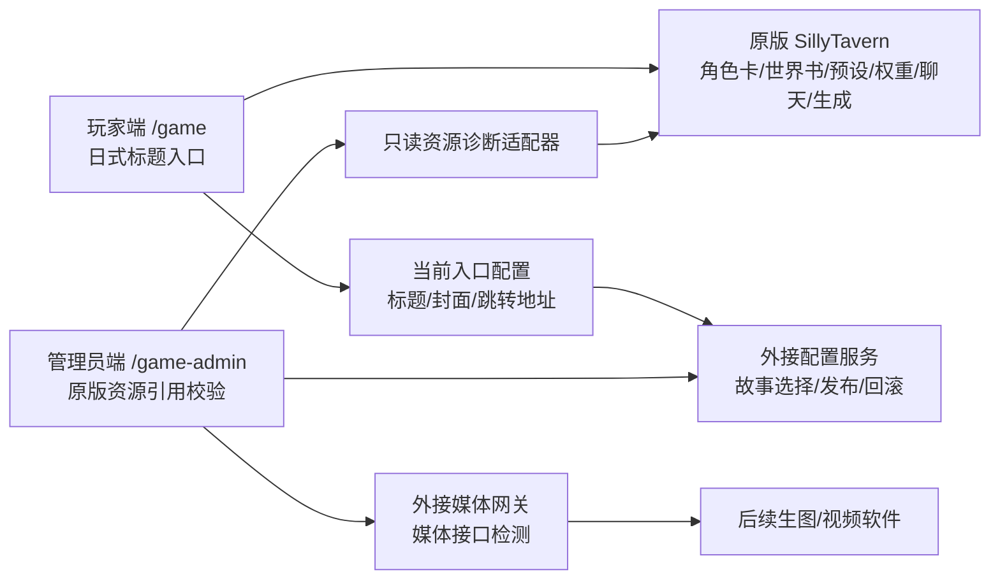
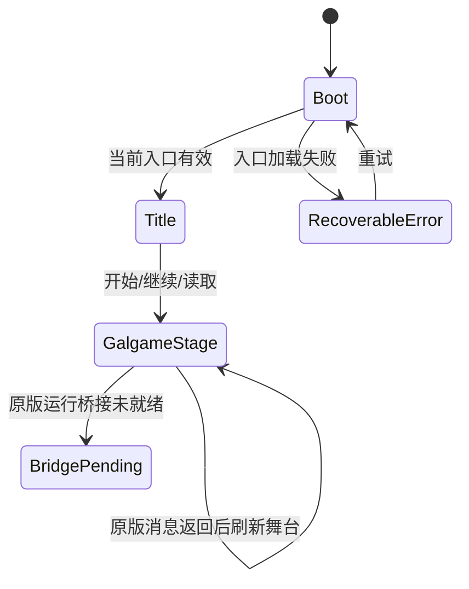

# AI Galgame 前端开发与外接接口规范

> 最新冲突标记：自 2026-07-24 起，凡本文提到由定制层重做 SillyTavern 的角色卡、世界书、预设、上下文构造、聊天历史、生成语义、固定剧情、前端分支/结局或平行剧情状态的内容，均以 `docs/GALGAME_NATIVE_FIRST_DEVELOPMENT_SPEC.md` 为准并视为作废。最新原则是：原版 SillyTavern 提供后端能力和运行语义，玩家端必须是我们自定义的 Galgame UI。

> 文档状态：最终方向工程基线 v1.1
> 生效日期：2026-07-24
> 适用范围：玩家端、管理员端、SillyTavern 前端适配、剧本配置服务、媒体接口
> 产品依据：`docs/GALGAME_DESIGN_SPEC.md`

> 历史视觉条款（2026-09-05，已被取代）：旧 `VISUAL-RUNTIME-1` 允许服务端 LLM 从对白提取标签。当前 annotation 必须按 shadow/gate 运行；只有带可校验原文证据的版本化 projection 和通过验收的 matcher 才能驱动图片呈现。旧 `docs/AI_GALGAME_VISUAL_RUNTIME_INTELLIGENCE_DEVELOPMENT_SPEC.md` 中与最新 `GALGAME_NATIVE_FIRST_DEVELOPMENT_SPEC.md`、`GALGAME_VISUAL_MATCHING_RECOVERY_DEVELOPMENT_SPEC.md` 冲突的行为均不生效。

## 1. 目标与硬性边界

本项目在不修改 SillyTavern 后端源代码、不改变 SillyTavern 原版功能语义的前提下，建设两个独立前端：

- 玩家端：面向普通玩家的极简 Galgame
- 管理员端：面向运营人员的故事入口、原版资源绑定、检查、发布和回滚工具

允许通过独立外接模块提供共享配置、存档或媒体生成能力，但外接模块必须与 SillyTavern 后端解耦，不能通过补丁、中间件注入或覆写路由改变 SillyTavern 行为。

最终版本的基本定位是“日式 JRPG/Galgame 前端皮肤 + SillyTavern 原版能力适配 + 极薄外接模块”。角色卡、世界书、预设、权重、上下文注入和生成能力必须以 SillyTavern 原版为准；定制层只改变展示和编排方式，不重写原版功能。

### 1.1 禁止修改

以下原版范围绝对只读；本项目不修改任何 SillyTavern 原版代码，只做上层开发：

- `src/**`
- `server.js`
- `plugins.js`
- SillyTavern 原版前端的所有页面、脚本、样式、模板以及已有 extension/plugin 代码
- SillyTavern 现有后端路由、鉴权、CSRF、存储和启动逻辑
- `config.yaml` 中与后端行为相关的配置
- 根目录 `package.json`、`package-lock.json` 中会影响 SillyTavern 运行的依赖和脚本

如果需求看起来必须改动上述原版代码，停止该实现路径并报告；允许新增的 `frontend/**`、`public/game/**`、`public/game-admin/**`、`external-modules/**` 代码只能通过既有接口/运行时合同委托 SillyTavern。原版运行桥调用 `Generate()` 不构成修改原版代码的授权。

### 1.2 允许范围

- 新增隔离的玩家端和管理员端源码
- 新增独立前端构建配置
- 使用 SillyTavern 已存在的 HTTP 接口
- 使用 SillyTavern 已存在的角色、世界设定、预设、聊天和生成能力
- 使用管理员适配层只读校验 SillyTavern 原版角色卡、世界书、预设和上下文配置引用
- 新增独立运行的配置服务或媒体网关
- 新增文档、测试和静态资源

### 1.3 兼容性原则

所有 SillyTavern 调用集中在适配层。页面组件不得直接散落调用 SillyTavern 接口，以便上游版本变化时只修改一个位置。

定制后台展示 SillyTavern 设置时必须保持原版功能等价。也就是说，后台可以换布局、换术语分组、提供发布校验和默认组合，但不能改变设置含义、权重含义、世界书激活逻辑或角色卡结构。无法做到等价封装的功能，应保留原版维护入口作为权威操作面。

玩家端“开始游戏”继续读取当前 Arc 的 chat seed；“继续游戏”把自动槽视为可恢复指针：先通过既有绑定聊天读取能力查找当前 Arc 的最新非 seed 聊天，并在它比自动槽指向的短分支更完整时展示并更新自动槽；未命中更完整聊天时才精确读取自动槽。手动存档始终按其保存的 chatId 精确读取，不得被最新聊天匹配替换。玩家视觉通道允许使用独立 `asset_curated_player-*` 资源作为 `playerAssetId`，该资源必须仍属于字符目录的受校验素材，不得混入角色池。

## 2. 总体架构



架构原则：

- SillyTavern 是内容与生成能力的权威源。
- 故事入口配置只保存原版资源绑定关系、舞台锚点、媒体策略和发布状态。
- 玩家端不直接接触角色卡、世界书、预设、权重和模型参数。
- 管理员端可以操作这些原版能力，但必须通过原版接口、原版数据结构或等价适配层完成。
- 外接模块只处理游戏进度、媒体生成、发布索引和安全隔离，不承载 SillyTavern 原版业务逻辑。

### 2.1 部署方式

推荐同源部署：

- 玩家端：`/game/`
- 管理员端：`/game-admin/`
- SillyTavern 原版页面：仅内部维护人员可访问

玩家端和管理员端可以构建为静态文件，由现有静态托管或独立静态站点提供。不得为了挂载页面而修改 SillyTavern 服务端路由。

### 2.2 发布与配置模式

**本地发布缓存**

- 默认故事入口、发布信息和存档状态存储在浏览器 IndexedDB
- 适合同一台设备上的设计、演示和调试
- 管理员发布只对当前浏览器生效
- 不提供本地剧情引擎；故事文本和走向仍必须来自 SillyTavern

**共享部署模式**

- 使用独立配置服务保存故事入口、默认推荐版本和可游玩作品清单
- 玩家端只读取已上架作品摘要和对应入口内容
- 管理员端经过独立鉴权后进行发布
- 配置服务是外接模块，不进入 SillyTavern 后端
- 故事入口引用 SillyTavern 原版资源；配置服务保存的是发布索引和绑定关系，不保存密钥或复制版世界书

共享部署必须使用配置服务；纯静态前端无法安全、可靠地让管理员向其他设备发布剧本。

前端通过 `frontend/shared/src/config-service.js` 接入配置服务。部署时可在玩家端和管理端 HTML 中设置 `meta[name="galgame-config-service"]`，或由静态托管层注入 `window.GALGAME_CONFIG_SERVICE_URL`。未配置时使用本地发布缓存。

玩家端从配置服务读取当前发布版本和剧本清单后，会把最近一次成功的 release 与 manifest 成对缓存到 IndexedDB。配置服务短暂不可用时，玩家端使用最近成功版本降级恢复，不进入管理端，也不暴露技术错误。

本地开发部署应使用统一启动脚本启动配置服务和原版运行桥，使两者共享同一份本地 proof secret，并统一指向当前 SillyTavern 地址。玩家端可通过共享适配层自动发现同机 loopback 运行桥，但续写授权仍以配置服务签发的短期 proof 为准；自动发现不得扩展为任意远程服务扫描，也不得绕过 proof 校验。

## 3. 建议目录

后续实现建议使用隔离目录，避免与上游页面形成耦合：

```text
frontend/
  player/
    src/
    tests/
    package.json
  admin/
    src/
    tests/
    package.json
  shared/
    domain/
    adapters/
    protocol/
    ui/
    tests/
public/
  game/                 # 玩家端构建产物
  game-admin/           # 管理员端构建产物
external-modules/
  game-config-service/  # 共享部署时可选，只保存入口发布索引
  media-gateway/        # 需要保护媒体服务密钥时使用，不参与剧情生成
docs/
```

要求：

- 前端使用自己的依赖清单，不修改根目录依赖。
- 构建产物与源码分离。
- 不直接修改 `public/index.html`、`public/script.js`、`public/style.css`。
- 不复制 SillyTavern 大段内部代码；通过适配器调用稳定能力。

### 3.1 物理隔离要求

本项目的定制代码必须形成清晰分层：

- `frontend/**` 是定制前端源码区。
- `public/game/**` 与 `public/game-admin/**` 是定制前端静态输出区。
- `external-modules/**` 是可独立运行、可替换、可删除的外接服务区。
- SillyTavern 原版源码、后端和原版前端保持独立，不承载定制业务逻辑。

玩家端、管理端和共享协议可以互相引用，但不得引用 `src/**` 后端源码，不得依赖原版 `public/index.html`、`public/script.js` 或 `public/style.css` 中的全局状态。

如果未来为了接入需要“开接口”，优先使用独立外接模块或反向代理。只有在用户明确批准某一个具体后端变更后，才允许触碰 SillyTavern 后端。

## 4. 前端应用划分

### 4.1 玩家端

主要模块：

- `Bootstrap`：读取默认推荐入口、可游玩作品清单和最小展示资源
- `TitleScreen`：作品选择、标题、封面、角色视觉锚点、开始、继续、读取
- `GameStage`：Galgame 舞台、背景、角色层、对话框和输入区
- `StageMessagePresenter`：从原版聊天可见 `displayText/text` 呈现原文、分页和交互；不得改写剧情事实、补造对白，或把展示注释写回 prompt、世界书、Arc、分支或结局。说话人、正文片段、人物实体、属性和场景必须采用独立、版本化且带原文证据的展示注释；消息级 `speaker/name` 仅表示原版消息作者，不等同于内嵌对白的实际说话人。未归属对白与旁白是不同类型，不能以固定角色表、语言词表或句式/动作词正则作为通用分类方案；不确定时保留未知说话人。注释只消费已展示文本及有限的已展示历史，按原文偏移和哈希校验，不得读取隐藏思考、prompt、角色卡正文或世界书正文。原文是唯一剧情内容，身份、头像和状态均为可重算的只读投影；详细架构、缓存失效、身份连续性、头像唯一绑定、状态回放和跨剧本验收见 `docs/GALGAME_PRESENTATION_IDENTITY_AND_STATE_PROJECTION_DEVELOPMENT_SPEC.md`。

StageMessagePresenter 的分页必须携带经证据确认的说话人状态。已归属对白的引号在页面分割点仍未闭合时，下一页可以继承同一身份，直至配对闭合符号；该规则仅作低优先级兜底，当前段内更强的明确归属及有效注释优先，闭合引号本身不能创建角色身份。播放器可将同一原版消息中连续、有完整来源跨度且每段都有有效 identityRef 的对白段聚合为一个只读“多人对话页”；中间出现旁白、未归属对白、未知、玩家、系统、动作段或来源缺口即结束聚合，且不得跨消息/分页会话边界。页面正文按原顺序无损显示全部片段；标题为“多人对话”，避免随头像轮换造成错误的单人归属。聚合页仅在至少两位角色均有已验证头像时，舞台角色层每 3 秒轮播该页内按 identityRef 去重的头像；少于两张已验证头像时，整个多人页显示中性群像占位，不显示唯一成功绑定的单人头像；缺图身份不借用他人图；引语延续页独立显示并固定其说话人，不轮播。轮播头像必须来自当前发布版本的精确角色绑定或通过现有视觉服务、hash/context/channel/唯一账本校验的决定；失败候选使用未知占位且不影响正文、输入、继续或原版聊天。换页/切聊天/舞台重置须取消旧定时器和迟到结果，确保新页不继承旧头像。
- `StageMessagePresenter` 对长回复还要做保守的完整性检查：没有足够可见正文、没有三选一、尾部停在未闭合句且没有终局标记时，只显示“可能未生成完”的恢复提示，保留原文并允许玩家显式输入“继续”走原版聊天追加流程；不得删除或覆盖原版截断消息，也不能把短的合法续写误判为失败。`行动顺序`、`先攻顺序`、`轮到 X 行动`只作为展示信息提取，无法解析时显示空状态，不创建剧情状态。

视觉绑定必须保持保守：角色名及其 `的回合`、`回合`、`的行动` 等展示后缀先归一到基础名，再执行精确角色/别名匹配。`性别`、`种族/物种`、`外观/特征`、`服装` 等可见属性会进入同一份 visual projection，不能从隐藏思考或角色卡正文补造。RUNTIME-3 闭集标签由服务端维护，角色性别最多匹配一个 masculine/feminine/androgynous 代码，无法确认时省略。未知角色不借用已绑定角色的 `characterPool` 资产；播放器会在池耗尽、跨角色冲突或服务失败时显示未知占位。已识别的敌方单位会从发布 catalog 中按哥布林/兽族、亡灵、强盗和敌方守卫等闭集标签选择独立透明立绘；同一局内按实体键保留绑定，池耗尽才回退未知占位。旁白优先使用 manifest 中 `channel: narrator` 的中性符号素材；未配置时才使用内置中性 SVG。玩家使用独立占位，切换消息前先清理上一角色的立绘。装备、道具和技能侧栏素材可以从同一发布 catalog 中按可见标签确定性匹配，匹配失败仍保持未知占位。视觉理解服务失败时，带显式可见标签的装备/道具/技能实体可以按闭集标签走确定性图标匹配；背景唯一允许进入生产匹配的输入是经当前页原文哈希、跨度与 chat/release/arc/catalog scope 验证，并由 `scene-continuity.v1` 判定为 `changed` 的场景投影。可见地点标签、清单标签或可信角色绑定都不能直接绕过该 gate 命中背景；它们最多作为独立 scene-continuity producer 的受限证据。没有有效 `changed` 投影时，不构造场景候选，也不得把默认背景标成命中。只有精确匹配成功时才允许锁定角色视觉资源。

播放器运行时应先排除不适合舞台层的缩略图和占位像素：动态场景素材至少为 640×360 且宽高比不低于 1.2，动态人物素材至少为 320×320。视觉服务 catalog v2 在 `catalogHash` 覆盖的 `characterChannels` 中为每个人物图声明 `character|player|narrator|system` 用途；视觉上下文 v2 返回这份已验证映射，玩家端在应用任何本地精确头像绑定前，必须验证 asset ID/version 与当前 speaker role 对应的 channel 完全一致。普通人物候选和精确绑定只能使用 `character`；player/narrator/system 只使用各自 channel。本次 `system` channel 保持零引用，system 角色仍显示中性内置占位，不读取 catalog system 资源。旧 catalog v1 仍可读取背景/图标和资源元数据，但没有可验证的人物用途映射，其角色头像精确绑定与动态候选一律 fail closed。新增人物资源不得被简易发布隐式归入 `character`，需通过带明确 channel 的 catalog 流程。人物闭集语义标签只有在可见当前页证据通过身份/来源校验时才可进入匹配；分析器失败或分数相近时使用未知占位。场景标签不属于此回退：地点 mention/显式标签本身不可触发背景匹配，只有当前页通过 `scene-continuity.v1` gate 的 `changed` 才能创建背景候选。

同一局内必须保持角色与素材的一对一关系。校验器允许显式角色和池中的同角色别名镜像，但拒绝不同角色共享 `assetId`；运行时池分配会排除显式绑定资源并按 `manifest + Arc + chat/session` 记录已分配资源，已分配资源不会再分给另一个名字。玩家端以隔离的派生账本记住 chat/release 下的 entityKey→asset 绑定；Arc 只是分析缓存失效因子，不得重置头像占用范围。该账本不存剧情事实、不写回原版聊天，绑定冲突时失败关闭为未知占位；账本不得因人物数量而裁剪旧绑定。默认角色图不能作为未知角色的隐式回退；原版聊天和存档仍是剧情权威。

历史 manifest 中的 `defaults.narratorAssetId`、`defaults.playerAssetId` 可能仍指向旧角色 PNG；玩家端不会把这些 legacy default 渲染为旁白或玩家头像。新 catalog 应为旁白和玩家保留独立、中性且内容哈希不复用的资源，并分别使用 `channel: narrator` 与 `channel: player`；玩家只有在发布了独立 player 资源时才显示该资源，否则继续使用中性占位。迁移旧 catalog 时必须保留原版本回滚。

视觉运行时不可用或返回未知匹配时，背景行为取决于经原文哈希、来源跨度及 chat/release/arc/catalog scope 校验的 `galgame.scene-continuity.v1` 投影：`continued`（无当前场景实体，或仅提及仍为当前地点的实体）保留当前已验证背景；只有可信 `changed` 才表示当前地点变化，此时若匹配未知/冲突/不唯一或资源加载失败，必须清除旧 scene identity 并恢复当前发布版本的默认背景，不能让旧地点图冒充新地点；`unknown` 或 evidence 校验失败时不得猜测切场，应保留最后验证背景并记录非敏感诊断。地点提及不等于切场，连续分页保持上一场景；聊天、release、arc 或 catalog scope 改变时清除旧场景身份并恢复新 scope 的默认背景。背景分析器未配置、不可用或未通过当前页 evidence gate 时，不执行 location-tag 确定性回退；只有本阶段独立 scene-continuity producer 通过当前页 evidence gate 并产生 `changed` 后才能创建背景候选，不承诺覆盖任意地点表达。角色层仍使用当前说话人已验证绑定头像或对应的中性占位，旁白和玩家使用各自符号占位。已发布且通过 manifest 校验的显式角色绑定可在运行时理解器不可用时直接作为可信头像映射；动态场景和未绑定角色仍须经过匹配。非法资源 URL 不得沿用旧图。为避免长原版回复让视觉请求整包失败，发送给 visual-asset-service 的可见消息 DTO 可保留头尾并限制在 4000 个 Unicode 字符以内；这只限制视觉理解输入，不截断聊天正文、存档或原版生成上下文。
- `SillyTavernOriginalChatBridge`：读取绑定角色的原版聊天、把玩家输入写回原版聊天，并把原版消息转换成 Galgame 可显示消息
- `PlayerErrorBoundary`：将入口加载错误转换为简短恢复提示

### 4.2 管理员端

主要模块：

- `ReleaseDashboard`：当前发布和回滚
- `StoryEntryLibrary`：导入、复制、归档和删除故事入口
- `SillyTavernResourceBinder`：绑定原版角色卡、群组、世界书、预设、权重和运行配置
- `SillyTavernParityPanel`：以后台方式展示原版功能，并保持与原版语义一致
- `SillyTavernResourceAvailabilityDiagnostic`：通过原版已有接口只读核对角色卡、世界书和预设引用是否存在，只提取名单字段，不展示、保存或复制资源正文
- `ScenarioValidator`：结构、资源、能力和兼容性校验
- `MediaHealthView`：接口检测和测试任务
- `SystemHealthView`：SillyTavern、配置服务和资源可用性

管理员端不得与玩家端共享路由入口。共享代码仅限领域模型、协议、适配器和基础 UI。

管理员端不是另一个独立剧情编辑器。它的职责是把 SillyTavern 原版能力组合成“故事入口”，并为玩家端提供发布后的只读游戏化入口。若某个原版功能尚未完成等价封装，管理员端应提示使用原版页面维护该项功能。

管理员端的“校验”和“发布”路径必须执行原版资源存在性诊断。当前实现通过适配层只读调用 `/api/characters/all`、`/api/worldinfo/list`、`/api/settings/get` 和 `/api/characters/chats`，核对角色卡、世界书、生成预设、指令预设、系统提示、上下文预设和聊天种子引用。适配层只提取名称字段用于比对，任何缺失项都必须阻止发布。

## 5. 核心领域模型

### 5.1 当前发布

```ts
interface ActiveRelease {
  releaseId: string;
  scenarioId: string;
  scenarioVersion: string;
  manifestId?: string;
  manifestVersion?: string;
  activeArcId?: string;
  publishedAt: string;
  manifestUrl: string;
  contentHash: string;
  minimumPlayerVersion: string;
}
```

玩家端每次启动时读取默认推荐 `ActiveRelease` 和可游玩作品清单。玩家可在标题页选择清单中的已上架作品；一局已开始的游戏继续绑定创建时的 release、manifest 和 Arc。管理员发布新版本不能悄悄改变进行中的存档。

继续或读取存档时，玩家端必须优先按存档中的 `scenarioId + scenarioVersion + arcId` 从配置服务或本地缓存取回对应 manifest，而不是只使用当前默认发布入口。若原版聊天已经在存档保存点之后新增角色回复，自动存档恢复时应同步到最新原版回复；若最新消息仍是玩家输入，则自动请求正式原版运行桥接续写，失败时只显示可恢复状态。

标题画面必须常驻提供“一键复位”，与连接状态栏的异常复位调用同一流程：探测服务、按监督器白名单恢复符合条件的进程，并重新读取当前发布内容和绑定原版聊天；不删除聊天、不清空浏览器存档、不自动发起生成。标题画面还在复位旁提供“一键关闭”：收到本机 process-supervisor 的成功受理后，只调用当前标签的 `window.close()`；若浏览器拒绝，则替换当前页面为简洁“已关闭”画面，绝不尝试关闭其他标签或浏览器。当前生成中、运行桥状态不明确或监督器拒绝时，留在页面并提示安全原因。关闭游戏服务后保留 8790 恢复控制器供下次复位使用。继续按钮不能只依赖 IndexedDB 自动槽；当槽缺失或版本不匹配时，应只读检查当前发布版本绑定角色的聊天列表，存在符合 Arc/seed 选择规则的聊天即允许继续，并由既有原版聊天加载路径恢复内容。该可用性探测只读聊天元数据，不读取/复制聊天正文，也不改变 SillyTavern 数据。

存档中的 `releaseId` 可能来自旧本地版本或后来被替换的发布记录，不能直接作为新的运行桥授权身份。读档时必须在保持 `scenarioId + scenarioVersion + arcId + chatId` 不变的前提下，从该版本 manifest 换算为配置服务认可的稳定可游玩 release，并在 proof 请求与运行桥请求中使用同一个换算结果。该换算只修复授权索引，不得把旧存档迁移到当前默认剧本或新版本。

玩家提交自由输入或点击原版回复中提取出的行动按钮后，前端必须先把玩家消息保存到同一原版聊天，再请求配置服务签发运行桥 proof。配置服务、运行桥和浏览器 CORS 必须让该 proof 请求从玩家路由一次性通过；请求进入运行桥后玩家端显示“思考中”直到成功或明确失败。失败时不得循环刷新状态，只能稳定保留当前玩家输入并提供手动“再试一次”。

“再试一次”和正式请求运行桥前都必须先重新读取当前绑定的原版聊天文件。若该文件已经包含角色新回复，前端应直接同步舞台和自动进度，不再重复请求运行桥；只有最新消息仍是玩家输入时，才允许继续请求原版运行桥。

配置服务为当前聊天签发运行桥证明时，可能遇到刚保存后的原版聊天读回短暂不同步或临时网络失败。玩家端可以在同一次玩家操作内做少量短间隔重试，并把失败原因记录到非玩家日志；不得进入持续自动重连循环，也不得向玩家暴露 proof、接口或配置服务等技术词。

### 5.2 故事入口清单

```ts
interface StoryEntryManifest {
  schemaVersion: "1.0";
  id: string;
  version: string;
  title: string;
  author?: string;
  locale: string;
  contentRating: string;
  saveCompatibility: string;
  resourceBindings: ResourceBindings;
  sillyTavernBindings: SillyTavernBindings;
  arcs?: ArcBindingV1[];
  defaultArcId?: string;
  presentation: PresentationConfig;
  story: NativeLauncherStory;
  media?: MediaPolicy;
}
```

`resourceBindings` 只保存游戏演出资源标识或别名，不保存凭据。`sillyTavernBindings` 只保存对原版资源的引用和绑定策略，不复制密钥，不复制一份与原版脱节的角色卡或世界书。

`arcs` 使用 `docs/AI_GALGAME_PRE_IMPLEMENTATION_MATERIALS.md` 定义的 `galgame.arc-release.v1` / `ArcBindingV1` 正式 schema。旧的单入口 `sillyTavernBindings` 只能兼容迁移为一个 `defaultArcId`，不能继续扩展成平行剧情节点。`ActiveRelease.activeArcId` 指向当前新局入口；进行中存档继续绑定创建时的 release 和 Arc。

`interaction` 与 `runtimeRequirements` 是旧方案字段，当前入口不得用它们重建一套前端玩法或运行配置。玩家实际输入、重生成、上下文与模型运行配置必须委托 SillyTavern 原版机制；展示层由自定义 Galgame 前端负责。

```ts
interface SillyTavernBindings {
  characters: Array<{
    id: string;
    avatar?: string;
    role: "main" | "supporting" | "narrator";
  }>;
  groupId?: string;
  worldBooks: Array<{
    name: string;
    mode: "global" | "character" | "scene" | "manual";
    weight?: number;
  }>;
  presetId?: string;
  instructPresetId?: string;
  systemPromptId?: string;
  contextPresetId?: string;
  chatSeedId?: string;
}
```

后续 Arc schema 中的 `SillyTavernBindingsV1.target` 是单角色、多角色和 group 的统一表达。旧 `characters[] + groupId` 结构只作为兼容输入；如果无法无歧义迁移，管理员发布必须失败并提示修正，不能由前端猜测。

字段名可以随原版接口适配调整，但语义必须与 SillyTavern 原版资源保持一致。

```ts
interface NativeLauncherStory {
  mode: "sillytavern-live";
  startChapterId?: string;
  startNodeId?: string;
  nodes?: {
    [anchorId: string]: {
      chapterId?: string;
      sceneId?: string;
      backgroundId?: string;
      characters?: StageCharacterAnchor[];
      lines?: [];
      choices?: [];
      allowFreeInput?: never;
      freeInputPrompt?: never;
      choicePrompt?: never;
      fallbackChoices?: never;
      nextNodeId?: never;
      freeInputNextNodeId?: never;
      proposedStateChanges?: never;
    }
  };
}
```

`story` 在当前版本只是入口锚点，不能承载前端剧情。`lines` 与 `choices` 必须为空；`allowFreeInput`、`freeInputPrompt`、`choicePrompt`、`fallbackChoices`、`nextNodeId`、`freeInputNextNodeId`、`proposedStateChanges` 都属于旧自建剧情循环残留，发布校验应拒绝。

`StoryDefinition` 只提供运行锚点和默认舞台。校验器必须拒绝任何前端固定台词、固定选项、固定跳转、固定结局或前端状态变更清单。玩家看到的文本、可选分支和剧情推进必须来自 SillyTavern 的生成结果、聊天历史和原版资源语义。

`sillytavern-live` 故事入口不得包含 `initialVariables`、`initialRelationships` 或 `initialInventory`。这些字段会让前端状态成为平行剧情权威，必须在导入、校验、发布和运行时被拒绝或清空。

### 5.3 运行要求

```ts
interface RuntimeRequirements {
  minimumContextTokens: number;
  structuredOutput: "required" | "preferred";
  multiCharacter: boolean;
  latencyPreference: "fast" | "balanced" | "quality";
  contentTags: string[];
  preferredProfileId?: string;
  fallbackProfileId?: string;
}
```

### 5.4 入口状态

当前定制层不维护 `GameState`。浏览器本地只允许缓存：

- 当前发布入口 `ActiveRelease`
- 当前入口 manifest
- 发布历史索引
- 媒体接口配置

聊天历史、重生成、滑动、上下文和实际剧情进度的权威归 SillyTavern 原版负责。自定义前端可以保存必要的显示状态和 UI 偏好，但不得保存节点、变量、关系、物品或 AI 场景结果来形成平行剧情系统。

### 5.5 已废弃的 AI 场景结果

旧方案中的 `SceneResult`、自建输出结构、结构化解析、可读文本降级、前端选择和前端剧情状态均已废弃。当前定制层不得绕开 SillyTavern 原版机制去请求、解析、规范化或推进剧情文本。

实际对白、选择、聊天历史、重生成、滑动、上下文和失败恢复必须来自 SillyTavern 原版运行机制。自定义前端负责把这些内容以 Galgame UI 展示给玩家。

## 6. 玩家入口状态



玩家端负责加载当前管理员发布的入口元数据，并在自定义 Galgame UI 内启动或恢复游玩。开始、继续、读取不得默认把玩家送回原版 SillyTavern UI；如果运行桥接尚未完成，应展示明确的游戏内未就绪/恢复状态，而不是伪装成已完成。

## 7. SillyTavern 适配层

### 7.1 适配层职责

`SillyTavernAdapter` 只允许用于管理员存在性诊断：

- 检查原版服务是否可用。
- 读取原版角色列表。
- 读取原版世界书列表。
- 读取原版设置列表，用于确认预设、指令预设、系统提示和上下文预设引用是否存在。
- 将缺失引用转换为管理员可理解的校验结果。

`SillyTavernAdapter` 不得创建或恢复聊天会话，不得调用生成接口，不得读取角色卡正文、世界书正文、提示词正文或密钥，不得拼接模型消息，不得返回剧情结果。

### 7.2 管理员只读调用规则

- 只调用当前 SillyTavern 已存在的只读或诊断接口。
- 保留现有会话、鉴权和 CSRF 机制。
- 不绕过安全检查，不在前端伪造内部权限。
- 接口路径、请求体和响应转换只能出现在适配层。
- 上游升级后先运行适配器契约测试，再允许发布管理员端。
- 原版支持的角色卡、世界书、预设、权重和上下文设置不得被定制层转换成不兼容语义。
- 管理员资源诊断只能读取列表类接口并做引用存在性核对。
- 故事入口可以绑定当前本地 SillyTavern 中真实存在的原版资源以便验证，但这只是引用绑定，不代表复制或创建同名资源正文。

### 7.3 玩家端原版聊天桥接层

`SillyTavernOriginalChatBridge` 是玩家端的独立薄桥接器。当前可算已验证的范围仅限原版聊天读写、目标角色/目标聊天绑定和目标聊天读回；其余能力必须按本文分级标注。它与管理员只读适配器位于同一共享适配层，但职责不同：

- 通过 `/api/characters/chats` 读取绑定角色的原版聊天列表。
- 通过 `/api/chats/get` 读取某个原版聊天文件。
- 通过 `/api/chats/save` 把玩家输入追加保存到原版聊天文件。
- 只把原版聊天消息转换成说话人、角色类型、文本和时间，供 Galgame 舞台展示。
- 可以从原版角色回复的可见文本中识别清晰标记的可选行动，并作为 `suggestedActions` 返回给玩家 UI；该字段只能用于按钮化快捷输入，不得决定分支、节点、结局或前端剧情状态。
- “开始游戏”优先读取故事入口绑定的 `chatSeedId` 作为原版开场聊天种子。
- 玩家首次从聊天种子提交输入时，应保存到新的原版聊天会话文件，避免改写种子本体。
- “继续”和“读取”读取绑定角色的最新原版聊天历史。
- 玩家提交输入后，若最新原版聊天仍以玩家消息结尾，玩家端必须显示“行动已记录、下一段暂时未接上”的恢复状态，暂停继续输入，并提供重新读取原版聊天的轻量操作。

它不得：

- 调用 `/api/backends/*/generate`、`/api/novelai/generate` 或任何底层模型生成接口。
- 读取 `/api/characters/get`、`/api/worldinfo/get` 或其他角色卡/世界书正文接口。
- 拼接角色卡、世界书、预设、系统提示或模型消息。
- 调用、复制或模拟原版前端 `Generate()`。
- 生成本地 AI 台词、固定剧情、固定选项、分支或结局。
- 把 `suggestedActions` 保存为前端剧情权威，或在没有原版文本依据时补造选项。

可见文本展示提取必须遵循 `docs/AI_GALGAME_FRONTEND_INTERACTION_AND_UI_SPEC.md` 中的 `galgame.presentation-extraction.v1`。该既有契约只提取 `displayText`、`suggestedActions` 和粗粒度 `speakerHints`，不是多角色语义分段、角色身份解析或状态回放的充分契约。后续通用语义注释如另行实现，必须使用独立版本化的只读 presentation contract；它不是 AI 故事响应协议，不得参与 prompt、世界书、Arc、结局或任何剧情状态决策。识别失败时保留原文和自由输入。详细目标见 `docs/GALGAME_PRESENTATION_IDENTITY_AND_STATE_PROJECTION_DEVELOPMENT_SPEC.md`。

当前聊天桥接层证明“原版聊天读写与自定义舞台展示”可用。2026-07-24 用户已明确批准一个等价的正式原版运行时桥接面：`external-modules/original-runtime-bridge/**`。

该外接桥接服务：

- 独立于 SillyTavern 后端运行，不挂载或修改原版后端路由。
- 在隔离浏览器进程中进入原版 SillyTavern 前端运行时。
- 选择故事入口绑定的原版角色和原版聊天。
- 调用原版运行时自己的生成函数继续当前聊天。
- 返回更新后的原版聊天快照给玩家端展示。
- 生成前后都以原版目标聊天文件读回为准：生成前确认目标聊天最后一条是玩家输入，并确认隐藏的原版运行时内存已经重新加载到同一条最后消息；生成后确认同一目标聊天新增角色回复。如果原版运行时跳到其他聊天、仍停在旧内存、目标文件未更新或只返回了文本字段，桥接必须返回失败。

玩家端只允许调用该桥的 HTTP 契约，不得 iframe 原版 UI，不得 import 原版 `public/script.js`，不得复制 `Generate()`，不得直接调用 `/api/backends/*/generate` 或 `/api/novelai/generate`。桥接失败时只能保留当前舞台、玩家输入和聊天上下文，显示重试/恢复状态，不播放本地固定剧情。

该桥默认只能监听 loopback 或本机等价通道；如需非本机访问，必须先有明确认证。CORS 只用于限制浏览器来源，不是认证。桥接请求必须绑定当前已发布入口或进行中旧存档 release 中允许的角色、group 和 chat；收到任意 `avatar + chatId` 不得直接触发生成。授权失败、release 不匹配、chat 不属于该 release 或角色/group 与 Arc 绑定不一致时，必须拒绝并返回可恢复错误。

桥接服务可以对原版模型上游的瞬时失败做有限次数内部重试，例如 429、500、502、503、504 或网络抖动。该重试不得复用到授权失败、目标聊天绑定失败、世界书不匹配或串聊天风险上；重试后仍必须按目标原版聊天文件读回验收。

聊天种子缺失或为空时，玩家端必须显示可恢复未就绪状态，不能显示“故事已经准备好”一类假成功文案，也不能播放前端固定开场。

玩家输入保存成功后，若配置了正式原版运行桥接服务，前端应显示“思考中”并请求桥接服务触发原版运行时续写；原版回复写回后自动刷新舞台。若桥接服务不可用或超时，前端应保留玩家刚提交的文本，显示可恢复状态，并允许稍后重试；它不得在此时补写本地 AI 回复。

连接状态异常、LLM 探测失败或生成失败标记持续存在时，玩家端显示“复位”按钮。复位中止过期的浏览器探测、使过期视觉请求失效、清理客户端瞬时健康状态并重新探测四项服务；随后由原生运行桥读取当前 SillyTavern Claude 配置，执行一次低 token 的 `/v1/messages` 请求验证实际推理链路。该探测不得携带聊天、角色卡或剧情上下文，不得写入目标聊天；结果单独记录 provider/model、耗时和非敏感错误码，不能记录凭据或上游正文。若酒馆与配置服务已恢复，只能重新读取并展示当前内存中已绑定的原版聊天；当前绑定缺失或读回不匹配时必须保留舞台和存档，不得改读自动存档或最新聊天。复位不能刷新页面、删除原版聊天、覆盖玩家存档、切换正在游玩的故事或把失败请求标记为成功。复位完成后仍以真实探测结果显示正常、部分异常或中断；因避免后台付费探测而过期的 LLM 结果只显示“待复测”并保留手动复位入口，不把其误判为整体连接故障。LLM 检测仅在用户主动复位时进行，避免定时轮询触发付费请求。未进行用户触发的 LLM 探测时显示“待按需检测”，未知状态不构成异常且不降低整体连接状态。视觉健康的本机只读 GET 遇到网络 TypeError 或 502/503/504 时最多做一次短重试，并有界超时；已确认视觉服务由断开恢复后，播放器应重新投影当前可见页的图像，不要求用户再推进剧情或触发模型生成。

原版 `Generate()` 成功写回非空角色回复时，玩家端以桥接诊断返回的实际 provider/model 更新 LLM 最近成功状态；该更新只记录标识与耗时，不保存提示词、回复正文或凭据。

Windows 本机模式下，复位先向独立进程管理器发送固定版本协议，请它检测 SillyTavern（当前端口 8000）、配置服务、原生运行桥和视觉服务的端口/健康状态。仅在端口未监听时启动对应的固定服务入口，随后限时重探；运行桥明确报告 `pending + stale` 且未处于停止过程时按既有策略重启，普通生成中不得重启。监听端口仍存在但健康失败时应保留现场并显示未恢复。管理器不可达时，复位仍执行上述健康探测和只读聊天恢复，不得阻断玩家恢复路径。

一键关闭请求只包含固定 `galgame.process-supervisor-shutdown.v1` 协议，不包含任何进程标识或执行内容。监督器只有在运行桥可达且明确空闲时才接受；先取得 shutdown lease 禁止新生成和竞争性 stop，再在 HTTP 受理响应送达后回收固定清单中的服务。执行期间监督器每 15 秒使用相同 owner `gateId` 续租 60 秒 lease；只有当前未过期 owner 可续租。续租失败必须中止并等待关闭执行器退出，保留 fail-closed 状态，不能继续未受 gate 协调的关闭，也不能释放无法确认所有权的 lease。客户端轮询最终 receipt，必须校验全部七个服务键与已知状态/错误码；只有确认各服务停止或已停止才关闭当前标签。监督器保留进行中的操作，并将已完成的最近 32 条 receipt 保留 5 分钟；运行桥 lease 60 秒后惰性释放，防止监督器崩溃留下永久 gate。状态不可读、未知、超时或部分失败时保留页面并报告失败。回收结果逐服务返回状态；8790 恢复控制器不得终止。Node 进程只允许按完整仓库绝对 entry 参数匹配。SillyTavern 相对 `server.js` 形式要求参数严格限定为该入口、直接父进程已退出，并通过只读 Windows 进程查询确认真实 CurrentDirectory 规范化后与仓库根目录完全相等；父进程仍存活但不是精确项目 launcher，或 CWD 查询、权限、架构及规范化任一失败，均返回 `failed/ambiguous`，不得视为已停止或终止该进程；Chrome 只允许精确匹配运行桥的专用 profile。通过强制结束实现关闭，所以必须先取得运行桥 gate 并再次验证 pending/stale/stopping；无法确认状态时 fail closed。所有游戏启动器（含根 `Start.bat`）应隐藏启动窗口并保留原参数与日志。

桥接验收不得只检查 HTTP 返回文本。测试必须读回目标原版聊天文件并确认最新消息为角色回复，同时确认非目标聊天没有被误写、误推进或被返回字段伪装为目标聊天。

### 7.4 运行配置

模型、API、预设、上下文、权重和生成参数全部通过 SillyTavern 原版能力维护。管理员入口只保存引用名称或标识，并检查这些引用是否存在；玩家端不展示 `profileId`、运行配置或模型参数。

运行配置校验必须区分两个层级：

- **引用存在**：通过原版列表/设置接口证明角色、世界书、preset、instruct、system、context、chat seed 的名称或标识存在。
- **运行时已应用**：通过已批准的原版运行时桥接或原版正式接口，在生成前证明当前原版运行时实际使用了目标角色、目标聊天、目标世界书和目标预设。

当前已经验证的是角色/聊天的目标绑定和资源引用存在性。preset、instruct、system、context、worldbook、group 的“运行时已应用”若缺少正式等价入口，必须标为 `deferred/unbridged` 或 blocker，不得只靠管理员 UI 状态宣称通过。

## 8. AI 输出与剧情约束

定制层可以展示 AI 输出，但不得成为 AI 输出的语义权威。所有 AI 文本、选择、失败恢复和聊天状态必须来自 SillyTavern 原版运行机制。

玩家端允许把原版角色回复中已经写出的行动候选显示成按钮。按钮点击必须等价于玩家在自由输入框中输入同一行动文字，并走现有原版聊天保存与原版运行桥接流程。该展示适配不得读取角色卡或世界书正文，不得补写隐藏提示词，不得把按钮点击解释成前端分支。

当前版本的约束是：

- 玩家端不得绕过 SillyTavern 直接调用底层模型生成接口。
- 玩家端不得把模型输出解析成自建分支、结局、节点跳转或平行状态。
- 玩家端不得保存剧情状态、变量、关系、物品、节点或 `SceneResult`。
- 运行失败时不得播放本地固定剧情或固定选择。
- 媒体接口只能根据未来明确的原版聊天、插件或人工标记事件接入，不得从自建剧情结果中派生剧情权威。

## 9. 故事入口配置与发布接口

配置服务为独立外接模块。建议最低接口如下：

前端适配层只依赖本节接口，不直接改写 SillyTavern 后端，也不把发布索引写入原版 SillyTavern 配置。共享部署下，`ConfigReleaseStore` 负责在外接服务和本地缓存之间切换；玩家页面只读取“默认推荐作品”和“可游玩作品清单”。

故事入口配置保存的是“哪个游戏入口使用哪些原版资源，以及怎样以游戏方式呈现”。它不得成为角色卡、世界书、预设或权重的替代存储。

### 9.1 玩家只读接口

```http
GET /v1/releases/active
GET /v1/scenarios
GET /v1/story-entries/{entryId}/versions/{version}/manifest
GET /v1/story-entries/{entryId}/versions/{version}/assets/{assetPath}
```

`GET /v1/releases/active` 返回：

```json
{
  "releaseId": "rel_20260723_001",
  "scenarioId": "summer-memory",
  "scenarioVersion": "1.2.0",
  "publishedAt": "2026-07-23T12:00:00Z",
  "manifestUrl": "/v1/scenarios/summer-memory/versions/1.2.0/manifest",
  "contentHash": "sha256:...",
  "minimumPlayerVersion": "1.0.0"
}
```

`GET /v1/scenarios` 返回玩家可选择的已上架作品摘要。摘要只包含标题、版本、入口、封面、角色显示名和对应 release 引用；不得返回角色卡正文、世界书正文、提示词、密钥、模型设置或原始资源内容。

### 9.2 管理员接口

```http
POST /v1/admin/story-entries/import
POST /v1/admin/story-entries/{entryId}/versions/{version}/validate
GET  /v1/admin/scenarios
GET  /v1/admin/releases
POST /v1/admin/releases
POST /v1/admin/releases/{releaseId}/rollback
GET  /v1/admin/health
```

发布必须是原子操作：新版本完成校验后才替换当前发布。服务端保留最近成功版本以支持回滚。

管理员鉴权由配置服务或反向代理负责。静态前端不能承担真正的权限保护。

配置服务掉线时，玩家端可使用本地最近成功缓存；管理员端不得在外接服务已配置但发布失败时悄悄改用本地发布，以免产生“管理员以为已经上线，玩家实际不可见”的误判。

管理员视觉上传入口必须把安全 PNG 合同说清楚：仅接受 8 位、非隔行 RGB/RGBA PNG；palette/indexed PNG 被服务拒绝时只显示可理解的转换提示，不显示内部错误码、路径、hash 或凭据。

本机视觉素材维护只能在 `127.0.0.1`/`localhost` 管理页会话中进行。写请求必须带匹配会话的 CSRF 令牌并通过 loopback 与同源校验；本机路由不接受 bearer/proof header，不可经 LAN 或反向代理暴露。素材上传得到的 draft 必须进入独立暂存 catalog 并完成 validate/publish；服务端拒绝与当前 `visual-control` 或已有活动 catalog 索引冲突的暂存 catalog ID。玩家 catalog 更新使用实时 source pointer 的完整 v2 manifest，按 `preview → journaled copy-on-write activate` 执行，回滚必须提交精确的当前/目标指针。暂存目录不得使用玩家源目录或迁移目标目录 ID，也不得切换玩家 `visual-control` 指针。简单发布遇到 draft 继续 fail closed。详细恢复记录见 `docs/GALGAME_VISUAL_MATCHING_RECOVERY_DEVELOPMENT_SPEC.md`。

最小 `game-config-service` 外接模块支持通过 `GALGAME_ADMIN_TOKEN` 保护 `/v1/admin/**`。该 Token 只能存在于外接服务环境、反向代理或受控运维工具中，不能写入玩家端、管理端静态文件、localStorage、故事入口配置或提交文件。

### 9.3 AI 剧本整理助手

`external-modules/script-import-assistant/**` 是允许的外接导入服务。它只用于管理员上架前整理剧本包，不参与玩家游玩时的剧情生成。

管理员端默认可调用：

```http
GET  /v1/health
POST /v1/admin/script-import/drafts
POST /v1/admin/script-import/drafts/{draftId}/redeploy
POST /v1/admin/script-import/drafts/{draftId}/confirm
```

整理助手输出 `galgame.script-import-draft.v1` 草稿。确认后，它可以通过 SillyTavern 已有 API 创建或核对明确命名的原版角色、世界书和开场 chat seed，然后返回只含引用的 manifest。该 manifest 继续走现有配置服务或本地发布流程。

`/v1/admin/**` 必须默认拒绝未认证请求。整理服务只能在配置了有效 `GALGAME_SCRIPT_ASSISTANT_ADMIN_TOKEN`，或位于受信外部反向代理、独立 admin service、mTLS、受控本地会话等真实认证边界之后时，开放上传、草稿、重新整理、确认导入和原版资源写入能力。未配置有效 token 或外部认证边界时，服务必须拒绝管理员请求或拒绝启动管理员接口。CORS、隐藏 `/game-admin/`、隐藏按钮和前端路由守卫都不是认证。

安全细节必须 fail-closed：非法 `GALGAME_SCRIPT_ASSISTANT_ADMIN_TOKEN_EXPIRES_AT` 不得被当作无过期继续放行；`TRUST_EXTERNAL_AUTH` 布尔开关不是认证本身，非 loopback 暴露必须有代理/mTLS/身份证明；带 `Origin` 的管理员请求必须命中明确白名单，未配置白名单时拒绝跨来源管理员请求。

整理助手不得：

- 把 LLM 作为玩家剧情运行时。
- 定义 `SceneResult`、剧情节点、固定分支、固定结局或玩家运行时本地 scripted fallback。
- 在前端、manifest、localStorage、IndexedDB 或日志中写入 LLM key、ST key、角色卡正文、世界书正文或提示词正文。
- 静默覆盖已有原版资源；同名资源内容不一致必须失败。

若需要沿用 SillyTavern 使用的 LLM key，只能由外接服务端读取同一服务端密钥来源。前端只知道整理服务地址，不知道 key。

AA1 只允许实现服务端 LLM 配置状态与密钥边界，不代表真实 LLM 整理已经实现。真实 LLM 调用必须另行增加服务端 prompt、超时、脱敏日志、错误恢复和不泄密测试；在此之前草稿应保持 `usesLlm=false`。

未配置 LLM 时，整理服务可以提供“导入期确定性摘要/导入计划生成器”用于形成管理员草稿。该路径只能输出普通摘要、资源引用计划、风险提示和是否可确认；不得输出玩家对白、行动选项、剧情节点、结局、`SceneResult` 或 runtime story，不得写入玩家 manifest 正文或本地剧情状态，玩家 `/game/` 也不得调用它。静态架构审计必须把这种 import-only 路径与禁止的玩家本地 scripted fallback 分开分类。

## 10. 外部媒体接口

### 10.1 设计目标

游戏只依赖统一任务协议，不依赖具体生图软件、模型或工作流。后续更换实现时只新增或替换 `MediaProvider`。

后续最小 `media-gateway` 外接模块应实现同一协议的 mock provider，用于前端联调、幂等验证和失败降级测试。它不得被视为真实生图实现；接入用户后续生图软件时，只替换网关内部 provider，不改变玩家端协议。

媒体请求需要角色外观、世界书和当前剧情语境时，应从原版 SillyTavern 聊天、插件事件、导出摘要或人工标记中取得授权后的媒体提示摘要。玩家前端不从自建剧情状态派生媒体语义，不携带密钥，也不直接暴露完整世界书或提示词。

```ts
interface MediaProvider {
  healthCheck(signal?: AbortSignal): Promise<MediaHealth>;
  createJob(
    request: CreateMediaJobRequest,
    signal?: AbortSignal,
  ): Promise<MediaJob>;
  getJob(jobId: string, signal?: AbortSignal): Promise<MediaJob>;
  cancelJob?(jobId: string, signal?: AbortSignal): Promise<void>;
}
```

### 10.2 创建任务

```http
POST /v1/media/jobs
Content-Type: application/json
Idempotency-Key: <releaseId>:<chatId>:<messageIndex>:<mediaKind>:<sourceProofHash>:<styleId>
```

```json
{
  "protocolVersion": "galgame.media-job.v1",
  "idempotencyKey": "rel_20260723_001:chat_01:12:image:hash_01:scenario_default",
  "releaseId": "rel_20260723_001",
  "scenarioId": "sillytavern-live-entry",
  "scenarioVersion": "2026.07.25",
  "arcId": "lucifer-arc1",
  "chatId": "galgame-imported-lucifer-seed",
  "messageIndex": 12,
  "mediaKind": "image",
  "triggerSource": "visible-chat-text",
  "sourceProof": {
    "sourceType": "visible-chat-text",
    "releaseId": "rel_20260723_001",
    "scenarioId": "sillytavern-live-entry",
    "scenarioVersion": "2026.07.25",
    "arcId": "lucifer-arc1",
    "chatId": "galgame-imported-lucifer-seed",
    "messageIndex": 12,
    "messageHash": "sha256:...",
    "createdAt": "2026-07-25T12:01:00Z"
  },
  "sceneSummary": "来自原版可见聊天文本的短场景摘要，最长 600 字符",
  "characterVisualRefs": ["visual:lucifer:anna", "visual:lucifer:black"],
  "styleId": "scenario_default",
  "timeoutMs": 120000
}
```

成功受理返回：

```json
{
  "protocolVersion": "galgame.media-job.v1",
  "requestId": "req_01",
  "job": {
    "protocolVersion": "galgame.media-job.v1",
    "jobId": "job_01",
    "idempotencyKey": "rel_20260723_001:chat_01:12:image:hash_01:scenario_default",
    "status": "queued",
    "createdAt": "2026-07-25T12:01:00Z",
    "updatedAt": "2026-07-25T12:01:00Z",
    "retryCount": 0
  },
  "statusUrl": "/v1/media/jobs/job_01",
  "cancelUrl": "/v1/media/jobs/job_01/cancel",
  "retryAfterMs": 2000
}
```

### 10.3 查询任务

```http
GET /v1/media/jobs/{jobId}
```

处理中：

```json
{
  "protocolVersion": "galgame.media-job.v1",
  "jobId": "job_01",
  "idempotencyKey": "rel_20260723_001:chat_01:12:image:hash_01:scenario_default",
  "status": "running",
  "createdAt": "2026-07-25T12:01:00Z",
  "updatedAt": "2026-07-25T12:01:05Z",
  "retryCount": 0
}
```

完成：

```json
{
  "protocolVersion": "galgame.media-job.v1",
  "jobId": "job_01",
  "idempotencyKey": "rel_20260723_001:chat_01:12:image:hash_01:scenario_default",
  "status": "succeeded",
  "createdAt": "2026-07-25T12:01:00Z",
  "updatedAt": "2026-07-25T12:01:20Z",
  "retryCount": 0,
  "result": {
    "assets": [
      {
        "mediaId": "media_01",
        "mediaKind": "image",
        "url": "https://media.example/game/job_01.webp",
        "mimeType": "image/webp",
        "width": 1536,
        "height": 864,
        "sha256": "...",
        "cacheKey": "rel_20260723_001:chat_01:12:image:hash_01:scenario_default"
      }
    ],
    "cache": []
  }
}
```

失败：

```json
{
  "protocolVersion": "galgame.media-job.v1",
  "jobId": "job_01",
  "idempotencyKey": "rel_20260723_001:chat_01:12:image:hash_01:scenario_default",
  "status": "failed",
  "createdAt": "2026-07-25T12:01:00Z",
  "updatedAt": "2026-07-25T12:01:30Z",
  "retryCount": 1,
  "error": {
    "code": "PROVIDER_FAILED",
    "safeMessage": "媒体暂时没有完成",
    "retryable": true,
    "providerTraceId": "trace_01"
  }
}
```

### 10.4 状态与重试

允许状态：

- `queued`
- `running`
- `succeeded`
- `failed`
- `cancelled`
- `expired`

规则：

- 同一幂等键必须返回同一任务或同一结果。
- 可重试错误最多自动重试一次。
- 前端使用逐步延长的轮询间隔，页面隐藏时降低频率。
- 非阻塞任务超时后停止前台轮询，保留任务标识供下次恢复。
- `sceneSummary` 和 `characterVisualRefs` 都是不可信输入，网关必须防 HTML、URL、路径和命令注入。
- 输出 URL 只允许同源相对路径、受控媒体网关 URL 或短期签名 `https` URL；禁止 `file:`、`data:`、`javascript:`。
- 缓存键必须绑定 release/chat/message/mediaKind/sourceProof/styleId，且读取时校验 MIME、文件大小、路径归属和可选 `sha256`。

### 10.5 视频兼容

视频使用同一接口：

- `mediaKind` 改为 `video`
- 输出资产增加时长、帧率、编码等字段
- `result` 返回视频 URL、封面和时长

图片版客户端遇到不支持的媒体类型时使用事件中的降级资源。

## 11. 进度边界

### 11.1 首期策略

- 定制层不保存玩家剧情进度。
- 定制层不保存 SillyTavern 会话句柄、聊天片段、最近 AI 场景结果、节点、变量、关系或物品。
- “开始游戏”“继续游戏”“读取”都进入自定义 Galgame 舞台；继续与读取语义最终必须由 SillyTavern 原版聊天历史承担，定制层只保存必要显示状态。
- IndexedDB 只保存当前入口发布索引、入口 manifest、发布历史和媒体接口配置。

### 11.2 版本兼容

入口发布记录绑定 `releaseId`、`scenarioVersion` 和 `saveCompatibility`，仅用于管理员发布与回滚说明。玩家实际进行中的聊天版本和历史仍以 SillyTavern 原版数据为准。

## 12. 玩家端错误模型

统一错误类型：

| 错误码 | 玩家提示 | 默认处理 |
| --- | --- | --- |
| `RELEASE_UNAVAILABLE` | 当前游戏暂时无法开始 | 重试并使用最近成功发布 |
| `RUNTIME_OFFLINE` | 这一段暂时没接上 | 保留画面并允许重试或返回标题 |
| `ORIGINAL_RUNTIME_TIMEOUT` | 这一段暂时没接上 | 保留本次输入和画面上下文并后台记录 |
| `ORIGINAL_EMPTY_REPLY` | 这一段暂时没接上 | 移除原版目标聊天中的空白回复，保留玩家输入并允许重试 |
| `ORIGINAL_MESSAGE_UNAVAILABLE` | 这一段暂时没接上 | 不播放本地剧情，提示稍后重试 |
| `MEDIA_FAILED` | 不弹窗打断 | 使用降级资源 |
| `SAVE_FAILED` | 暂时无法保存 | 保留内存状态并再次尝试 |

管理员端可以查看更具体的错误码、发生时间、关联版本和请求标识，但不得记录完整提示词、密钥或不必要的玩家输入。

## 13. 安全与隐私

- 玩家端和管理员端不包含 AI 或媒体服务密钥。
- 管理员页面必须由反向代理或独立服务鉴权保护，仅隐藏 URL 不构成安全措施。
- 所有外部接口使用 HTTPS。
- 跨域访问采用明确来源白名单。
- 剧本资源路径必须防止目录穿越。
- 所有用户输入或外部返回文本在展示前进行安全转义。
- AI 输出按不可信数据处理，禁止直接注入 HTML。
- 媒体 URL 必须限制允许协议和来源。
- 日志默认不保存完整对话；需要诊断时采用可关闭、可脱敏的方式。
- 商业发布前应单独评估 SillyTavern AGPL-3.0 许可义务和所使用模型、素材的授权。

## 14. 性能与体验指标

- 标题画面可交互时间：本地资源场景目标不超过 2 秒。
- 对话推进响应：点击后 100 毫秒内出现视觉反馈。
- 场景切换：不因未完成生图永久阻塞。
- 首屏资源按需加载，下一场景背景和立绘提前预取。
- 大图使用适合显示尺寸的 WebP/AVIF，并保留降级格式。
- 移动端与桌面端都不出现文本遮挡、按钮溢出或横向滚动。
- 页面恢复前后台后，不能重复提交玩家行动。

## 15. 测试策略

### 15.1 单元测试

- 故事入口清单校验
- 固定台词、固定选项、固定跳转和固定结局拒绝校验
- `sillytavern-live` 拒绝 `initialVariables`、`initialRelationships` 和 `initialInventory`
- `interaction`、`runtimeRequirements`、`allowFreeInput` 和 `freeInputPrompt` 等旧运行时字段拒绝校验
- 入口发布缓存和回滚索引
- SillyTavern 只读适配器不得暴露生成、会话或资源正文读取能力
- 媒体任务状态转换与幂等键

### 15.2 契约测试

- SillyTavern 管理员只读适配器对当前版本列表/设置接口的请求与响应
- SillyTavern 玩家聊天桥接器对原版聊天列表、读取和保存接口的请求与响应
- 原版角色卡、世界书、预设和上下文配置引用的存在性校验
- 缺失原版资源引用阻止管理员发布
- 配置服务发布和回滚
- 媒体任务创建、轮询、失败和超时
- 资源 URL 与内容哈希

### 15.3 端到端测试

至少覆盖：

1. 管理员导入并发布一个有效故事入口。
2. 缺失原版资源引用时管理员发布被阻止，并展示缺失项。
3. 缺失或为空的 `chatSeedId` 被管理员资源诊断拒绝。
4. 玩家首次打开 `/game/` 只看到标题入口，不看到模型、API、提示词、角色卡、世界书、预设等术语。
5. 玩家端没有故事/场景管理入口，也没有管理员入口。
6. 点击开始、继续或读取后进入自定义 Galgame 舞台，不离开玩家路由。
7. 点击开始后读取绑定的原版聊天种子并显示其文本；若读取失败，只显示恢复状态，不显示本地固定剧情。
8. 配置正式原版运行桥接后，玩家提交输入会显示“思考中”，随后自动显示由同一目标原版聊天文件读回的角色回复；若原版运行时串到其他聊天，玩家端显示重试状态而不是接受结果。
9. 媒体服务离线时不影响入口加载和自定义舞台进入。
10. 管理员回滚只影响后续入口元数据，不改写原版聊天历史。
11. SillyTavern 连接异常时玩家只看到入口级恢复提示，不暴露技术细节。
12. 冻结边界检查确认未修改 `src/**`、`server.js`、`plugins.js`、原版 `public/index.html`、`public/script.js` 和 `public/style.css`。

### 15.4 视觉验收

在桌面、平板和常见手机尺寸检查：

- 标题、封面、角色视觉锚点和版本提示不互相遮挡
- 开始、继续、读取按钮在移动端不溢出
- 玩家端没有管理员入口、故事管理入口或原版技术术语
- 点击开始、继续、读取后进入自定义 Galgame 舞台，不默认跳转原版 UI
- 背景和角色展示资源比例正确，不发生意外裁切

## 16. 实施阶段

### 阶段 1：静态体验壳

- 玩家端标题、封面、角色视觉锚点和开始/继续/读取入口
- 建设最小舞台、对话框和输入区外观，但不接管剧情语义
- 验证零学习成本、自定义舞台进入和不跳转原版 UI

### 阶段 2：管理员只读资源校验

- 完成只读适配器和契约测试
- 校验角色卡、世界书、预设、系统提示和上下文配置引用是否存在
- 缺失引用时阻止发布

### 阶段 3：配置索引与媒体接口

- 入口发布、回滚和本地/共享配置索引
- 媒体接口幂等、超时、失败和回调协议
- 媒体语义只从原版聊天、插件事件或人工标记接入

### 阶段 4：视觉打磨与边界验收

- 日式标题页视觉、美术资产和移动端适配
- 玩家术语隔离、路由隔离和管理员入口隔离
- 冻结 SillyTavern 后端和原版前端边界验证

### 阶段 5：媒体接口

- `MediaProvider`、任务协议、轮询、缓存和降级
- 使用模拟服务完成契约测试，等待后续生图软件接入

### 阶段 6：打磨与交付

- 响应式适配、性能、可访问性和端到端测试
- 固化一个标准故事入口样板
- 形成部署与运营检查清单

## 17. 完成定义

一个功能只有同时满足以下条件才算完成：

- 玩家体验符合产品文档，不暴露底层概念。
- 管理员功能不进入玩家路由和菜单。
- SillyTavern 调用只存在于适配层。
- 原版角色卡、世界书、预设、权重和上下文功能没有被定制层改写或降级。
- 没有修改 SillyTavern 后端文件。
- 对应单元或契约测试通过。
- 网络失败、解析失败和媒体失败有明确降级。
- 桌面与移动端完成视觉检查。
- 新增协议或产品行为已同步更新两份基线文档。

## 18. 开发变更流程

开发任务开始前：

1. 判断需求属于玩家端、管理员端、适配层还是外接模块。
2. 检查是否触碰后端禁区。
3. 确认是否改变玩家零学习成本原则。
4. 确认是否需要更新剧本或媒体协议版本。

若任务要求修改 SillyTavern 后端，必须停止实施并向用户说明原因，获得明确书面授权后才能继续。不得以“实现更方便”为理由自行修改。


## 2026-10-03 稳定性与 HUD 明细补充
按 `GALGAME_STABILITY_AND_HUD_DEVELOPMENT_2026-10-03.md` 执行，仍遵守 native-first。
装备、道具、技能展示复用现有明确字段解析器；装备与背包字段分别解析，不把盔甲重复列为消耗品。
普通对白没有新字段时，可显示当前可见聊天分支中最近一条明确记录，必须标为“最近记录”并在详情注明来源消息与“非实时状态”。
这不是库存快照合并、消耗计算或持续状态引擎；每次从当前快照重算，不读取未来消息，不跨聊天继承，不持久化物品权威。
已识别字段值精确为“无”“空”“none”“empty”或“[]”时，显示明确空记录并替换旧记录；未完成的字段标题不等于清空。自然叙述不由新增规则推断库存变化。
图片只增强显示：无图仍显示原文物品明细，明确空记录不能被图片匹配重新填充。非法 URL 决策仍须拒绝，独立有效的显式人物绑定按现有规则保留。
编辑、swipe、删除、分支和读档后重新计算派生记录；所有原版文本、存档、模型与 catalog 配置保持不变。
测试必须等待本次视觉渲染 Promise 完成，不能以历史请求存在或固定 sleep 认定成功。独立审计与真实端到端验收单独记载。


### 携带武器的保真补充
装备字段与背包字段已分开提取，因此不再隐藏背包记录中的 weapons 分组。背包明确列出的剑、弓等仍按原分组展示，不能当作消耗品，也不能据此推断已经装备。历史来源和明确空状态规则不变。

## 2026-10-04 可见页场景连续性生产接线

背景生产流程默认只消费当前显示的原版可见页。刷新恢复例外只在连续性账本缺失时，后台只读回看同一 scope 的旧角色可见页以找已发生的转场；历史回放不阻塞当前页面。页面标注经 8801 版本化只读 endpoint 生成，shared 层复核 scope/hash/Unicode spans 并创建既有 `scene-continuity.v1`；`changed` 才把带闭集语义标签的当前页 scene entity 提交给 8798，`continued`/`unknown` 不请求切图。该特定展示投影按用户要求限域启用，不能复用为 dialogue speaker/identity/roster 自动启用依据；其余一般注释仍按本文件 §4 gate。分析失败不得阻塞对话或清空同 scope 已验证背景；所有 UI 显示只呈现原版内容。
Scene analysis is latest-visible-page first. A page change supersedes any non-identical in-flight cursor, aborts its browser request, and begins analysis for the page now on screen. The analysis service forwards client cancellation to the provider request. Only a response that still matches the current request token, scope, and timeline may update the stage; exact duplicate requests for one cursor may share the in-flight result.
该 producer 仅消费原版角色消息；按原版 `is_system===true`→system、否则 `is_user===true`→player、原版 assistant/character→character 归一，来源不明时不创建请求。player/system 消息由播放器跳过，8801 对非 character 来源也须 fail closed，固定回 low-confidence 空场景响应并回填当前 requestId/hash，不调用 provider。对外响应中的 `visualTags` 证据跨度必须完全位于 `currentLocation` 内；无 current location 时标签列表为空。8801 会先按原始数组校验 `visualTags` 的 `maxItems`，超限仍须 fail closed；未超限时才丢弃结构完整但跨度不属于 `currentLocation` 的可选标签，不伪造或扩写 evidence。位置、转场和响应其余字段仍按原 schema 严格校验，畸形/未知标签继续失败关闭。这样保住有效地点/转场，同时不让旁提环境词成为背景证据。玩家输入的行动意图本身不证明转场。
刷新或连接复位若落在 player/system 页，不分析该页；播放器先按当前 chat/release/arc/catalog scope 校验场景连续性账本。账本缺失时，可在后台从当前页之前最多 128 个原版角色可见历史候选进行同合同的只读冷启动分析；不超过 4000 code point 的早期完整消息按一个候选处理，超限时按原版显示页扫描。每批最多 12 个候选，provider 请求至少间隔 2.1 秒，不使用会早于候选窗口所需时长的整轮硬超时。每条完成后可以写只含摘要哈希和调度偏移的可丢弃检查点；刷新恢复必须重新验证同一 scope、当前 cursor、候选集合和 analyzer scope。切换 chat/page 取消运行；失败候选记录偏移并在下一次恢复时重试，不阻塞当前页面。找到最近一个 high-confidence 且带当前地点/转场 exact spans 的有效 `changed` 锚点后，只有可见 cursor 仍匹配时才重新投影，再由 8798 重新解析资源。历史消息/页正文会发送到已配置的视觉专用分析 provider，不发送凭据或 chat id。player/system 和之后的消息不进入候选。该流程不调用剧情生成，不修改原版聊天或存档，只重建带消息/页面/前缀 hash 的可丢弃缓存。不得从 player/system 文本生成场景实体；无有效锚点时显示发布版本默认背景。

## 2026-10-04 浏览器视觉分析访问修复

玩家端分析 adapter 必须请求 8798 的固定 `/v1/presentation/health`、`/v1/presentation/annotations` 与 `/v1/presentation/scene-continuity` 路由；8798 通过 exact Origin allowlist、固定方法/版本头、请求体上限、超时和客户端取消检查后代理到 loopback 8801。浏览器不得直接连接 8801；代理不转发 Cookie、任意头、客户端指定 URL 或密钥。分析器健康检查与 `/v1/core/visual-context` catalog 检查合并成当前单一“视觉”连接状态；catalog 必须启用、活动 catalog/profile 信息完整一致，且 presentation 与 scene-continuity 两个分析范围均已就绪，避免将 HTTP 200、空 catalog 或只启用部分分析能力误报为视觉链路正常。SillyTavern 原版文件、聊天、存档、catalog 指针与视觉资源均不因代理接线而变化。
